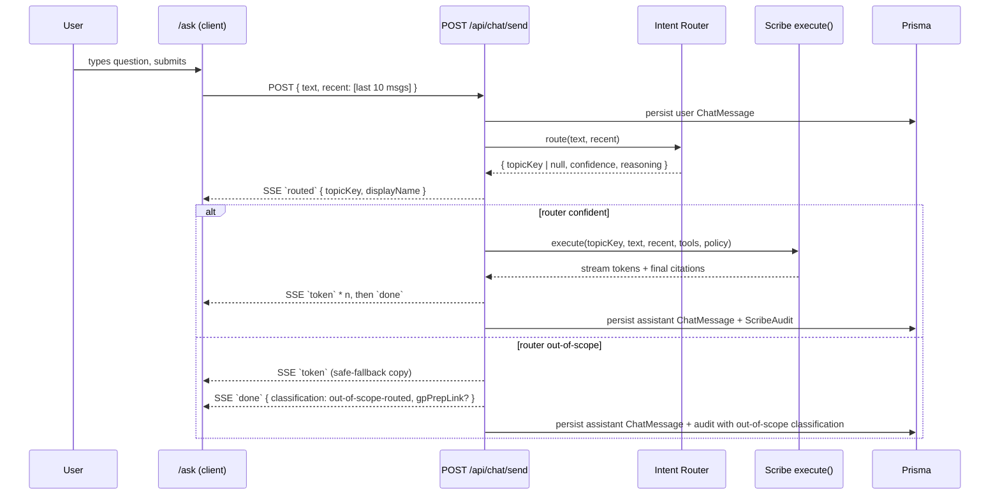

# Chat-first health assistant with specialist-scribe routing

## Overview

Add a single free-text entry point — "ask anything about your health" — that routes every turn to the right specialist scribe (iron / sleep-recovery / energy-fatigue today; more later). The chat layer sits above the existing scribe infrastructure and uses the same graph + provenance + safety policies that topic pages already enforce. As a prerequisite, close the extraction coverage gap that currently makes PR #80's 23 new canonical-key entries inert (the graph needs the data before the assistant can reason over it).

This is **not** a new reasoning engine — it's a conversational UX wrapper around the scribe runtime already shipped by [2026-04-18-001-feat-clinical-scribes-in-content-plan.md](docs/plans/2026-04-18-001-feat-clinical-scribes-in-content-plan.md). The durable asset remains the compiled record.

## Problem Frame

Today a user can only access scribe reasoning by landing on a topic page and selecting text (the "Explain" surface via `src/app/api/scribe/explain/route.ts`). They must already know which topic is relevant. There's no affordance for:

- "Why is my ferritin still low?" (phrased in user's own words, not a topic key)
- "Is my sleep affecting my energy?" (spans two topics)
- "What should I ask my GP next week?" (meta, cross-topic)

A conversational surface solves both the discovery problem (user doesn't need the graph taxonomy to ask questions) and the synthesis problem (questions that naturally span topics) — while keeping the regulatory posture from [R17–R19 of the origin brainstorm](docs/brainstorms/2026-04-15-health-graph-pivot-requirements.md) intact, because every answer still funnels through a topic scribe with its `SafetyPolicy`.

Separately, PR #80 shipped 23 new canonical-key entries (11 wearable metrics, 6 vital signs, 6 biomarkers, 2 lifestyle subtypes, 3 canonical-key generators) but the extraction prompts in `src/lib/intake/prompts.ts` and `src/lib/intake/lab-prompts.ts` don't enumerate them — so no user data ever lands in the graph under the new keys. The assistant will be answering questions against a record that's missing its latest registry additions unless this ships first.

## Requirements Trace

- **R-A.** User can ask a free-text health question from the home surface and receive a provenance-cited answer without navigating to a specific topic page. → U4, U5.
- **R-B.** Every chat turn is routed to one of the registered topic scribes (`iron`, `sleep_recovery`, `energy_fatigue`) or returns a safe out-of-scope surface. The router is deterministic under the same input and its decision is auditable. → U2.
- **R-C.** Chat answers are subject to the same `SafetyPolicy` and forbidden-phrase gates as topic-page content, and GP-prep routing remains a first-class outcome. → U3, U6.
- **R-D.** Conversations persist per-user and survive page reloads / new sessions. MVP: one flat conversation per user (no multi-thread UX). → U3.
- **R-E.** The new lifestyle subtypes (`sun_exposure`, `social_isolation`), new biomarkers (progesterone, estradiol, PSA, zinc, selenium, copper, tumor_marker category), new vital-signs (basal body temp, menstrual cycle day, lean mass, visceral fat, bone density, Bristol stool scale), and new canonical metrics (glucose variability, sleep stages/latency, activity zones, VO₂ max, hydration, SpO₂ stream, cycle day) extracted from intake text and lab uploads land in the graph under the correct canonical keys. → U1.
- **R-F.** Every chat turn produces a `ScribeAudit` row via the existing `execute()` path. → U3.

## Scope Boundaries

**In scope:**
- New chat surface at `src/app/(app)/ask/` + entry point on `src/app/(app)/home/page.tsx`.
- Intent router at `src/lib/scribe/router/` that picks a topicKey from free-text, with an explicit out-of-scope fallback.
- Extraction-prompt coverage for the 23 canonical entries shipped by PR #80.
- Reuse of the `ChatMessage` Prisma model (already present — see [prisma/schema.prisma](prisma/schema.prisma)).
- Streaming answer UX (SSE, reusing the explain-route pattern).

**Out of scope (deferred to separate plans):**

### Deferred to Separate Tasks

- **New specialist scribes beyond the existing three.** Inflammation, cardiometabolic, hormones, and gut remain substrate-only per the origin-doc R12 scope boundary. Expanding specialists is a follow-up plan once the chat surface demonstrates value with the three we have. Deferred to: a follow-up plan once router signal shows which specialist users want next.
- **Multi-thread conversation UX.** MVP ships one flat, continuous per-user conversation. Conversation grouping, titles, and history list deferred.
- **Voice input / TTS.** Text in / text out only.
- **Mobile-native entry.** Web-responsive only in v1, matches origin-doc R-web-first.
- **Agent-to-agent handoffs.** If a question spans topics, the router picks the best single topicKey per turn. Two specialists collaborating on one answer is deferred.

**True non-goals:**
- Chat as the new primary landing surface. Home remains the daily brief; chat is an entry-point card on home and a drill-down at `/ask`.
- Deletion of topic pages. Topic pages stay as the durable surface; chat is an additional path.
- A new LLM client or provider. Reuse `src/lib/scribe/llm.ts` and `src/lib/scribe/llm-anthropic.ts`.
- Migrations on shipped scribe / audit / policy tables. Any extension is additive.

## Context & Research

### Relevant Code and Patterns

**Scribe runtime (reuse as-is):**
- `src/lib/scribe/execute.ts` — `execute()` is the single entry for tool-calling + policy enforcement + audit write. Chat turns funnel through this unchanged.
- `src/lib/scribe/tool-catalog.ts` — 6 tool handlers already shipped (`search_graph_nodes`, `get_node_detail`, `get_node_provenance`, `compare_to_reference_range`, `recognize_pattern_in_history`, `route_to_gp_prep`). Chat reuses all of them via the scribe.
- `src/lib/scribe/policy/registry.ts` — three topic policies registered; chat reads from the same registry.
- `src/lib/scribe/llm.ts` + `src/lib/scribe/llm-anthropic.ts` — multi-turn tool-use loop adapter. Chat streaming is additive to this, not a replacement.

**Closest existing pattern (template for chat API):**
- `src/app/api/scribe/explain/route.ts` — SSE stream of `meta` / `token` / `done` events. Invariants D10 (user-scoping) and D11 (audit-before-gate) are documented in the file. Chat route replicates this shape with a router step prepended.
- `src/components/scribe/use-explain-stream.ts` — client-side SSE reader using `fetch` + streaming reader (not `EventSource`, which can't POST). Chat UI reuses this pattern.

**Intake extraction (where the coverage gap lives):**
- `src/lib/intake/prompts.ts` — `EXTRACTION_SYSTEM_PROMPT` and `buildIntakeExtractionPrompt`. No attribute-hints section today.
- `src/lib/intake/lab-prompts.ts` — lab-specific prompts; similarly doesn't enumerate the new biomarker additions.
- `src/lib/graph/attributes/lifestyle.ts` — exports `LIFESTYLE_SUBTYPES` tuple (re-exported via `src/lib/graph/attributes/index.ts`).
- `src/lib/health/canonical.ts` — `CANONICAL_METRICS` list (G1 additions landed here).
- `src/lib/intake/biomarkers.ts` — `BIOMARKER_REGISTRY` (G3 additions landed here).
- `src/lib/graph/attributes/vital-signs-registry.ts` — G2 additions landed here.

**Persistence (already in place):**
- `prisma/schema.prisma` — `ChatMessage` model exists (flat per-user, `role`, `content`, `metadata`, `createdAt`). MVP reuses it as-is; no migration needed. Multi-conversation grouping (`conversationId`) is deferred.

**Home + navigation:**
- `src/app/(app)/home/page.tsx` — daily brief landing. Entry point card lives here.
- `src/app/(app)/layout.tsx` + `src/app/(app)/path-to-tab.ts` — existing tab/nav infra. `/ask` registers as a new tab destination.

### Institutional Learnings

- `docs/solutions/best-practices/deepening-plans-with-research-agents-2026-04-16.md` — the only current solution doc; not directly relevant to this work but flags that institutional knowledge in this repo lives in `docs/solutions/`.

### External References

Skipped. The codebase has strong local patterns (scribe runtime + explain endpoint + streaming) that the chat layer directly mirrors — external research would add little.

## Key Technical Decisions

- **Chat wraps the scribe runtime; does not replace it.** Every chat turn resolves to one `execute()` call with a routed `topicKey`. This keeps D10 (user-scoping), D11 (audit-before-gate), and policy enforcement as structural invariants rather than things the chat layer has to re-implement and keep in sync.
- **Per-turn routing, not per-conversation.** Each user utterance is routed independently. If the user pivots from ferritin to sleep mid-conversation, the next turn goes to `sleep_recovery` — visible to the user via a "Asking <specialist>…" chip. Alternative (single specialist per conversation) rejected because it fights the "ask anything" framing and creates awkward "switch specialist" UX.
- **Router is a structured-output LLM call, not a keyword classifier.** Free-text questions use idioms that don't keyword-match topic labels ("I'm knackered"→energy_fatigue, "period pains"→hormones, not in MVP so goes out-of-scope). The router returns `{ topicKey, confidence, reasoning }`; low confidence or no-match routes to a safe out-of-scope surface.
- **Out-of-scope is a first-class outcome, not an error.** When the router can't confidently route (or routes to a topic that's not yet a registered policy — e.g., hormones), the UI renders a "This might be a question for your GP — here's how to ask it" surface that reuses the GP-prep tool. Consistent with origin-doc R13 / R17.
- **MVP = flat conversation per user.** `ChatMessage` as-is, ordered by `createdAt`. No `Conversation` model, no thread list, no rename. Thread grouping is deferred because it's UX polish, not core capability.
- **Recent history as scribe context, bounded.** Each turn passes the last N messages (e.g., 10) as prior context to `execute()`. The scribe's LLM already supports conversation history; we just populate it. Unbounded history is deferred.
- **Extraction prompts read from registry, not hard-coded.** U1 generates the attribute-hint sections from the exported registries (`LIFESTYLE_SUBTYPES`, `BIOMARKER_CANONICAL_KEYS`, etc.) at module-load time. Registry additions automatically flow to prompts — no second place to edit.
- **New route at `/ask`, not `/chat`.** "Ask" frames the question shape (single question, not a casual conversation). Reinforces the discovery-and-synthesis use case rather than "chatbot". Cheap to change later.
- **Streaming is mandatory from v1.** The scribe explain route already streams; chat answers are longer on average, so non-streaming would feel like a regression from the topic-page surface. Reuse the SSE pattern end-to-end.

## Open Questions

### Resolved During Planning

- **Does the plan need a separate `Conversation` Prisma model?** No. The existing `ChatMessage` table supports a flat per-user conversation. Multi-thread grouping is deferred to a follow-up.
- **Do we build a new LLM client?** No. `src/lib/scribe/llm.ts` + Anthropic adapter already support multi-turn tool-use.
- **Does chat introduce a new audit stream?** No. Every chat turn lands in `ScribeAudit` via `execute()` — same write path as topic-page content and explain.
- **Where does the chat surface live?** New route at `src/app/(app)/ask/page.tsx` + entry card on `src/app/(app)/home/page.tsx`. Not the default landing surface; home's daily brief remains primary.
- **How do we surface the routed specialist?** A small chip in the answer bubble ("Asked Iron specialist"). Clickable → opens the topic page in a drill-down. Reinforces the graph-first mental model: the chat is a shortcut, the topic page is the durable home for that answer.

### Deferred to Implementation

- **Exact streaming event shape for chat.** Likely mirrors explain's `meta` / `token` / `done` but may need an extra `routed` event so the UI can render the specialist chip as soon as the router completes. Defer the exact protocol to U5.
- **Router model + temperature.** U2 starts with the same model tier the scribes use; tuning happens once we see real routing decisions in audit.
- **Recent-history window size.** Start with 10 messages (5 user + 5 assistant). Revisit once we have real usage.
- **Out-of-scope copy.** U6 drafts placeholder copy; final wording will be iterated with real failure examples from testing.
- **Rate limiting per user.** Exists on magic-link flow; may need a separate limit for chat. U6 adds it if scribe audit signals runaway use, otherwise deferred.

## High-Level Technical Design

> *This illustrates the intended approach and is directional guidance for review, not implementation specification. The implementing agent should treat it as context, not code to reproduce.*

**Per-turn flow:**



**Intent router contract (conceptual — not implementation):**

```
Input:  { text: string, recent: ChatMessage[] }
Output: { topicKey: 'iron' | 'sleep_recovery' | 'energy_fatigue' | null,
          confidence: 0..1,
          reasoning: string }     // short, audit-trail only
```

The registered topic policies (`listTopicPolicyKeys()`) are the closed set of valid `topicKey` values. Adding a policy to the registry automatically widens the router's allowed set on next deploy — no router-side list to maintain.

## Implementation Units

- [x] **U1: Extraction coverage for PR #80 registry additions**

**Goal:** Make the 23 new canonical-key entries from PR #80 actually land in the graph. Generate attribute-hint sections of the intake and lab extraction prompts from the exported registries so the LLM knows the allowed values.

**Requirements:** R-E

**Dependencies:** None

**Files:**
- Modify: `src/lib/intake/prompts.ts` (import `LIFESTYLE_SUBTYPES`, add an ATTRIBUTE HINTS block listing allowed `lifestyleSubtype` discriminator values, biomarker canonical-key aliases from `BIOMARKER_REGISTRY`, canonical-metric keys from `CANONICAL_METRICS`, and vital-signs keys from `VITAL_SIGNS_REGISTRY`)
- Modify: `src/lib/intake/lab-prompts.ts` (enumerate new biomarkers — progesterone, estradiol, PSA, zinc, selenium, copper — and the `tumor_marker` category)
- Modify: `src/lib/graph/attributes/lifestyle.ts` (extend `SocialIsolationBranch.pattern` with `'none'` / `'unknown'` for parity with other pattern branches — MNT-04 carry-over from PR #80 review)
- Test: `src/lib/intake/prompts.test.ts` (create)
- Test: `src/lib/intake/lab-prompts.test.ts` (extend existing — already present)

**Approach:**
- The extraction prompts already have a section-based structure. Add a new `ATTRIBUTE HINTS` section that enumerates allowed discriminator values from each registry import, built at module load.
- Do not hardcode lists; import from `src/lib/graph/attributes/index.ts` (lifestyle subtypes) and `src/lib/intake/biomarkers.ts` (`BIOMARKER_CANONICAL_KEYS`) etc. Registry drift is impossible by construction.
- Keep prompt length reasonable: canonical keys only, not full alias lists (the LLM is good at inferring aliases; giving it the canonical key is the guardrail).
- Lab prompt update is additive: existing biomarker coverage stays; new entries append to whatever enumeration structure the prompt already uses.

**Patterns to follow:**
- The existing `src/lib/intake/lab-prompts.ts` already enumerates biomarkers for the lab surface — extend in-place rather than reinventing.
- PR #80's pattern for `LIFESTYLE_SUBTYPES` tuple export — a `readonly` tuple that's both a type and a runtime value.

**Test scenarios:**
- Happy path — `buildIntakeExtractionPrompt(input)` output includes every entry from `LIFESTYLE_SUBTYPES`, every canonical key from `BIOMARKER_CANONICAL_KEYS`, every key from `CANONICAL_METRICS`, and every key from the vital-signs registry. Assert by substring presence of a representative sample from each registry.
- Happy path — lab prompt includes `progesterone`, `estradiol`, `psa`, `zinc`, `selenium`, `copper` as recognised biomarker labels.
- Edge — adding a new entry to any registry automatically flows into the prompt output (property test: registry-to-prompt correspondence).
- Edge — `SocialIsolationBranch` Zod schema accepts `'none'` and `'unknown'` as valid patterns.
- Integration — extraction round-trip: a synthetic intake transcript mentioning "I barely get any sun" produces a `lifestyle` node with `subtype: 'sun_exposure'`. (Only if an end-to-end extraction test fixture exists today — otherwise assert the prompt contents and let U1's coverage be prompt-shape, with round-trip extraction deferred to U1b if needed.)

**Verification:**
- Prompts emit all new canonical keys at compile time (asserted by tests).
- Lab-prompt additions don't collide with existing aliases (no regression in existing `lab-prompts.test.ts`).
- `SocialIsolationBranch.pattern` enum parity test passes.

---

- [x] **U2: Intent router (free-text → topicKey)**

**Goal:** A deterministic, structured-output LLM call that maps a user utterance (+ short recent history) to one of the registered topic policies or an explicit out-of-scope outcome.

**Requirements:** R-B

**Dependencies:** U1 is not strictly required but recommended — without it, the graph is still sparse and the router's decisions will be tested against an underpopulated graph.

**Files:**
- Create: `src/lib/scribe/router/index.ts` (exports `routeTurn(input): Promise<RouteDecision>`)
- Create: `src/lib/scribe/router/types.ts` (`RouteDecision` shape)
- Create: `src/lib/scribe/router/prompt.ts` (system prompt + per-topic description injected from `listTopicPolicyKeys()` and the topic registry)
- Test: `src/lib/scribe/router/index.test.ts`

**Approach:**
- Reuse `src/lib/llm/client.ts` (the structured-output single-shot client) — not the scribe's multi-turn loop. The router is one call, one JSON output, no tools.
- The router's system prompt is generated from `listTopicConfigs()` (display name, one-line scope from each policy). Adding a new topic policy automatically widens the router on redeploy; no router-side list.
- `RouteDecision = { topicKey: string | null, confidence: number, reasoning: string }`. `topicKey: null` is the explicit out-of-scope path.
- Confidence threshold (e.g., 0.6) below which `null` is substituted, even if the model returned a topicKey. Configurable.

**Patterns to follow:**
- `src/lib/llm/client.ts` for the structured-output call.
- Scribe policy registry (`src/lib/scribe/policy/registry.ts`) for the list of valid topicKeys.

**Test scenarios:**
- Happy path — "Why is my ferritin low?" → `{ topicKey: 'iron', confidence: ≥0.8 }`
- Happy path — "I'm knackered and my sleep is broken" → one of `sleep_recovery` or `energy_fatigue`, high confidence
- Happy path — "Did my deep sleep improve this month?" → `sleep_recovery`
- Edge — empty string → `topicKey: null` without calling the LLM (pre-guard)
- Edge — question that clearly spans two topics → one confident pick + reasoning that acknowledges overlap (does not return both)
- Error path — question about a topic that isn't registered (e.g., hormones) → `topicKey: null` with reasoning naming the out-of-scope domain
- Error path — LLM returns malformed JSON → caller sees a wrapped error, not a crashed chat turn
- Integration — adding a new policy to `src/lib/scribe/policy/registry.ts` causes the router to consider that topicKey on the next build (covered by the prompt-generation test asserting enumeration correspondence)

**Verification:**
- Router decisions are reproducible under fixed seed / temperature=0 for the canonical test fixtures.
- No topicKey leaves the router that isn't in `listTopicPolicyKeys()`.

---

- [x] **U3: Chat turn runtime (persistence + scribe wrapper)**

**Goal:** A server-side helper that persists the user message, calls the router, invokes `execute()` with the routed topicKey and recent history, persists the assistant message, and returns a stream. One function, one invariant set.

**Requirements:** R-C, R-D, R-F

**Dependencies:** U2

**Files:**
- Create: `src/lib/chat/turn.ts` (exports `runChatTurn({ userId, text }): AsyncIterable<TurnEvent>`)
- Create: `src/lib/chat/types.ts` (`TurnEvent` union: `routed`, `token`, `done`, `error`)
- Create: `src/lib/chat/repo.ts` (persistence helpers around `ChatMessage`)
- Test: `src/lib/chat/turn.test.ts`
- Test: `src/lib/chat/repo.test.ts`

**Approach:**
- `runChatTurn` orchestrates: persist user message → load last N messages → route → persist router decision to message `metadata` → call `execute()` with routed topicKey → yield token events → persist final assistant message with citations + classification in `metadata`.
- When router returns `topicKey: null`, skip `execute()` and yield a safe-fallback token stream + a `done` event with classification `out-of-scope-routed` and a GP-prep link. Write an audit row via `recordAudit` with the same shape `execute()` would have produced for symmetry.
- Recent-history budget: last 10 `ChatMessage` rows by `createdAt` descending, re-reversed for chronological context.
- Failures at any stage yield an `error` event and write an audit row — the conversation is never silently lost. `ScribeAuditWriteError` bubbles up per the documented D11 contract.

**Patterns to follow:**
- `src/lib/scribe/execute.ts` — orchestration shape (resolve inputs once, thread through, audit-before-gate).
- `src/app/api/scribe/explain/route.ts` — SSE event shape (reuse `meta` / `token` / `done`; add `routed`).

**Test scenarios:**
- Happy path — user sends "Why is my ferritin low?" → router picks `iron` → execute() yields tokens → final message persisted with citations → audit row written with correct topicKey / classification.
- Happy path — last-10 history passed to execute() in chronological order.
- Edge — first message (no prior history) works identically; `recent` is an empty array.
- Error path — router throws → user message is still persisted, an error event is yielded, and an audit row lands with classification `error` (or equivalent). The assistant message is NOT persisted.
- Error path — `execute()` throws mid-stream → partial tokens stop flowing, error event yields, audit is written (D11 invariant already handles this in execute; we verify the chat wrapper propagates correctly).
- Error path — `ScribeAuditWriteError` during finalization → the chat turn fails closed; assistant message is not persisted (so the audit trail and chat history don't diverge).
- Integration — two turns in a row: the second turn's `recent` includes both messages from the first turn.
- Integration — out-of-scope turn produces a GP-prep-shaped `done` event that the UI can render differently.

**Verification:**
- Every chat turn produces exactly one audit row (or one with classification `error`).
- No chat turn persists an assistant message without a corresponding audit row.
- Conversation history read back from the DB matches the sequence of events yielded.

---

- [x] **U4: Chat API route (SSE streaming)**

**Goal:** `POST /api/chat/send` — a thin HTTP wrapper around `runChatTurn` that handles auth, input validation, and SSE serialization.

**Requirements:** R-A, R-F

**Dependencies:** U3

**Files:**
- Create: `src/app/api/chat/send/route.ts`
- Test: `src/app/api/chat/send/route.test.ts`
- Create: `src/app/api/chat/history/route.ts` (GET endpoint returning the last N messages for the logged-in user)
- Test: `src/app/api/chat/history/route.test.ts`

**Approach:**
- Mirror the shape of `src/app/api/scribe/explain/route.ts`: auth via `getCurrentUser()`, input validation via Zod, `text/event-stream` response, event kinds mapped from `TurnEvent`.
- History endpoint returns `ChatMessage[]` with metadata parsed (router decision, classification, citations). Pagination deferred; fixed last 50 for MVP.
- Rate limit is deferred; add a TODO comment that references the magic-link limiter pattern if abuse emerges.

**Patterns to follow:**
- `src/app/api/scribe/explain/route.ts` — same SSE shape, auth guard, and D10/D11 comments.

**Test scenarios:**
- Happy path — POST with valid body + session → 200 SSE stream, `routed`/`token`/`done` events in order.
- Error path — POST without session → 401 JSON, no stream.
- Error path — POST with malformed body (missing `text`) → 400 JSON.
- Error path — body with text > 2000 chars → 400 (reuse explain's bound for symmetry).
- Integration — GET history returns messages in chronological order with parsed metadata.
- Integration — history from one user never leaks to another (userId scoping verified).

**Verification:**
- Route follows the documented explain-route invariants (D10 user scoping, D11 audit-before-gate) — comment the invariants at the top of the file for future reviewers.

---

- [x] **U5: Chat UI at `/ask`**

**Goal:** Consumer-friendly chat surface: message list, composer, streaming assistant bubbles with "Asked <specialist>" chip, clickable citations, GP-prep handoff.

**Requirements:** R-A

**Dependencies:** U4

**Files:**
- Create: `src/app/(app)/ask/page.tsx`
- Create: `src/components/chat/message-list.tsx`
- Create: `src/components/chat/message-bubble.tsx`
- Create: `src/components/chat/composer.tsx`
- Create: `src/components/chat/specialist-chip.tsx`
- Create: `src/components/chat/use-chat-stream.ts`
- Test: `src/components/chat/use-chat-stream.test.ts`
- Test: `src/components/chat/message-bubble.test.tsx` (citation click, specialist chip render, GP-prep card render)
- Modify: `src/app/(app)/path-to-tab.ts` (register `/ask` as a tab)
- Modify: `src/app/(app)/path-to-tab.test.ts`

**Approach:**
- `useChatStream` hook mirrors `useExplainStream` — `fetch` + streaming reader, abort-on-new-start. Accepts an optional initial text (for home entry-point deep-link).
- On mount, `/ask` page fetches `GET /api/chat/history` to rehydrate prior messages. Graceful empty state ("Ask anything about your health") with suggestion chips on empty conversation.
- Specialist chip in the assistant bubble shows "Asked <displayName>" with subtle styling. Clickable → `/topics/<topicKey>` (drill-down preservation). For out-of-scope turns, replace with a GP-prep card instead.
- Citation rendering reuses the topic-page pattern (inline `[n]` numbers that scroll/scroll-spy to a citations list).
- Composer supports Enter to submit, Shift+Enter for newline, optimistic append of user message.

**Patterns to follow:**
- `src/components/scribe/use-explain-stream.ts` — SSE reading + abort handling.
- `src/components/scribe/inline-explain-card.tsx` — citation-with-provenance rendering.
- `src/components/topic/gp-prep-card.tsx` — GP-prep surface (reuse as-is for out-of-scope outcome).

**Execution note:** Start with a failing integration test that drives the hook through a canned SSE stream and asserts the rendered bubble shape. The hook is the bit that breaks in subtle ways; UI composition around it is low risk once the hook is proven.

**Test scenarios:**
- Happy path — user types, submits, optimistic bubble appears; streamed tokens accrete into the assistant bubble; specialist chip renders once `routed` event arrives.
- Happy path — history rehydrates on mount; rendered in chronological order.
- Edge — user submits while a stream is in flight: previous stream is aborted, new turn starts, no ghost tokens.
- Edge — empty submission (whitespace only) → no-op, no turn.
- Error path — stream emits `error` event → assistant bubble renders an inline retry surface; prior messages remain.
- Error path — network failure during SSE → UI shows "Something went wrong. Retry." with the original input preserved.
- Integration — clicking a citation opens the source-chunk viewer (same surface topic pages use).
- Integration — out-of-scope turn renders GP-prep card instead of a normal assistant bubble.
- Integration — specialist chip click navigates to `/topics/<topicKey>`.

**Verification:**
- Manual pass: type a question from the `/home` entry point, land on `/ask` with the first turn running, receive a streamed answer with citations, click a citation, back-button returns cleanly.
- No layout shift as tokens stream (bubble grows, page doesn't jump).
- Agent-native parity: a CLI caller invoking `POST /api/chat/send` and reading the SSE gets the same information the UI renders (router decision visible in events, audit written).

---

- [ ] **U6: Home entry point + out-of-scope surface polish**

**Goal:** An "Ask anything about your health" card on the home surface that deep-links to `/ask` with the first message pre-filled. Polish the out-of-scope surface so it reads as a helpful redirect to GP prep, not a failure.

**Requirements:** R-A

**Dependencies:** U5

**Files:**
- Modify: `src/app/(app)/home/page.tsx`
- Create: `src/components/home/ask-anywhere-card.tsx`
- Test: `src/components/home/ask-anywhere-card.test.tsx`
- Modify: `src/components/chat/message-bubble.tsx` (out-of-scope variant)

**Approach:**
- Card lives alongside the daily brief on `/home`. Input + submit → navigates to `/ask?seed=<text>`; `/ask` reads the query param and auto-fires the first turn.
- Out-of-scope variant of `message-bubble` uses the existing `GPPrepCard` component as the body when `classification === 'out-of-scope-routed'`. Copy: "I'm not the right specialist for that yet — here's how to raise it with your GP."
- Home card copy and empty-state copy on `/ask` share a micro-copy file so tone stays consistent.

**Patterns to follow:**
- Existing home-surface cards in `src/components/home/`.
- `src/components/topic/gp-prep-card.tsx`.

**Test scenarios:**
- Happy path — home card submission navigates to `/ask?seed=<encoded-text>` and the first turn auto-fires.
- Happy path — out-of-scope message bubble renders GP-prep card content with copy-to-clipboard affordance.
- Edge — seed query param with whitespace-only or empty string does not auto-fire (defensive).
- Edge — seed query param with encoded special characters (apostrophes, quotes) round-trips correctly.
- Integration — agent-native: an agent can POST to `/api/chat/send` and receive the same routed decision + GP-prep content the UI renders on out-of-scope.

**Verification:**
- Submitting "what's a good multivitamin?" from home → lands in `/ask` → renders GP-prep out-of-scope card (multivitamin isn't a v1 topic).
- Submitting "why is my ferritin low?" from home → lands in `/ask` → router picks iron → streamed answer with citations.

---

## System-Wide Impact

- **Interaction graph:** Chat turns flow through the same `execute()` path topic pages use. Every existing scribe-side invariant (user scoping, audit, policy enforcement, tool-handler gating) applies unchanged.
- **Error propagation:** Router failures, LLM failures, audit-write failures all bubble up to the chat turn's `error` event and write an audit row. The chat UI renders a retry surface; it does not swallow errors.
- **State lifecycle risks:** A user message persists before the assistant response starts. If the turn crashes mid-stream, the user message is in history without a matching assistant response. Mitigation: U3 persists a failure-classification assistant message in these cases so the history always has both sides. Covered by U3 error-path tests.
- **API surface parity:** Chat introduces two new API routes (`POST /api/chat/send`, `GET /api/chat/history`). No existing routes change. Scribe `explain` and `compile` routes stay untouched and remain the preferred path for topic-page-scoped surfaces.
- **Integration coverage:** Router → execute() → audit → history-read → UI render is a cross-layer chain. U3's integration tests and U5's hook-level integration test cover it end-to-end.
- **Unchanged invariants:** D10 (user scoping), D11 (audit-before-gate), `SafetyPolicy` enforcement, forbidden-phrase gates, topic-page compile pipeline, GP-prep tool, source-chunk provenance, graph taxonomy (nodes, edges, registries). This plan does not touch any of them.

## Risks & Dependencies

| Risk | Mitigation |
|------|------------|
| Router consistently picks the wrong specialist for natural-language questions. | Structured-output LLM with reasoning field; audit every decision; iterate the router prompt once we have 50–100 real routing decisions from the audit trail. |
| Chat answers feel shallower than topic-page content. | They're running the same scribe with the same tools, so this is expected: a conversational answer is shorter than a three-tier page. UI makes the specialist chip + "see full topic page" link prominent so users can escalate to depth when they want it. |
| Conversation history bloats the LLM input over time. | Bounded to last 10 messages; history in DB is unbounded but only the tail is sent to `execute()`. Tune the window once we see real dialogue shapes. |
| Out-of-scope surface feels like a dead-end. | U6 makes it a GP-prep handoff — a useful, branded action, not an error. Copy review before ship. |
| PR #80 extraction-prompt changes regress existing extraction accuracy. | U1's tests assert the new attribute-hints section is additive; existing lab-prompts tests stay green. Run the intake pipeline against a canned transcript before merge. |
| `ChatMessage` reused as-is limits future multi-thread UX. | Additive later: add a nullable `conversationId` column with default `null` (meaning "the flat conversation"). No data migration needed for existing rows. |
| `specialist chip → topic page` navigation feels like exiting the chat. | UI uses a drill-down (modal or split-pane) instead of a full navigation on the chip click. Decide in U5; revisit after manual usability pass. |

## Documentation / Operational Notes

- Add a short section to README.md under "Current branch workflow" documenting the chat route for internal users.
- Scribe-audit dashboard (if one exists) needs a new grouping for `source: 'chat'` vs `source: 'explain'` vs `source: 'compile'` — inspection only, not a new metric.
- No new secrets or env vars. Reuses the existing Anthropic + OpenRouter keys the scribes already use.

## Sources & References

- **Origin document:** [docs/brainstorms/2026-04-15-health-graph-pivot-requirements.md](docs/brainstorms/2026-04-15-health-graph-pivot-requirements.md)
- **Parent plan:** [docs/plans/2026-04-15-004-feat-health-graph-pivot-plan.md](docs/plans/2026-04-15-004-feat-health-graph-pivot-plan.md)
- **Sibling plan (shipped):** [docs/plans/2026-04-18-001-feat-clinical-scribes-in-content-plan.md](docs/plans/2026-04-18-001-feat-clinical-scribes-in-content-plan.md) — the scribe runtime this plan builds on
- **Preceding plan (shipped PR #80):** [docs/plans/2026-04-20-001-feat-taxonomy-gap-closure-plan.md](docs/plans/2026-04-20-001-feat-taxonomy-gap-closure-plan.md) — the taxonomy additions U1 makes extractable
- **Key source files:**
  - `src/lib/scribe/execute.ts` — runtime this plan wraps
  - `src/app/api/scribe/explain/route.ts` — SSE pattern this plan replicates
  - `src/lib/scribe/policy/registry.ts` — closed set of routable topicKeys
  - `src/lib/intake/prompts.ts` + `src/lib/intake/lab-prompts.ts` — U1 extraction-prompt targets
- **Prior PRs:** #69 (clinical scribes), #76 (add-documents), #80 (taxonomy gap closure)
