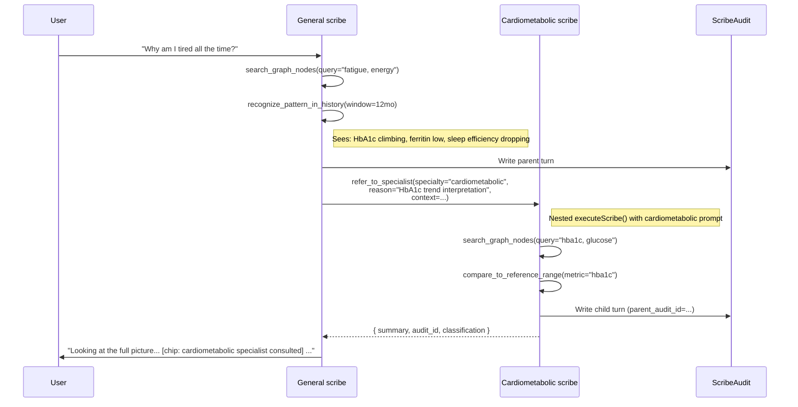

# feat: Synthetic demo persona + general/specialist referral scribes

## Overview

Three intertwined pieces, shipped as one plan:

1. **A complete specialty taxonomy** registered as data, with three core specialties fully implemented (Cardiometabolic, Sleep & Recovery, Hormonal/Endocrine) and the rest scaffolded as stubs the general scribe knows about.
2. **A "general" scribe persona** that owns the chat surface by default, sees the full graph, and refers to specialists when depth helps.
3. **A statistically synthesized demo persona** (38yo, mild metabolic syndrome, ~24 months of trended data) so the chat actually has insights to surface — answering the "I uploaded a few documents and it's not enough to get any insights" frustration without contaminating real-user paths.

This is greenfield in three places — multi-specialty registry, inter-scribe referral, statistical synthetic data — but builds on solid existing scaffolding (per-topic `Scribe` rows, topic router that returns `null` when no specialist fits, six graph-search tools, demo-user gating pattern).

## Problem Frame

Today the chat surface picks **one** specialist topic per turn (`iron`, `sleep-recovery`, `energy-fatigue`) or returns null and falls through to a single generic path. There's no general practitioner persona, no way for a specialist to defer to another specialist, and no synthetic dataset rich enough to demo the product's value proposition. The result: a sparse demo where uploading a few documents produces a graph but no narrative insight, and where the architectural promise of "team of AI specialists" isn't visible.

We want the demo experience to feel like talking to a thoughtful general practitioner who knows when to consult a colleague, backed by data dense enough that the consultations are non-trivial.

## Requirements Trace

- **R1.** A user (currently: only the demo user) opens the chat and gets a coherent general scribe response by default — without first picking a topic.
- **R2.** When the conversation calls for specialist depth, the general scribe **visibly** consults a specialist; the user sees who was consulted and why.
- **R3.** A specialty registry exists as the single source of truth for the full taxonomy: name, scope, status (`core` vs `stub`), system prompt path, safety policy. Reviewers can read it once and know the complete map.
- **R4.** Three core specialties — Cardiometabolic, Sleep & Recovery, Hormonal/Endocrine — have working system prompts, can answer in-domain questions, and can be referred to by the general scribe.
- **R5.** Stub specialties are registered (so the general scribe knows they exist) but referral to a stub falls back to the general scribe with a clear annotation. No silent dead ends.
- **R6.** A demo persona exists with ~24 months of statistically realistic data spanning all three core specialties, persistent enough that demo conversations show patterns and trends, not flat noise.
- **R7.** The synthetic data path is **demo-only** — gated by the existing `getDemoUserForSeedOnly()` pattern, lint-restricted from real-user API routes.
- **R8.** Every referral writes a `ScribeAudit` row chained to its parent turn, so the audit trail captures the full multi-specialist conversation.
- **R9.** Existing single-topic scribe behavior keeps working — `iron`, `sleep-recovery`, and `energy-fatigue` are not regressed.

## Scope Boundaries

- **No** real-user synthetic data. The persona seeds only the demo user.
- **No** new Prisma models. Reuse `Scribe`, `ScribeAudit`, `ChatMessage`, `GraphNode`, `GraphEdge`, `SourceDocument`, `SourceChunk`, `HealthDataPoint`. Add columns only if forced.
- **No** specialist-to-specialist chains beyond depth 1. The general scribe can refer; a specialist cannot recursively refer in v1.
- **No** new specialist UIs (no per-specialist landing pages, no "talk directly to the cardio scribe" mode). Specialists are reachable only via referral from general.
- **No** retraining/fine-tuning of models. "Trained on a specific dataset" maps to system prompt + tool selection, not weights.
- **No** specialty-scoped data filtering. All scribes see the full graph; differentiation lives in the prompt.

### Deferred to Separate Tasks

- **Direct-address mode** ("ask the cardio scribe…"): future iteration. Requires UX exploration first.
- **Real-user multi-specialty rollout**: gated on demo working + safety review.
- **Specialist-to-specialist referral chains** (depth >1): defer until we see whether single-hop covers the common cases.
- **Synthetic personas beyond the metabolic one**: future iteration; one persona is enough to validate the architecture.

## Context & Research

### Relevant Code and Patterns

- [src/lib/scribe/execute.ts](src/lib/scribe/execute.ts) — async-generator orchestrator that runs the multi-turn tool-use loop until `end_turn` or max retries. The referral tool will dispatch a nested call to this same function with a different `topicKey`.
- [src/lib/scribe/router/index.ts](src/lib/scribe/router/index.ts) — returns `topicKey: string | null` with confidence threshold; `null` is the hook for general-scribe fallback.
- [src/lib/scribe/policy/registry.ts](src/lib/scribe/policy/registry.ts) — current registry of three topics (`iron`, `sleep-recovery`, `energy-fatigue`). Generalize this into the full specialty registry.
- [src/lib/scribe/tool-catalog.ts](src/lib/scribe/tool-catalog.ts) — six existing tools: `search_graph_nodes`, `get_node_detail`, `get_node_provenance`, `compare_to_reference_range`, `recognize_pattern_in_history`, `route_to_gp_prep`. Add `refer_to_specialist` here.
- [src/lib/scribe/tools/route-to-gp-prep.ts](src/lib/scribe/tools/route-to-gp-prep.ts) — the existing "out-of-scope" routing tool. Pattern to follow for tool handler shape.
- [prisma/fixtures/demo-navigable-record.ts](prisma/fixtures/demo-navigable-record.ts) — existing 500+ LOC hand-built demo fixture (graph nodes/edges/source docs/chunks). The synthetic-persona pattern extends this: same direct-write approach, but generated programmatically with seeded RNG instead of hand-crafted JSON.
- [prisma/seed.ts](prisma/seed.ts) — seed runner pattern. The new demo runner mirrors its idempotent upsert/teardown structure.
- [src/lib/demo-user.ts](src/lib/demo-user.ts) — `getDemoUserForSeedOnly()` ESLint-restricted gate. The synthetic persona writer hangs off this.
- [prisma/schema.prisma:201–220](prisma/schema.prisma) — `Scribe` model keyed by `(userId, topicKey)` with unique index. No schema change needed; we just add new `topicKey` values.
- [prisma/schema.prisma:362–425](prisma/schema.prisma) — `HealthDataPoint` model. Direct-write target for synthetic vitals/sleep/labs.

### Institutional Learnings

- **`docs/solutions/`** — no prior solutions on multi-agent referral or synthetic personas. This is institutional new ground.
- **PR #83 follow-up (issue #84)** — activation funnel revealed that "silent fallback" (e.g., dropping users from a cohort without warning) is a recurring failure mode. Apply that lesson here: every stub-specialty referral surfaces "no specialist available, falling back to general" rather than silently routing.

### External References

None gathered for this plan — the architectural pieces (multi-agent orchestration, referral protocols, statistical health-data synthesis) are general patterns and the codebase has enough scaffolding to extend without external guidance. If specific question arise during implementation (e.g., realistic distributions for HbA1c trajectories), spot-research at execution time.

## Key Technical Decisions

- **Specialty registry is the contract.** A single `SPECIALTIES` array (or readonly map) is the source of truth. Router validates against it, audit logs cite from it, UI labels read from it. Adding a specialty is a one-file change.
  - **Rationale:** Avoids the drift hazard the activation-funnel review surfaced — multiple sources of truth diverge silently. One file, one constant.

- **`status: 'core' | 'stub'` lives on each registry entry.** Stubs are first-class entries with `displayName`, `scope`, and a referral-fallback message. They register their existence to the general scribe's prompt without a working system prompt of their own.
  - **Rationale:** Honest architecture — the general scribe shouldn't claim a specialist exists if it doesn't, and shouldn't pretend a specialty doesn't exist when we know it should. The stub state captures "we know about this; not built yet."

- **Referral is a tool call, not a router decision.** The general scribe calls `refer_to_specialist({ specialty, reason, context })` from inside its tool-use loop. Implementation dispatches a nested `executeScribe()` with the target's system prompt and returns the assistant message text + audit-id back to the caller.
  - **Rationale:** Reuses the existing audit/safety machinery untouched. The router still picks general-vs-direct-specialist on the first turn; mid-conversation referral is the scribe's own decision based on what it learns from the graph.

- **Referral nesting capped at depth 1.** The execution context tracks `referralDepth`; if a specialist's tool catalog includes `refer_to_specialist`, the dispatcher refuses with an error result.
  - **Rationale:** Prevents accidental loops, matches v1 scope, and keeps audit chains shallow.

- **Visible-by-default UX.** Referrals surface in the chat as an inline chip ("Asking the cardiometabolic scribe about your HbA1c trend…") that expands to show the specialist's response attributed to the specialty. The user's mental model becomes "team of specialists," not "black box AI."
  - **Rationale:** Trust and verifiability. A hidden hand-off feels magical; a visible one feels like medical care.

- **Synthetic data uses direct writes, not the LLM extraction pipeline.** The persona generator writes `HealthDataPoint`, `GraphNode`, `GraphEdge`, `SourceDocument`, and `SourceChunk` rows directly. Lab "documents" are generated as deterministic synthetic chunk text so citations resolve, but nothing routes through Claude.
  - **Rationale:** Deterministic, fast (<30s rebuild), free, and reviewable. Running real extraction over fake PDFs adds latency, cost, and randomness with no user-visible benefit.

- **Statistical synthesis uses seeded autocorrelated random walks with trends and inflections.** Each metric (e.g., HbA1c) is generated from `value(t) = baseline + trend*t + AR(1)_noise(seed) + step_change(t_inflection)`. Same seed → identical output every run.
  - **Rationale:** Determinism enables snapshot tests; autocorrelation makes the data look medically plausible (today's blood pressure correlates with yesterday's); trend + inflection makes for genuinely diagnostic-looking patterns.

- **Reuse `Scribe` table for the general persona.** A `(demoUserId, 'general')` row is upserted by the seed runner. No schema change.

- **Existing topics (`iron`, `sleep-recovery`, `energy-fatigue`) get re-classified, not deleted.** `iron` becomes a sub-topic under Cardiometabolic; `sleep-recovery` is the Sleep & Recovery specialty itself; `energy-fatigue` is a triage topic the general scribe handles. Migrate the registry mappings; preserve all existing tests.

## Open Questions

### Resolved During Planning

- **Q: How does the synthetic data write to the graph if extraction is normally LLM-driven?** A: Bypass extraction; write `GraphNode`/`GraphEdge`/`SourceChunk` rows directly. The chunks contain hand-written narrative text so citation tools find provenance.
- **Q: Do specialists see scoped data or full graph?** A: Full graph. Scoping is a future-iteration concern; for v1, the prompt shapes behavior, not the data view.
- **Q: How does the user know they're talking to a specialist?** A: Visible inline chip in the chat surface, attributed bubble. Not silent.
- **Q: Should referral loops be allowed?** A: No, capped at depth 1 in v1.
- **Q: What model do specialists use?** A: Same model as today's scribe (Claude Opus 4.6). Specialization is system prompt + tool emphasis, not weights.
- **Q: What happens when general refers to a stub specialty?** A: Error result returned to general's tool loop with "specialty not yet implemented; using general knowledge instead." General continues without the referral.

### Deferred to Implementation

- **Exact stub specialty list.** The plan proposes ~9 stubs (Mental Health, Musculoskeletal, GI, Immune/Inflammation, Reproductive, Neurological/Cognitive, Dermatology, Nutrition, Preventive Care) but the implementer should validate against a quick read of common GP referral lists and adjust before locking the registry.
- **Realistic baseline values and trends for the persona.** Implementer should pick plausible HbA1c starting values, trend slopes, BP ranges, sleep efficiency degradation curves, etc. Cite a source (UpToDate, NHANES, etc.) in code comments rather than inventing.
- **Chip vs. inline-blockquote vs. attributed-bubble for the referral UX.** Three reasonable presentations; pick the one that reads cleanest in a quick design pass during execution.
- **Whether the referral tool result includes raw transcript or summary.** Likely summary + audit-id link, but exact shape decided during execution once the rendering is sketched.
- **Migration strategy for existing `iron` + `energy-fatigue` topics.** Likely just re-categorize in the registry, but if existing scribe rows reference them, may need a one-time data migration. Defer until execution shows whether anything breaks.

## High-Level Technical Design

> *This illustrates the intended approach and is directional guidance for review, not implementation specification. The implementing agent should treat it as context, not code to reproduce.*

### Specialty registry shape

```
SPECIALTIES = [
  // Always-on
  { key: 'general',          status: 'core', displayName: 'General care',
    scope: 'Triage and coordination across all domains. Refers to specialists when depth is needed.',
    systemPromptPath: 'src/lib/scribe/specialties/general/system-prompt.md',
    safetyPolicyPath: 'src/lib/scribe/specialties/general/safety-policy.ts' },

  // Core (built out)
  { key: 'cardiometabolic',  status: 'core', displayName: 'Cardiometabolic medicine',
    scope: 'Heart, vascular, glucose, lipids, blood pressure, weight regulation.', ... },
  { key: 'sleep-recovery',   status: 'core', displayName: 'Sleep and recovery medicine',
    scope: 'Sleep architecture, HRV, fatigue, recovery patterns, iron/ferritin link.', ... },
  { key: 'hormonal-endocrine', status: 'core', displayName: 'Hormonal and endocrine health',
    scope: 'Thyroid, sex hormones, cortisol, adrenal patterns, metabolic hormone signaling.', ... },

  // Stubs (registered, not implemented)
  { key: 'mental-health',    status: 'stub', displayName: 'Mental health',
    scope: 'Mood, anxiety, cognition. Not yet built.', systemPromptPath: null, ... },
  // ...mksk, gi, immune, reproductive, neuro-cognitive, dermatology,
  //    nutrition, preventive-care
]
```

### Referral flow (visible to user)



### Synthetic data shape (per metric)

For each metric (e.g., `HbA1c`):
- `baseline` — clinically plausible starting value (e.g., 5.4)
- `trend_per_month` — small drift (e.g., +0.04 → climbs to 6.3 over 24mo)
- `noise_sigma` and `ar1_phi` — autocorrelated short-term variation
- `inflection_at_month` — optional step change (e.g., user starts metformin → trend slope halves)
- `sample_cadence` — daily for vitals/sleep, weekly for weight, quarterly for labs

Generator returns a deterministic time series given a seed. The seed lives in the persona definition so every demo refresh produces the exact same graph.

## Implementation Units

- [ ] **Unit 1: Specialty registry**

**Goal:** Generalize the existing topic-policy registry into a single specialty registry that is the source of truth for name, scope, status, system prompt path, and safety policy. Migrate existing topics into it without regression.

**Requirements:** R3, R5, R9

**Dependencies:** None.

**Files:**
- Create: `src/lib/scribe/specialties/registry.ts`
- Create: `src/lib/scribe/specialties/types.ts`
- Modify: `src/lib/scribe/policy/registry.ts` (now re-exports from specialties for back-compat, or is replaced if call-sites updated cleanly)
- Modify: `src/lib/scribe/router/index.ts` (validate against the new registry's `core`-status keys)
- Test: `src/lib/scribe/specialties/registry.test.ts`

**Approach:**
- Define `Specialty` type with `key`, `status: 'core' | 'stub'`, `displayName`, `scope`, `systemPromptPath: string | null`, `safetyPolicyKey: string | null`.
- Export `SPECIALTIES` as a frozen array. Helper functions: `getSpecialty(key)`, `listCoreSpecialties()`, `listStubSpecialties()`, `isCoreSpecialty(key)`.
- Carry forward `iron` (now under cardiometabolic), `sleep-recovery`, `energy-fatigue` (now a triage topic the general scribe owns directly) so existing tests pass.

**Patterns to follow:**
- [src/lib/scribe/policy/registry.ts](src/lib/scribe/policy/registry.ts) — same shape, expanded fields.

**Test scenarios:**
- Happy path: `getSpecialty('cardiometabolic')` returns a core entry with non-null prompt path.
- Happy path: `getSpecialty('mental-health')` returns a stub entry with null prompt path.
- Edge case: `getSpecialty('not-a-key')` returns `undefined`.
- Edge case: `listCoreSpecialties()` includes general + 3 core specialties = 4 entries.
- Integration: existing router tests against `iron`, `sleep-recovery`, `energy-fatigue` continue to pass without modification (or with mechanical-only updates).

**Verification:**
- Existing 967+ tests still green.
- Adding a specialty is a one-file edit (`registry.ts`).

---

- [ ] **Unit 2: General scribe persona**

**Goal:** Add a `general` topicKey with system prompt and safety policy. Wire the router to fall back to `general` when its decision is `null`. Ensure the existing single-topic behavior (a confident specialist match) still works.

**Requirements:** R1, R9

**Dependencies:** Unit 1.

**Files:**
- Create: `src/lib/scribe/specialties/general/system-prompt.md`
- Create: `src/lib/scribe/specialties/general/safety-policy.ts`
- Create: `src/lib/scribe/specialties/general/index.ts`
- Modify: `src/lib/scribe/router/index.ts` (`null` → `'general'` at the call site or via a wrapping helper; preserve `confidence` and `reasoning` for audit)
- Modify: `src/lib/scribe/repo.ts` (ensure `getOrCreateScribeFor(userId, 'general')` works)
- Test: `src/lib/scribe/specialties/general/general.test.ts`

**Approach:**
- System prompt: care-coordinator voice, full tool catalog access, instructed to consult specialists when the data warrants it. Emphasize: cite graph evidence, name uncertainty, don't claim diagnoses.
- Safety policy: same baseline as existing topics — clinical-safe classification, refuse out-of-scope.
- Router fallback: a `resolveTopicKey(decision)` helper returns `decision.topicKey ?? 'general'`. Don't mutate router output — wrap it where executeScribe is invoked.

**Patterns to follow:**
- [src/lib/scribe/policy/sleep-recovery.ts](src/lib/scribe/policy/sleep-recovery.ts) for safety policy shape.
- Existing system prompts under `src/lib/scribe/policy/` for tone calibration.

**Test scenarios:**
- Happy path: router returns `null` → executeScribe is invoked with `topicKey='general'`.
- Happy path: router returns `'iron'` (existing) → executeScribe is invoked with `topicKey='iron'`, general not engaged.
- Edge case: router returns `'cardiometabolic'` (new) → executeScribe runs the new specialist, not general. (Cross-validates Unit 3.)
- Integration: a real LLM call to the general scribe with a graph-search question lands a clinical-safe answer with at least one citation.

**Verification:**
- Asking a vague question without a clear specialty match (e.g., "how am I doing overall?") engages the general scribe with an audit row showing `topicKey='general'`.

---

- [ ] **Unit 3: Three core specialist scribes**

**Goal:** System prompts and safety policies for `cardiometabolic`, `sleep-recovery` (extend existing), and `hormonal-endocrine`. Register each in the specialty registry with `status: 'core'`. Wire each into the router's valid-keys list so the router can directly route when confidence is high.

**Requirements:** R4, R9

**Dependencies:** Unit 1.

**Files:**
- Create: `src/lib/scribe/specialties/cardiometabolic/{system-prompt.md,safety-policy.ts,index.ts}`
- Create: `src/lib/scribe/specialties/hormonal-endocrine/{system-prompt.md,safety-policy.ts,index.ts}`
- Modify: `src/lib/scribe/specialties/sleep-recovery/{system-prompt.md,safety-policy.ts}` (port from existing `policy/sleep-recovery.ts`, broaden scope from "sleep recovery topic" to the full sleep-and-recovery specialty including iron-fatigue link)
- Modify: `src/lib/scribe/specialties/registry.ts` (register the three)
- Test: `src/lib/scribe/specialties/cardiometabolic/cardiometabolic.test.ts`
- Test: `src/lib/scribe/specialties/hormonal-endocrine/hormonal-endocrine.test.ts`

**Approach:**
- Each specialist prompt: scope statement, the metrics they're domain expert on, when to defer to general or another specialist (referral hints, even though specialists won't refer in v1 — write the prompt for v2 forward compatibility).
- Tool catalog: same six tools as today + the new `refer_to_specialist` tool **disabled** (filtered out for specialist scribes in v1; only general gets it).
- Cardiometabolic prompt explicitly absorbs the existing `iron` topic; hormonal-endocrine starts fresh.

**Patterns to follow:**
- Existing `src/lib/scribe/policy/iron.ts` and `policy/sleep-recovery.ts` for prompt voice and reference-range handling.

**Test scenarios:**
- Happy path: cardiometabolic scribe asked about HbA1c trend on the demo persona returns a clinical-safe answer citing the relevant graph nodes.
- Happy path: hormonal-endocrine scribe asked about thyroid markers on the demo persona returns a clinical-safe answer.
- Happy path: sleep-recovery answers correctly about iron-fatigue link (consolidated scope).
- Edge case: each specialist asked about an out-of-scope topic refuses or routes to gp-prep with `safetyClassification='out-of-scope-routed'`.
- Edge case: each specialist's tool list does **not** include `refer_to_specialist`. (Tested by inspecting the resolved tool list at scribe-construction time.)

**Verification:**
- Three new audit rows appear with `topicKey` matching each new specialty after a smoke test against the demo persona.

---

- [ ] **Unit 4: Stub specialty registration**

**Goal:** Register the remaining specialties as `status: 'stub'` so the general scribe knows they exist. Stubs have a displayName, a scope description, and a referral-fallback message. They have no system prompt and cannot be selected by the router.

**Requirements:** R5

**Dependencies:** Unit 1.

**Files:**
- Modify: `src/lib/scribe/specialties/registry.ts`
- Test: `src/lib/scribe/specialties/registry.test.ts` (extend Unit 1 tests)

**Approach:**
- Register entries for: Mental Health, Musculoskeletal, GI/Digestive, Immune/Inflammation, Reproductive, Neurological/Cognitive, Dermatology, Nutrition, Preventive Care. Implementer should validate this list against a quick read of common GP-referral specialties and adjust before locking.
- Each stub: `status: 'stub'`, `systemPromptPath: null`, `safetyPolicyKey: null`, plus a `referralFallbackMessage` field that the referral tool returns when general tries to consult them.
- Router rejects stub keys (extends existing "unregistered topicKey coerced to null" logic with "stub topicKey coerced to null").

**Patterns to follow:**
- Unit 1 registry shape. No new patterns.

**Test scenarios:**
- Happy path: `getSpecialty('mental-health').status === 'stub'`.
- Edge case: router given a confident match for `'mental-health'` coerces to `null` with reasoning string.
- Edge case: `listStubSpecialties()` returns the full set; `listCoreSpecialties()` excludes them.
- Integration: general scribe's system prompt rendering includes stub names in its "specialists I can consult" list with a marker indicating which are not yet built.

**Verification:**
- The general scribe's prompt accurately describes the full taxonomy.

---

- [ ] **Unit 5: Referral protocol — `refer_to_specialist` tool**

**Goal:** New tool the general scribe (only) can call from inside its tool-use loop. Dispatches a nested `executeScribe()` with the target specialty's prompt, captures the result, writes a chained audit row, and returns a structured summary to the caller.

**Requirements:** R2, R8

**Dependencies:** Units 1, 2, 3, 4.

**Files:**
- Create: `src/lib/scribe/tools/refer-to-specialist.ts`
- Create: `src/lib/scribe/tools/refer-to-specialist.test.ts`
- Modify: `src/lib/scribe/tool-catalog.ts` (register the new tool, gated to general only)
- Modify: `src/lib/scribe/execute.ts` (thread `referralDepth` through the execution context; refuse depth > 0 for any tool, including this one)
- Modify: `src/lib/scribe/repo.ts` (`ScribeAudit` write needs to accept an optional `parentRequestId` for chaining)

**Approach:**
- Tool input: `{ specialty: string, reason: string, context: string }` (Zod-validated against core specialty keys + stub keys).
- Behavior:
  - Stub target → return `{ status: 'stub', message: <referralFallbackMessage> }` without dispatching.
  - Core target → dispatch nested `executeScribe()` with `referralDepth: 1`, target specialty's system prompt, the `context` as the user-equivalent message, and the **same userId/graph context**.
  - Capture the assistant's final message + audit id; return `{ status: 'consulted', specialty, summary, auditId, classification }` to the caller.
- Audit chaining: child `ScribeAudit` row gets `parentRequestId` set to the parent turn's request id. Existing `ScribeAudit` upsert-by-requestId invariant preserved (D11).
- Depth guard: any tool dispatched with `referralDepth >= 1` rejects with a structured error.

**Execution note:** Test-first. The protocol has subtle audit-chaining and depth-guard semantics; failing integration tests anchor the contract before implementation drifts.

**Patterns to follow:**
- [src/lib/scribe/tools/route-to-gp-prep.ts](src/lib/scribe/tools/route-to-gp-prep.ts) for tool handler shape, Zod schema, error result format.
- [src/lib/scribe/execute.ts](src/lib/scribe/execute.ts) for invoking nested execution.

**Test scenarios:**
- Happy path: general scribe calls `refer_to_specialist({ specialty: 'cardiometabolic', reason: '...', context: '...' })`; returns a consulted result with non-empty summary and a valid auditId.
- Happy path: child audit row's `parentRequestId` matches the parent turn's requestId.
- Edge case: target is a stub → returns `{ status: 'stub', message: ... }`, no nested dispatch, no child audit row.
- Edge case: target is `'general'` (self-referral) → tool returns a structured error.
- Edge case: target is an unregistered key → tool returns a structured error.
- Error path: nested execute throws → caller's audit row written with classification reflecting the failure; tool returns `{ status: 'error', message }` rather than propagating.
- Error path: a specialist scribe attempts to call `refer_to_specialist` (depth-guard check) → tool returns a structured error and parent execution continues. (Specialists shouldn't have access to the tool, but this is defense in depth.)
- Integration: full roundtrip on the demo persona — general turn → referral → specialist turn → general final response. Both audit rows present, chain intact, classification clean.

**Verification:**
- Querying ScribeAudit by `parentRequestId` returns the child row for any referral that happened.
- Specialists never appear as the orchestrating scribe with a non-zero referral depth.

---

- [ ] **Unit 6: Referral UX in chat surface**

**Goal:** When a turn included a referral, the chat surface renders an inline indicator with the consulted specialty and an expandable specialist response. Visible-by-default, attributable.

**Requirements:** R2

**Dependencies:** Unit 5.

**Files:**
- Modify: `src/app/(app)/ask/page.tsx` (or whichever component renders chat turns — confirm at execution time)
- Modify: `src/app/api/chat/send/route.ts` (SSE payload: include referral metadata when present)
- Modify: `src/lib/chat/turn.ts` (collect referral metadata from tool-call results, surface in the turn payload)
- Create: `src/components/chat/ReferralChip.tsx` (or extend an existing message-rendering component)
- Test: `src/components/chat/ReferralChip.test.tsx`

**Approach:**
- Decide chip-vs-bubble during execution; ship one variant. Chip-with-expandable-summary leans cleaner; an attributed second bubble shows more depth. Pick one, ship it, iterate later.
- SSE event: when a referral completes, emit a `referral` event with `{ specialty, displayName, reason, summary, auditId }`. Renderer interleaves it inline with the assistant turn.
- Tooltip / aria-label includes the safety classification so accessibility doesn't lose context.

**Patterns to follow:**
- Existing chat message components in `src/components/chat/` (verify path at execution time).
- Existing SSE event shapes in `src/app/api/chat/send/route.ts`.

**Test scenarios:**
- Happy path: `ReferralChip` renders displayName from the registry, not a raw key.
- Happy path: clicking the chip expands the specialist summary.
- Edge case: turn with no referral renders unchanged.
- Edge case: stub-status referral renders a different chip variant ("specialist not yet available — answered with general knowledge").
- Integration: SSE roundtrip — server emits referral event → client renders chip → audit-id link is clickable (or at least surfaces as data-attribute for future deep-link).

**Verification:**
- Manual smoke test: ask the demo user "why am I tired" in the chat; see at least one referral chip appear, expandable, with attributed text.

---

- [ ] **Unit 7: Synthetic persona generator**

**Goal:** A demo-only seed runner that creates a single persona — 38yo male, mild metabolic syndrome — with ~24 months of statistically realistic data (vitals, sleep, labs) and a hand-curated graph narrative dense enough that the chat surface produces real insights.

**Requirements:** R6, R7

**Dependencies:** None for the data-writing pieces; benefits from Units 1–4 being shipped so end-to-end demos work, but can be developed in parallel.

**Files:**
- Create: `prisma/fixtures/synthetic/metabolic-persona.ts` (persona definition: seed, baseline values, trends, inflections, narrative beats)
- Create: `prisma/fixtures/synthetic/generators.ts` (autocorrelated-walk + trend + inflection generator; seeded RNG)
- Create: `prisma/fixtures/synthetic/graph-narrative.ts` (hand-curated set of GraphNode + GraphEdge + SourceChunk rows with citation-resolvable text — e.g., "Lab report 2025-Q3: HbA1c 6.1, ferritin 32…")
- Create: `scripts/demo/seed-metabolic-persona.ts` (idempotent runner: tear down existing demo data, regenerate, upsert)
- Modify: `src/lib/demo-user.ts` (extend if needed; the existing `getDemoUserForSeedOnly()` gate is the boundary)
- Modify: `package.json` (add `npm run demo:seed` script)
- Test: `prisma/fixtures/synthetic/generators.test.ts`
- Test: `prisma/fixtures/synthetic/metabolic-persona.test.ts`

**Approach:**
- Seeded PRNG (e.g., `seedrandom` or a small in-house Mulberry32) so every regeneration is byte-identical.
- For each metric: `value(t) = clamp(baseline + trend*t + AR(1)_noise + step_change(t_inflection), [physical_min, physical_max])`.
- Quarterly labs (HbA1c, lipid panel, ferritin, TSH, free T, fasting glucose, CRP), weekly weight, daily BP morning/evening, daily sleep efficiency + total sleep + HRV, weekly mood/energy self-report.
- One inflection at month 14: persona started lifestyle intervention → trend slope reduces in cardiometabolic markers.
- Hand-curated graph: ~30–50 GraphNode rows (key conditions: pre-diabetic trajectory, low ferritin, borderline hypertension, sleep efficiency decline, low-normal testosterone), ~40–80 GraphEdge rows linking them with `SUPPORTS` / `CAUSES` / `TEMPORAL_SUCCEEDS` / `OUTCOME_CHANGED`. SourceChunk rows for citation provenance contain hand-written narrative paragraphs.
- Seed runner: idempotent — wraps everything in a transaction that deletes existing demo-user data first, then writes fresh.

**Execution note:** Capture realistic baseline values and trend slopes at execution time by spot-checking against UpToDate / NHANES / clinical sources; cite the source in code comments. Don't invent the medicine.

**Patterns to follow:**
- [prisma/fixtures/demo-navigable-record.ts](prisma/fixtures/demo-navigable-record.ts) for the direct-write graph fixture pattern.
- [prisma/seed.ts](prisma/seed.ts) for the idempotent runner shape.
- [src/lib/demo-user.ts](src/lib/demo-user.ts) for the demo-only gate.

**Test scenarios:**
- Happy path: running the generator twice with the same seed produces byte-identical output (snapshot test on a serialized representation).
- Happy path: a 24-month HbA1c series shows a monotonic-ish trend with autocorrelated noise (assert ≥80% of consecutive differences are smaller than the long-run trend slope * 12).
- Happy path: the inflection at month 14 reduces post-inflection trend by at least 50% (sanity-check the step-change machinery).
- Edge case: clamping prevents physically-impossible values (e.g., HbA1c never goes below 4.0 or above 12.0).
- Integration: running `npm run demo:seed` against a clean local DB completes in <30s and leaves the demo user with non-zero counts in `HealthDataPoint`, `GraphNode`, `GraphEdge`, `SourceChunk`.
- Integration: the general scribe asked "what's been changing in my data?" returns an answer that cites at least three different graph nodes covering at least two specialties.

**Verification:**
- `npm run demo:seed && npm run dev` lands a chat session where the general scribe demonstrably surfaces patterns and at least one specialist referral on the first or second turn.
- Re-running `npm run demo:seed` produces the same data.

---

## System-Wide Impact

- **Interaction graph:** New tool `refer_to_specialist` joins six existing tools in `tool-catalog.ts`. Tool catalog now branches by topicKey (general gets seven; specialists get six). The router's `null` return path is no longer dead — it routes to general.
- **Error propagation:** Referral failures must not propagate silently. The referral tool catches nested-execute errors and returns structured error results to the caller; both parent and child audits land. Stub-target referrals return a recognizable `'stub'` status that the general scribe knows how to interpret in its prompt.
- **State lifecycle risks:** `ScribeAudit` is append-only with the requestId-upsert invariant. New `parentRequestId` field (on existing model — confirm during Unit 5; if a schema change is required, scope it as a sub-unit) preserves the invariant; never delete or mutate audit rows. The synthetic-data seed runner deletes-then-rewrites for the demo user only — guard with `getDemoUserForSeedOnly()` and assert at the top of the runner.
- **API surface parity:** No new public API routes. SSE event from `chat/send/route.ts` adds an event type; consumers parse it as additive (existing clients tolerate unknown events).
- **Integration coverage:** The full general → referral → specialist → response loop must be exercised by an integration test against a real (test) DB and a real LLM call to confirm the audit chain, classification handling, and turn payload assembly all hold together. Mocks alone can't prove it.
- **Unchanged invariants:** Existing single-topic scribe behavior for `iron`, `sleep-recovery`, `energy-fatigue` continues to work end-to-end. The router still returns these keys when confidence is high; executeScribe still runs the topic-scoped scribe; ScribeAudit writes the same way.

## Risks & Dependencies

| Risk | Mitigation |
|---|---|
| Referral nested execution doubles latency on the user-visible turn. | Stream the parent's tokens normally; surface the referral chip after the child completes. Cap referrals at 1 per turn in v1 (enforce in tool dispatcher). Measure on the demo persona before declaring done. |
| Statistical synthesis produces medically implausible series (e.g., HbA1c oscillating wildly). | Seeded determinism + clamping + an integration test that asserts physical ranges + spot-check at execution time against clinical references. |
| `ScribeAudit.parentRequestId` is a schema change we hadn't planned for. | Verify during Unit 5; if it's not on the existing model, add it as a nullable column (additive, zero-downtime) and document in the unit. Defer to implementation. |
| Demo-data isolation slips and synthetic rows reach a non-demo user. | Three guards: `getDemoUserForSeedOnly()` runtime gate, ESLint restriction on imports outside `prisma/`, `scripts/`, top-of-runner assertion that the resolved user is the demo user. |
| Existing topics (`iron`, `energy-fatigue`) get re-categorized in a way that breaks legacy scribe rows. | Migration is metadata-only (registry change); existing `Scribe` rows keyed by old topicKeys keep working until next prompt update. Verify with the existing 967-test baseline. |
| Stub specialties become silent dead ends. | Stub referral always returns the registered `referralFallbackMessage` to the caller; chat UX renders a distinct chip variant. Tested in Unit 5 + Unit 6. |
| Specialist prompts diverge over time (e.g., cardiometabolic prompt updated, hormonal-endocrine drifts). | Single `specialties/` directory keeps prompts close together; periodic review during deepening passes. Out of scope for v1 to automate. |
| Synthetic narrative chunks make claims (e.g., "patient started metformin in March 2025") that conflict with the data series. | Generator and narrative are co-defined in `metabolic-persona.ts`; narrative paragraphs reference the same inflection points as the data generator. Integration test asserts citation timestamps fall within the data window. |

## Documentation / Operational Notes

- Add a short README at `prisma/fixtures/synthetic/README.md` explaining: this is demo-only, how to add a new persona, why we generate-not-extract.
- Add a short note in the team's onboarding doc (or wherever `npm run demo:seed` is going to be advertised) about the demo workflow.
- No production rollout, no feature flag, no monitoring change. Demo-only.

## Sources & References

- Local research summary captured in this conversation (no origin requirements doc — this plan was direct-entry from `ce:plan` after a planning-bootstrap).
- Existing scribe scaffolding (referenced inline above).
- Prior art for synthetic health-data generation: defer to execution-time spot research.
- Lesson from PR #83 / issue #84: "silent failure modes mislead the reader" — applied here to stub-specialty referral handling.
