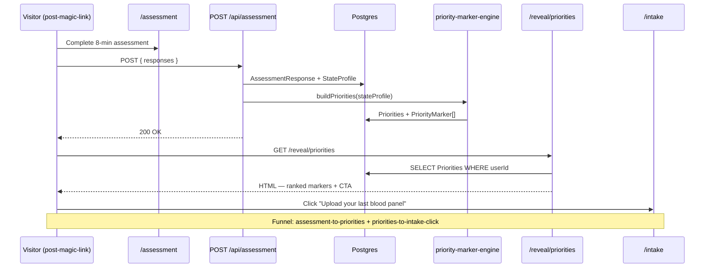

# feat: Priority markers — pivot post-assessment deliverable from supplements to data

## Overview

Pivot the post-assessment deliverable from supplement protocols (compounds + dosages) to **priority biomarker recommendations**. Same architectural surface (`/reveal/*`, the assessment + archetype system), fundamentally different output. The user lands on a personalised list of "the markers worth measuring for someone like you," with a primary CTA into `/intake` to upload an existing panel or order one.

This closes Move 1 of the authed-product finishing list ([docs/ideation/2026-05-10-authed-product-finishing.md](../ideation/2026-05-10-authed-product-finishing.md)) and is a pre-requisite for Tier 1 Moves 2 (DB persistence) and 3 (GDPR right-to-X) — those plans land separately, after this one ships.

The pivot does three things at once:

1. **Closes the regulatory exposure** that Phase 0's marketing funnel inadvertently amplified. Every paying customer signing up via `/uk/fatigue-in-men` or `/us/fatigue-in-men` today consents to LLM processing on `/onboarding`, then receives a milligram-level supplement stack as their first deliverable. That is FDA SaMD / UK MHRA / FTC HBNR-shaped exposure shipped to production. Priority markers (data-acquisition guidance, not intervention guidance) is materially different territory.
2. **Aligns the authed-product surface with the marketing position.** Phase 0 chose Form Intelligence (translate your numbers); the reveal flow has been saying Supply (take these compounds). The pivot collapses the two-products-glued-together state into one coherent product.
3. **Drives the funnel.** The new reveal CTA points at `/intake`. Today the post-assessment deliverable IS the destination — there's no path forward. After the pivot, the deliverable becomes the on-ramp to data upload, which is what the marketing funnel was built to drive.

Three phases:

- **Phase 1 — schema + engine + surface retirement (eng-only, ~3 days):** rename `Protocol`/`ProtocolItem` tables to `Priorities`/`PriorityMarker`; replace `protocol-engine.ts` with `priority-marker-engine.ts` (placeholder content); retire `/guide` (redirect → `/ask`) and `/setup` (preferences fold into `/settings`); extend editorial-QA scan; add funnel instrumentation. Eng can run in parallel with founder/clinical content work below.
- **Phase 2 — clinical content + reveal rewrite (~5–10 days, gated on clinical review):** founder + clinical reviewers author the archetype-to-priority-markers mapping (8 archetypes × 3–5 markers each); engineering rewrites `/reveal/protocol` → `/reveal/priorities` against the locked content; `/protocol` repurposes to "priority markers over time" (or temp-redirects).
- **Phase 3 — production deploy gate:** UK GP + US PCP review of the priority-marker output complete; reviewer notes addressed; editorial-QA green; funnel instrumentation active. Then ship to main.

The eng pause in effect since 2026-05-10 stays in effect for Phase 1 (Stripe / preview tier / lifecycle emails). This work is **finishing what's already in users' hands**, not building new features against unvalidated demand.

## Decision Frame

| Decision | Stance |
|---|---|
| **Output shape** | 3–5 ranked priority markers per archetype. Each carries: marker name, one-sentence "why this matters for you" rationale tied to assessment answers, category tag, UK/US panel availability indicator. **No compounds, no doses, no supplement names anywhere in the output.** |
| **Architecture** | Reuse the existing assessment + archetype + state-profile system. Only the output mapping changes (archetypes map to priority-marker sets instead of compound stacks). Schema rename rather than throw-and-rebuild. |
| **Primary CTA from `/reveal/priorities`** | "Upload your last blood panel" (if applicable) and "Order one of these panels" (provider links, neutral; affiliate question deferred). Both route to `/intake`. |
| **`/guide` future** | Retire. Redirect `/guide` → `/ask`. The home gear icon's link to `/guide` becomes `/settings` (the obvious target). The `/reveal/begin` "Talk to our guide" CTA becomes "Open your record" or similar. |
| **`/setup` future** | Retire from onboarding. Wake/wind-down preferences fold into `/settings` (where they already partially live). The mock-protocol-timeline preview dies with the pivot. |
| **Migration** | One existing `Protocol` row in production. Accept the data loss as part of the rename — truncate before schema rename; no migration script. If production count is non-zero on the day of the rename, revisit. |
| **Clinical review posture** | Same Path A regulatory posture as the Phase 0 marketing pages — descriptive, not prescriptive. Priority-marker output reads as "here's what's worth measuring for your profile," not "here's what your profile shows." Clinical reviewers gate on output content; legal-review-of-the-system itself is deferred (still on the Phase 1 prerequisite list). |

## Requirements

| # | Requirement | Source |
|---|---|---|
| **R1** | After completing `/assessment`, the user lands on `/reveal/priorities` (replacing `/reveal/protocol`) with a personalised list of 3–5 priority biomarkers ordered by impact-on-symptom for their archetype. | Brainstorm D1 + D2 |
| **R2** | Each priority marker on `/reveal/priorities` displays: marker name, one-sentence rationale tied to assessment answers, category tag, UK/US panel availability indicator. **Zero compound names, zero dose strings, zero supplement names** anywhere in the rendered output. | Brainstorm D2 + D9 |
| **R3** | The primary CTA on `/reveal/priorities` and any continuation surface routes to `/intake`. Secondary "Order a panel" links route to vetted provider URLs (UK + US). The post-assessment deliverable is no longer a destination — it is the on-ramp to data upload. | Brainstorm D3 |
| **R4** | The existing `AssessmentResponse` → `StateProfile` → archetype mapping is preserved. Only the archetype-to-output mapping changes. The assessment questions, scoring, and archetype taxonomy do not change. | Brainstorm D4 |
| **R5** | The `Protocol` and `ProtocolItem` Prisma models are renamed to `Priorities` and `PriorityMarker`. Old fields (`compounds`, `dosage`, `timeSlot`, `timeLabel`, `mechanism`, `evidenceTier`) are dropped. New fields (`markerName`, `rationale`, `category`, `panelAvailability`) are added. | Brainstorm D5 |
| **R6** | `/guide` is removed from the user-facing surface. The route returns a 308 redirect to `/ask`. The home page's gear icon links to `/settings`. The `/reveal/begin` "Talk to our guide" CTA copy is replaced. `src/lib/mock-data.ts` `guideResponses` is deleted along with the rest of the supplement-protocol legacy. | Brainstorm D6 |
| **R7** | `/protocol` is repurposed as "priority markers over time" — a versioned history view of the user's priority-marker recommendations. Day 1, when there is only one snapshot, it default-redirects to `/reveal/priorities`. Once a second snapshot exists, it renders the version history. | Brainstorm D7 |
| **R8** | `/setup` is removed from the onboarding flow. The wake/wind-down preferences are preserved by being moved to `/settings`. The supplement-timeline preview is deleted. The verify route's redirect target list updates accordingly. | Brainstorm + IA implication of D5 |
| **R9** | The editorial-QA gate ([src/lib/compliance/static-copy.test.ts](../../src/lib/compliance/static-copy.test.ts)) is extended to scan all new and rewritten surfaces (`/reveal/priorities`, the new `priority-marker-engine.ts`, the archetype content files). The forbidden-phrases list ([src/lib/scribe/policy/forbidden-phrases.ts](../../src/lib/scribe/policy/forbidden-phrases.ts)) catches drug names, dose strings, and imperative-treatment language. CI fails on violations. | Brainstorm D9 |
| **R10** | Funnel instrumentation captures the post-assessment-to-intake conversion. A new activation-funnel stage `assessment-to-priorities-view` plus a `priorities-to-intake-click` counter on `/reveal/priorities`. Reuses the existing `LandingPageVisit` + `DiagnosticEvent` patterns from Phase 0. | Brainstorm Success Criterion 3 |
| **R11** | Production deploy is gated on UK GP and US PCP review of the priority-marker output. Reviewers' notes are addressed in the content before merge. The review is a hard gate, not advisory. | Brainstorm D8 + Success Criterion 4 |

## Key Technical Decisions

| # | Decision | Rationale |
|---|---|---|
| **D1** | **Schema rename via `prisma db push --accept-data-loss`.** No migration directory in this repo. Accept the loss of 1 production `Protocol` row. | Matches the existing deploy mechanism (Phase 0 used the same path). Migration script for 1 row is over-engineering. |
| **D2** | **Reuse the `Priorities` table shape from `Protocol` (1:1, versioned, rationale).** New `PriorityMarker` table parallels `ProtocolItem` shape (per-priorities row, ordered list of items). | The structural shape is sound; only the field names + content change. Throw-and-rebuild would lose the architectural insight that protocols and priorities are isomorphic at the data layer. |
| **D3** | **`priority-marker-engine.ts` is a pure function over `StateProfile`.** Same signature as `protocol-engine.ts`'s `buildProtocol`: takes assessment + state profile, returns priorities. Stateless, testable in isolation. | Mirrors the existing engine pattern. Easy to unit-test against archetype fixtures. |
| **D4** | **Archetype taxonomy is locked from existing code.** Eight archetypes from [src/lib/protocol-engine.ts:14-58](../../src/lib/protocol-engine.ts#L14): sustained-activator, fragmented-sleeper, sympathetic-dominant, flat-liner, over-stimulated, well-regulated, plus two implicit. Don't redesign the taxonomy. | Out of scope. Assessment-to-archetype is working; we're only changing the output mapping. |
| **D5** | **Priority-marker content lives in TypeScript data files**, mirroring the marketing pages pattern (`content/marketing/{market}/{slug}.ts`). Path: `content/priority-markers/{archetype}.ts`. Each file exports a typed `ArchetypePriorities` object. | Type-safety + the editorial-QA scan (R9) extends to walk this folder. Same pattern that worked for marketing pages. Clinical reviewer can read the .ts files directly without engineering involvement. |
| **D6** | **`/protocol` temp-redirect strategy until 2nd snapshot exists.** Day 1 implementation: hard-redirect to `/reveal/priorities`. Plan a follow-up issue for the version-history view once we have any user with a 2nd snapshot. | Right-sized to current needs. Building a version-history view for zero users is over-engineering. |

## Output Structure

```
content/
  priority-markers/
    sustained-activator.ts
    fragmented-sleeper.ts
    sympathetic-dominant.ts
    flat-liner.ts
    over-stimulated.ts
    well-regulated.ts
    (+ 2 more archetypes per current taxonomy)
prisma/
  schema.prisma                                # rename Protocol → Priorities;
                                               # rename ProtocolItem → PriorityMarker;
                                               # field changes per R5
src/
  app/
    reveal/
      protocol/page.tsx                        # DELETE
      priorities/page.tsx                      # NEW — replaces protocol/ as the climax
    (app)/
      protocol/page.tsx                        # MODIFY — redirect to /reveal/priorities
                                               # until 2nd snapshot exists (D6)
      guide/page.tsx                           # DELETE
      guide/route.ts                           # NEW — 308 redirect to /ask
      home/page.tsx                            # MODIFY — gear icon link
      settings/page.tsx                        # MODIFY — fold wake/wind-down preferences
    setup/page.tsx                             # DELETE
    api/auth/verify/route.ts                   # MODIFY — drop /setup from redirect list
  components/
    marketing/                                 # untouched
    reveal/
      priorities-list.tsx                      # NEW — renders the ranked marker list
      priority-marker-card.tsx                 # NEW — single marker row
  lib/
    protocol-engine.ts                         # DELETE
    priority-marker-engine.ts                  # NEW — buildPriorities(assessment, stateProfile)
    mock-data.ts                               # DELETE entirely (mockProtocolItems +
                                               # guideResponses are the only consumers
                                               # left after this pivot)
    metrics/
      activation-funnel.ts                     # MODIFY — add assessment-to-priorities stage
    compliance/
      static-copy.test.ts                      # MODIFY — scan content/priority-markers/
```

## Visitor → Priority Markers → Intake Sequence



## Implementation Units

### Phase 1 — schema + engine + surface retirement (~3 days eng, no content dependency)

#### U1 · Schema rename + supplement-protocol code deletion

**Goal.** Rename `Protocol` → `Priorities`, `ProtocolItem` → `PriorityMarker`. Drop old fields, add new fields. Delete `src/lib/protocol-engine.ts` and `src/lib/mock-data.ts`. Delete the `/reveal/protocol`, `/protocol` (existing implementation), `/guide`, and `/setup` pages.

**Files.**
- Modify: [prisma/schema.prisma](../../prisma/schema.prisma) — rename two models, update fields per R5. Cascade unchanged.
- Modify: `src/types.ts` (or wherever `Protocol`, `ProtocolItem`, etc. types are exported) — rename types, update field shapes.
- Delete: [src/lib/protocol-engine.ts](../../src/lib/protocol-engine.ts), [src/lib/mock-data.ts](../../src/lib/mock-data.ts).
- Delete: [src/app/reveal/protocol/page.tsx](../../src/app/reveal/protocol/page.tsx), [src/app/(app)/guide/page.tsx](../../src/app/%28app%29/guide/page.tsx), [src/app/setup/page.tsx](../../src/app/setup/page.tsx).
- DB: `psql -d morning_form_dev -c 'TRUNCATE "Protocol", "ProtocolItem", "ProtocolAdjustment" CASCADE;'` then `pnpm prisma db push --accept-data-loss`.

**Approach.** Single coordinated commit. Type-checker will surface every consumer that needs updating; chase them down. The hardest changes are likely in `/protocol/page.tsx` (modifies in U6), `/onboarding/page.tsx` (the "next step" link), and the verify route's redirect logic (modifies in U7).

**Patterns to follow.** The Phase 0 schema migrations ([docs/plans/2026-05-09-001-feat-programmatic-seo-geo-plan.md](2026-05-09-001-feat-programmatic-seo-geo-plan.md) U3, U5) used the same `prisma db push --accept-data-loss` pattern for new model additions; rename + drop is the inverse but the deploy mechanism is identical.

**Test scenarios.**
- Happy path: schema migration applies cleanly to dev DB after TRUNCATE.
- TS compiler clean across the repo after the rename.
- `pnpm vitest run` green (existing protocol-related tests will fail; they need updates or deletion in this unit).
- Lint clean.

**Verification.** `pnpm tsc --noEmit && pnpm lint && pnpm vitest run` all green. The supplement-protocol legacy is gone from the codebase entirely (grep confirms no `protocol-engine`, `mockProtocolItems`, or `guideResponses` references remain).

**Dependencies.** None — this is the foundation.

**Execution note.** Test-first discipline doesn't apply meaningfully here; this is a coordinated rename + delete. Run tsc continuously to surface fallout.

---

#### U2 · `priority-marker-engine.ts` — placeholder content

**Goal.** Stand up the new engine with the same signature shape as the deleted `protocol-engine.ts`. Output a stub priority-markers structure for each archetype using clearly-marked placeholder content. **U3 will replace the placeholder content with clinical-reviewer-approved markers.**

**Files.**
- Create: `src/lib/priority-marker-engine.ts` — exports `buildPriorities(stateProfile)` returning a `Priorities`-shaped object with `PriorityMarker[]` items.
- Create: `src/types.ts` (or wherever) — `Priorities`, `PriorityMarker` types matching the new schema.

**Approach.** Mirror the structure of the deleted `BASE_PROTOCOLS` table, but the placeholder content for each archetype reads `[ARCHETYPE NAME] — placeholder marker N. Awaiting clinical review.` This makes it impossible to ship to production without clinical content (R11 gate); but eng can wire everything else up.

**Patterns to follow.** [src/lib/protocol-engine.ts](../../src/lib/protocol-engine.ts) (the version that existed in main pre-U1; pull it from git history if needed) — same archetype keys, same signature shape, different output content.

**Test scenarios.**
- Unit test per archetype: `buildPriorities(stateProfile_for_<archetype>)` returns an object with the expected archetype-keyed content.
- Edge case: state profile that maps to no archetype (empty assessment, partial data) → returns `null` or a sensible fallback.
- Integration: priority-marker-engine output round-trips through Prisma (insert → read → matches input shape).

**Verification.** Unit tests green. Engine output type-checks against the new `Priorities` type.

**Dependencies.** U1.

**Execution note.** Test-first for the archetype-keyed output mapping. The clinical-content quality is U3's gate; the structural correctness is U2's.

---

#### U6 · Retire `/guide` (redirect → `/ask`); update home gear icon and `/reveal/begin` CTA

**Goal.** `/guide` page is gone (deleted in U1); `/guide` route returns a 308 permanent redirect to `/ask`. Home gear icon links to `/settings`. `/reveal/begin` "Talk to our guide" CTA copy + link replaced.

**Files.**
- Create: `src/app/(app)/guide/route.ts` — Next.js Route Handler returning `NextResponse.redirect(new URL('/ask', request.url), 308)`.
- Modify: [src/app/(app)/home/page.tsx](../../src/app/%28app%29/home/page.tsx) — header gear icon `href="/guide"` → `href="/settings"`.
- Modify: [src/app/reveal/begin/page.tsx](../../src/app/reveal/begin/page.tsx) — "Talk to our guide" CTA copy + link to `/ask` (or whichever post-reveal destination locks in U4).

**Approach.** 308 redirect (not 301 / 302) communicates permanence to crawlers and preserves request method. Internal links update by hand; grep confirms no other references to `/guide` remain.

**Test scenarios.**
- Happy path: `GET /guide` → 308 with `Location: /ask`.
- Happy path: home gear-icon click navigates to `/settings`.
- Happy path: reveal-begin CTA click navigates to `/ask` (or destination locked in U4).
- Edge case: `GET /guide?with=query` preserves the query string in the redirect target.

**Verification.** `pnpm dev`; manually click through; curl-verify the redirect.

**Dependencies.** U1.

**Execution note.** None.

---

#### U7 · Retire `/setup`; fold wake/wind-down preferences into `/settings`

**Goal.** `/setup` page is gone (deleted in U1). The wake/wind-down preferences (currently localStorage-only via [src/app/setup/page.tsx:17-21](../../src/app/setup/page.tsx#L17)) move to `/settings`. The verify route ([src/app/api/auth/verify/route.ts:62-66](../../src/app/api/auth/verify/route.ts#L62)) drops `/setup` from any redirect logic. Onboarding flow becomes: `/sign-in` → magic link → `/onboarding` (consent) → `/assessment` → `/processing` → `/reveal/priorities` → `/intake`.

**Files.**
- Modify: [src/app/(app)/settings/page.tsx](../../src/app/%28app%29/settings/page.tsx) — add a "Daily rhythm" section with wake/wind-down inputs.
- Modify: [src/app/api/auth/verify/route.ts](../../src/app/api/auth/verify/route.ts) — verify-time redirect logic. Drop `/setup`. **Update redirect to land on `/onboarding` first if consent not yet recorded** — this also fixes [F14 from the ideation doc](../ideation/2026-05-10-authed-product-finishing.md) (verify route currently bypasses consent on second-device sign-in).
- Modify: [src/app/processing/page.tsx](../../src/app/processing/page.tsx) — "next step" target changes from `/setup` (or wherever it currently points) to `/reveal/priorities`.

**Approach.** The wake/wind-down preferences write to `localStorage` today (`mf_preferences` key). This unit keeps the localStorage write but moves the input UI to `/settings`. **DB persistence of preferences is part of Move 2 (separate plan); this unit doesn't try to fix that.**

**Test scenarios.**
- Happy path: post-assessment user is redirected to `/reveal/priorities` (not `/setup`).
- Happy path: settings page renders wake/wind-down inputs; saving updates `mf_preferences` localStorage.
- Edge case: returning user on second device, after magic-link verify, lands on `/onboarding` (consent screen) before `/record` if consent not yet recorded; otherwise lands directly on `/record`.
- Regression: no broken links to `/setup` anywhere in the codebase (grep confirms).

**Verification.** Manual smoke through the onboarding flow on dev; verify preferences persist via existing localStorage path.

**Dependencies.** U1.

**Execution note.** None. The DB-persistence of preferences is a separate Move 2 problem; this unit is path/UX-only.

---

#### U8 · Editorial-QA scan extension + funnel instrumentation

**Goal.** [src/lib/compliance/static-copy.test.ts](../../src/lib/compliance/static-copy.test.ts) extends its `SCAN_ROOTS` to include `content/priority-markers/`. The forbidden-phrases gate catches drug names, dose strings, and imperative-treatment language in the new content folder. Activation-funnel ([src/lib/metrics/activation-funnel.ts](../../src/lib/metrics/activation-funnel.ts)) gains an `assessment-to-priorities-view` stage and a `priorities-to-intake-click` Diagnostic counter.

**Files.**
- Modify: [src/lib/compliance/static-copy.test.ts](../../src/lib/compliance/static-copy.test.ts) — add `content/priority-markers` to SCAN_ROOTS.
- Modify: [src/lib/metrics/activation-funnel.ts](../../src/lib/metrics/activation-funnel.ts) — new stage `assessment-to-priorities-view`, joined to User by `userId` (the user has signed up by now).
- Create: `src/components/reveal/priorities-list.tsx` (NEW from U4) emits a `priorities-to-intake-click` Diagnostic on the CTA click, via the existing `incrementDiagnostic()` helper from [src/lib/marketing/diagnostic.ts](../../src/lib/marketing/diagnostic.ts).

**Approach.** Reuse the Phase 0 instrumentation pattern. The `assessment-to-priorities-view` stage proves out by joining `Priorities.createdAt` (set when the engine writes them post-assessment) to the user's first `/reveal/priorities` page-view. The `priorities-to-intake-click` is a Diagnostic counter on click, not a per-user stage — the conversion rate is computed CLI-side as `(assessment-to-priorities count) → (intake first-upload count)`.

**Patterns to follow.** Phase 0's [src/lib/marketing/diagnostic.ts](../../src/lib/marketing/diagnostic.ts) (incrementDiagnostic helper); the activation-funnel `anchor-page-visit` stage definition added in PR #96.

**Test scenarios.**
- Happy path: editorial-QA test fails CI when a placeholder marker file with the word "creatine" is staged.
- Happy path: completed assessment + viewing /reveal/priorities → User appears in the `assessment-to-priorities-view` stage map.
- Happy path: clicking the CTA on /reveal/priorities increments the `priorities-to-intake-click` DiagnosticEvent for today's day bucket.
- Edge case: user views /reveal/priorities multiple times within 1 minute → schema-level dedupe via the LandingPageVisit `@@unique([mfAnonymousId, slug, minuteBucket])` constraint (or the equivalent for this new stage; deferred to plan-time decision).

**Verification.** `pnpm vitest run` green; manual smoke of the funnel CLI shows the new stage and counter.

**Dependencies.** U1, U2. (Content scan needs `content/priority-markers/` to exist; instrumentation needs the new surface to fire from.)

**Execution note.** Test-first for the editorial-QA extension (a known-bad fixture file → CI red before the marker content is added in U3).

---

### Phase 2 — clinical content + reveal rewrite (~5–10 days, gated on clinical review)

#### U3 · Author archetype-to-priority-markers content (founder + clinical reviewer)

**Goal.** Eight `content/priority-markers/{archetype}.ts` files, one per archetype, each containing 3–5 priority biomarkers ranked by impact-on-symptom. Each marker has: name, one-sentence rationale, category, panelAvailability (UK / US / both / neither). **No compounds, no doses, no supplement names. The editorial-QA gate (R9) is the runtime check.**

**Owner.** Founder + UK GP + US PCP. **This is content work, not engineering.** Engineering is unblocked from U1+U2 (engine ships with placeholder content); engineering ships U4–U8 against the placeholder until U3 lands.

**Approach.** Founder drafts a first pass against the eight archetypes. Each draft is reviewed by the UK GP (for clinical sensibility against UK panel norms) and the US PCP (for US panel norms). Reviewers' notes addressed. Editorial-QA gate green.

**Test scenarios.**
- Each archetype file exports a typed `ArchetypePriorities` object satisfying the schema in [src/lib/priority-marker-engine.ts](../../src/lib/priority-marker-engine.ts).
- Editorial-QA test green on every commit.
- Clinical reviewer sign-off documented in PR description.

**Verification.** Reviewer sign-off + editorial-QA + the reveal page renders sensible content for each archetype in dev.

**Dependencies.** U2 (the engine + types must exist for the content to type-check against).

**Execution note.** This unit is a content-and-clinical-review workstream that runs in parallel with the eng phases. It blocks U4 from going to production but not from being authored against the placeholder.

---

#### U4 · `/reveal/priorities` page + components

**Goal.** New page at [src/app/reveal/priorities/page.tsx](../../src/app/reveal/priorities/page.tsx) replaces the deleted `/reveal/protocol`. Renders the user's priorities (from `Priorities` table, populated post-assessment by the engine) as a ranked list. CTA links into `/intake`.

**Files.**
- Create: `src/app/reveal/priorities/page.tsx` — server component, reads `Priorities` for `currentUser.id`, renders via `<PrioritiesList>`.
- Create: `src/components/reveal/priorities-list.tsx` — renders the ranked markers + CTA. Triggers the `priorities-to-intake-click` Diagnostic on CTA click (server-action-style or via a form POST handler).
- Create: `src/components/reveal/priority-marker-card.tsx` — single marker row (name, rationale, category tag, panel-availability indicator).
- Modify: [src/app/processing/page.tsx](../../src/app/processing/page.tsx) — "next step" target → `/reveal/priorities`.

**Approach.** Server component reads the post-assessment Priorities row + items. `<PrioritiesList>` orchestrates layout; `<PriorityMarkerCard>` is the unit. CTA is a form submission that POSTs to a small route handler which emits the Diagnostic, then redirects to `/intake`.

**Patterns to follow.** Phase 0's marketing page-template pattern ([src/components/marketing/page-template.tsx](../../src/components/marketing/page-template.tsx)) for the rigid layout; [src/components/marketing/cta-block.tsx](../../src/components/marketing/cta-block.tsx) for the CTA shape.

**Test scenarios.**
- Happy path: post-assessment user lands on `/reveal/priorities` with their archetype's marker set rendered.
- Edge case: user with no `Priorities` row (engine failure, schema sync issue) → render a graceful error state with a "Retry" affordance pointing to `/processing`.
- Edge case: user with a `Priorities` row from a now-deleted archetype (very rare, post-rename) → render error state.
- Integration: clicking the CTA increments `priorities-to-intake-click` Diagnostic + lands the user on `/intake`.

**Verification.** Manual smoke through the full assessment → priorities flow on dev; visual check the rendered markers; CTA-click verifies Diagnostic counter.

**Dependencies.** U1, U2, U3 (for production deploy; placeholder content is fine for dev), U8 (for the Diagnostic helper wiring).

**Execution note.** None.

---

#### U5 · `/protocol` repurpose — temp-redirect on day 1

**Goal.** [src/app/(app)/protocol/page.tsx](../../src/app/%28app%29/protocol/page.tsx) becomes a temp-redirect to `/reveal/priorities` until the version-history view is built (deferred). The IA mapping in [src/app/(app)/path-to-tab.ts](../../src/app/%28app%29/path-to-tab.ts) and the bottom nav stay as-is — `/protocol` is still in the IA, just renders as a redirect for now.

**Files.**
- Modify: [src/app/(app)/protocol/page.tsx](../../src/app/%28app%29/protocol/page.tsx) — replace contents with `redirect('/reveal/priorities')` from `next/navigation`.
- (Defer) `/protocol` rendering as version-history once a 2nd snapshot exists for any user.

**Approach.** Smallest possible change. The temp-redirect is honest: until we have a 2nd snapshot for any user, the version history would be empty. Better to send users to the canonical view they care about.

**Test scenarios.**
- Happy path: GET `/protocol` (authed) → redirect to `/reveal/priorities`.
- Edge case: GET `/protocol` (unauthed) → existing auth gate kicks in; user signs in; lands on `/reveal/priorities` (if onboarded) or `/onboarding` (if not).

**Verification.** Manual smoke + verify no broken links.

**Dependencies.** U1, U4 (so the redirect target exists).

**Execution note.** None.

---

### Phase 3 — production deploy gate

#### Pre-deploy checklist (not a unit, a hard gate)

- [ ] **Clinical review complete** — UK GP and US PCP have reviewed the priority-markers content and any reviewer notes are addressed. Sign-off documented in the PR description.
- [ ] **Editorial-QA gate green on all commits** — `pnpm vitest run src/lib/compliance/static-copy.test.ts` passes; CI green on the PR.
- [ ] **Funnel instrumentation verified in dev** — `assessment-to-priorities-view` stage and `priorities-to-intake-click` counter both observably populated after a manual smoke run.
- [ ] **`forbidden-phrases.ts` runtime check verified** — synthetic priority-markers content with a planted compound name fails the check; confirmed before content is finalised.
- [ ] **Production migration sequence documented** — the order of operations for the schema rename in production: announce maintenance window if any real users exist; truncate; `prisma db push`; deploy. Rollback plan: revert the deploy + restore from the most recent backup.
- [ ] **No grep hits for `Protocol` or `mockProtocolItems` or `guideResponses` or `protocol-engine` remaining in `src/`** — confirms the rename + deletion is clean.

## Risks

| Risk | Likelihood | Impact | Mitigation |
|---|---|---|---|
| **Clinical reviewer flags the priority-markers output as still SaMD-adjacent** | Medium | High | Pivot to Option A from the brainstorm (strip the post-assessment deliverable entirely; assessment routes straight to /intake). The schema rename + retirement work is reusable; only U3 + U4 content changes. **Pre-mitigation: send reviewers the brainstorm + the proposed marker output BEFORE the engine implementation locks in.** |
| **Founder time on archetype-to-marker content is the schedule bottleneck** | High | Medium | Eng ships Phase 1 (U1 + U2 + U6 + U7 + U8) against placeholder content. Production deploy is gated on U3, but eng work is not. Founder + clinical reviewer have ~2 weeks while Phase 1 lands. |
| **Schema rename breaks an unanticipated consumer** | Medium | Low | Type-checker surfaces every consumer at `tsc --noEmit` time. Existing test suite catches behavioural breakage. The supplement-protocol surfaces are well-isolated (per the inventory) so blast radius is low. |
| **Production has real `Protocol` rows we don't know about** | Low | Medium | Verify production count immediately before deploy. If non-zero, write a one-shot migration script (preserve `userId`, drop the items table content, regenerate priorities from re-running the engine). Acceptable degradation for a pre-customer phase. |
| **The new `/protocol` redirect breaks bookmarks / saved tabs for any existing user** | Low | Low | 308 redirect preserves bookmarks. The redirect lands on `/reveal/priorities` which is a richer destination than the old `/protocol` page rendered. Net positive UX. |
| **Onboarding-completion-to-intake conversion drops vs current state** | Medium | Medium | We don't have baseline data; instrumentation in U8 establishes one. **If conversion drops materially in the first 2 weeks post-deploy, revert U4 to a simpler "your record is being built — upload a panel" page (closer to Option A from the brainstorm).** |
| **`/setup`'s wake/wind-down preferences UX in `/settings` feels bolted-on** | Low | Low | Acceptable for now; the proper home for daily-rhythm preferences is part of Move 2 (DB persistence) anyway. Polish in a follow-up. |
| **Eng pause feels broken because we're shipping while ostensibly paused** | Low | Low | Update the founder-action handoff to reflect the corrected stance: pause stays for Phase 1; un-pause for Tier 1 finishing. Mention this in any team comms. |

## Operational Notes

- **Schema deploy mechanism.** `prisma db push --accept-data-loss` (no migrations directory in this repo). Same as Phase 0. The TRUNCATE before push is needed because the rename drops fields that have NOT NULL data; `db push` would otherwise fail.
- **Type rename strategy.** Do the schema rename in U1 in a single coordinated commit (model rename + field changes + `prisma generate` + downstream type updates). Don't ship a half-renamed state.
- **Funnel instrumentation order.** Add the new stage (U8) AFTER the new surface (U4) is up; otherwise the stage will count zero indefinitely and show up as a regression in the funnel report.
- **`forbidden-phrases.ts` is the single source of truth for regulatory phrases.** Don't fork. The list lives at [src/lib/scribe/policy/forbidden-phrases.ts](../../src/lib/scribe/policy/forbidden-phrases.ts).
- **Pre-deploy: snapshot the production database** before the schema rename. Standard practice; cheap insurance.

## Deferred to Implementation

- **Affiliate vs neutral provider links from priority markers.** Founder business decision. Engineering can ship the link slots with neutral URLs; affiliate-tagging can be added later.
- **`/protocol` version-history view.** Deferred until 2 distinct snapshots exist for any user.
- **DB persistence of wake/wind-down preferences.** Part of Move 2 (separate plan).
- **Marker-name canonicalisation across UK/US conventions** (e.g., "Hb" vs "Haemoglobin"; "ApoB" vs "Apolipoprotein B"). Editorial style call. Pick one per marker; document in [content/priority-markers/](../priority-markers/) README.
- **Provider URL copy** (e.g., "Order Medichecks Energy Panel" vs "Order from Medichecks"). Copy task; lock in U4.

## Scope Boundaries (NOT in this plan)

- Move 2 (DB persistence of check-ins, consent, preferences). Separate plan.
- Move 3 (GDPR right-to-export + right-to-delete). Separate plan; depends on Move 2.
- Move 4 (first-paint credibility pass — `/you` Sign Out, fake Whoop/Oura badges, intake staged-docs UX). Separate plan; can run in parallel with this.
- Move 5 (auth-gate pre-app pages). Separate small PR; cheapest win on the Tier 1 list.
- Move 6 (IA cleanup — `/insights` decision, bottom-nav mismatch). Tier 3; defer until usage data exists.
- Move 7 (topic stub state affordance). Trivially fixable; rolls into next IA pass.
- Phase 1 marketing-funnel work (U5–U9 of [docs/plans/2026-05-09-001-feat-programmatic-seo-geo-plan.md](2026-05-09-001-feat-programmatic-seo-geo-plan.md)). Stripe / preview tier / lifecycle emails. Eng pause stays for these.
- Building Supply as a real launched product (DSHEA review, fulfillment, refund policy). Future phase.

## Phased Delivery

| Phase | Units | Cost | Gate |
|---|---|---|---|
| **Phase 1 — eng-only** | U1, U2, U6, U7, U8 | ~3 days | Code review |
| **Phase 2 — content + reveal** | U3, U4, U5 | ~5–10 days incl. clinical review | U3 clinical sign-off |
| **Phase 3 — production deploy gate** | (no units, just the checklist above) | ~1 day | All checklist items green |

Phase 1 ships against placeholder content; Phase 2 replaces placeholder with clinical-reviewer-approved markers and ships the rewritten reveal page; Phase 3 is the gate. Total elapsed time: 2–3 weeks if clinical reviewer turnaround is reasonable.

## Linked artifacts

- Origin brainstorm: [docs/brainstorms/2026-05-10-priority-markers-pivot-requirements.md](../brainstorms/2026-05-10-priority-markers-pivot-requirements.md)
- Authed-product finishing ideation: [docs/ideation/2026-05-10-authed-product-finishing.md](../ideation/2026-05-10-authed-product-finishing.md)
- Phase 0 SEO/GEO plan (the funnel that drives users into this surface): [docs/plans/2026-05-09-001-feat-programmatic-seo-geo-plan.md](2026-05-09-001-feat-programmatic-seo-geo-plan.md)
- Phase 0 acquisition brainstorm (Form Intelligence wedge): [docs/brainstorms/2026-05-06-acquisition-anchor-pages-requirements.md](../brainstorms/2026-05-06-acquisition-anchor-pages-requirements.md)
