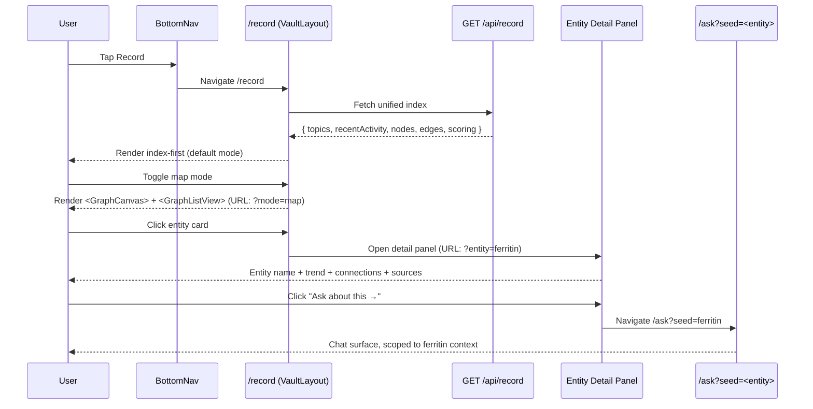

# feat: Unify /record + /graph into the vault surface — entity-native, clinically grounded

## Overview

`/record` and `/graph` show the same data — both hit `getFullGraphForUser` ([src/lib/graph/queries.ts](../../src/lib/graph/queries.ts)) — in two presentational frames. `/graph`'s `<h1>` literally says "Your record." The duplication is structural, not naming. This plan collapses both surfaces into one entity-native vault on the `/record` path, with the existing `GraphCanvas` becoming a *mode* of that surface instead of a separate destination. Bottom nav shrinks from 5 tabs to 4 (Home / Record / Ask / You), retiring the already-orphaned `/protocol` slot.

The unification is the Step 5 slice of [docs/strategy/cto-architecture-2026-05-12.md](../strategy/cto-architecture-2026-05-12.md) — the vault UX that becomes the foundation for clinician briefs (Step 6–8) and the external MCP server (Step 9). Get the surface right now and every downstream surface (entity-as-MCP-resource, entity-as-brief-section, entity-as-shared-view) inherits the same mental model.

**Three things this plan does at once:**

1. **Closes the duplication.** One surface, one API, one mental model. The user no longer mentally swaps between two tabs that show the same data differently. (User-reported confusion is the trigger for this plan.)
2. **Adopts the Obsidian-vault metaphor, but entity-native, not file-native.** The unit is a clinical entity — biomarker, symptom, episode, intervention — not a note. Topics + entity index + map view + active-entity panel mirror Obsidian's daily-driver layout, framed in clinical language.
3. **Weaves Claude inline.** "Ask about this →" on every entity prefills `/ask` with the entity's context. `/ask` stays as its own tab for open-ended questions, but most asking happens in-context from the vault.

**Three phases:**

- **Phase 1 — IA + nav refresh (~1 day):** drop `/protocol` from bottom nav (already redirects to `/reveal/priorities`); add 308 redirect `/graph → /record`. Cheap, ships first.
- **Phase 2 — Unified `/record` surface (~5 days):** new server-rendered entry, unified API endpoint absorbing both prior reads, index-first default layout, entity detail panel (right rail desktop / bottom sheet mobile), map-mode toggle re-using `GraphCanvas`. Delete `/graph/page.tsx` and the orphaned `/api/graph/` route at the end of the phase.
- **Phase 3 — Inline Ask weaving (~2 days):** "Ask about this →" affordance on every entity card and detail panel. Prefills `/ask` with entity-scoped context. No new chat infra — reuses `runChatTurn`.

Total: ~8 working days. Ships as 3 PRs (one per phase) or 1 stacked PR depending on review cadence. The eng-pause posture from the priority-markers pivot is broken intentionally for this work — the duplication is a present-tense product wound that the marketing funnel keeps directing users toward.

## Decision Frame

| Decision | Stance |
|---|---|
| **Path naming** | Keep `/record` as the path. Tab label stays "Record." "Vault" is the internal architectural concept, not user-facing copy. Lowest-churn migration; no marketing-link rewrites; preserves the established URL. |
| **What absorbs what** | `/record` absorbs `/graph`. `/graph` returns 308 to `/record` for back-compat. The opposite (graph absorbs record) would lose the established route and the "living index" framing already in copy. |
| **Default landing mode** | Index-first. Topics + recent activity + entity browser is the default view; map mode is one tap away. Sparse records still feel substantial; the force-directed canvas shows as a particle cloud below `MIN_EDGE_DENSITY` and is a worse first impression. Today's `/graph` already hides the canvas at low density — the unified surface formalises that. |
| **Map view scope** | Map mode reuses `<GraphCanvas>` and `<GraphListView>` from `src/components/graph/` verbatim. No re-render of the visualisation engine. The existing `MIN_EDGE_DENSITY` gate stays. |
| **Entity detail panel** | Right rail on desktop (≥768px) showing active entity; bottom sheet on mobile via the existing `<NodeDetailSheet>`. Selecting a topic, an entity row, or a graph node all converge on the same panel. |
| **Timeline mode** | Deferred. Depends on the `EntityVersion` model from CTO-brief Step 3. Stubbed as a disabled toggle with a "coming after the timeline refactor" hint. Building it now without `EntityVersion` would force a re-write. |
| **Bottom nav shape** | Home / Record / Ask / You. Four tabs. `/protocol` removed (already redirects to `/reveal/priorities` — the bottom-nav entry stayed only because nobody had pruned it). |
| **`/graph` URL afterlife** | 308 permanent redirect to `/record`. Preserves any external bookmarks, shared links, and the SEO breadcrumb for the brief period the route existed. |
| **`/ask` future** | Stays a top-level tab. The CTO brief considered folding it into the vault as a panel; the lower-risk move is to weave "Ask about this" inline while keeping the dedicated tab for open-ended questions. Re-evaluate after 2 weeks of vault usage. |

## Requirements

| # | Requirement | Source |
|---|---|---|
| **R1** | `/record` renders a single unified vault surface: topics, recent activity, entity index, optional map view, and active-entity detail panel. The user can complete every task they could complete on `/record` or `/graph` today without switching tabs. | User challenge; [CTO brief §6](../strategy/cto-architecture-2026-05-12.md#6-user-facing-exploration-ux) |
| **R2** | The default landing view is index-first (topics + recent + entity browser). The map view (force-directed `<GraphCanvas>` + grouped `<GraphListView>`) is one tap/click away via a mode toggle in the header. | [CTO brief §6](../strategy/cto-architecture-2026-05-12.md#6-user-facing-exploration-ux); current `/graph` `MIN_EDGE_DENSITY` behavior |
| **R3** | Clicking any topic card, entity row, or graph node opens the entity detail panel. The panel renders entity name, latest reading/state, trend (if applicable), connections (via `getNodeProvenance`-style edge enumeration), and source documents. Desktop ≥768px: right rail. Mobile: existing `<NodeDetailSheet>` slide-up. | [CTO brief §6](../strategy/cto-architecture-2026-05-12.md#6-user-facing-exploration-ux); existing `<NodeDetailSheet>` |
| **R4** | Every entity card and the entity detail panel surface an "Ask about this →" affordance. Clicking it routes to `/ask` with a prefilled context describing the entity (type, canonical key, latest value, immediate connections). The chat surface honors the prefilled context as a system-prompt scoping hint, not as a user message. | User challenge ("Claude integration"); [CTO brief §6](../strategy/cto-architecture-2026-05-12.md#6-user-facing-exploration-ux) |
| **R5** | `/graph` returns a 308 permanent redirect to `/record`. The route handler preserves any query string. `src/app/(app)/graph/page.tsx` is deleted. `src/app/api/graph/route.ts` is deleted. The orphaned `/api/graph/nodes/` route is deleted unless used elsewhere (grep confirms it isn't). | Lowest-churn migration; D6 |
| **R6** | Bottom nav reduces from 5 tabs (Home/Record/Graph/Protocol/You) to 4 (Home/Record/Ask/You). The `/protocol` entry is removed entirely from `<BottomNav>`. The `/protocol` path itself stays (already redirects to `/reveal/priorities` per [src/app/(app)/protocol/page.tsx](../../src/app/%28app%29/protocol/page.tsx)) for back-compat with the `path-to-tab` mapping. The `/ask` entry is added; it points to the existing `/ask` route. | D7; current `/protocol` already orphaned |
| **R7** | A single unified read endpoint (`GET /api/record`) returns: topics (with status + last-updated), recent activity, the importance-scored node set (tier + score, capped at 200 per current `/api/graph`), edges, and `nodeTypeCounts`. This replaces `/api/record/index` AND `/api/graph` in one call. The existing aggregation in [src/lib/record/aggregate.ts](../../src/lib/record/aggregate.ts) extends to include the importance-scoring path from [src/lib/graph/importance.ts](../../src/lib/graph/importance.ts). | Performance (one round-trip instead of two); avoid client-side stitching |
| **R8** | Map mode preserves all behavior from today's `/graph`: edge-density gating (`MIN_EDGE_DENSITY = 0.4`), the SUPPORTS-edges-don't-count rule, the 200-node cap, the desktop-only canvas. Mobile users in map mode see only the grouped list view. | Behavior parity with `/graph` |
| **R9** | The new surface has zero compound names, zero dose strings, zero supplement names — same regulatory bar as the rest of the authed product. The editorial-QA gate at [src/lib/compliance/static-copy.test.ts](../../src/lib/compliance/static-copy.test.ts) extends to scan any new component files. | [CTO brief §7](../strategy/cto-architecture-2026-05-12.md#7-safety-and-compliance) |
| **R10** | An empty-state path renders when the user has no graph nodes — same "blank record" copy that [src/components/record/record-index.tsx](../../src/components/record/record-index.tsx) shows today, surfaced unchanged. The map-mode toggle is disabled and tooltipped "your record is empty — add a document to see connections." | Behavior parity with today's empty `/record` |
| **R11** | Activity-funnel instrumentation gains a `record-view` stage (resolves off first `/api/record` GET per user) and a `record-entity-open` Diagnostic counter (fires on every entity-detail open). Reuses the existing `incrementDiagnostic` helper and the `(key, day)` upsert pattern. | [CTO brief §8](../strategy/cto-architecture-2026-05-12.md#8-the-8-week-mvp); same pattern as `priorities-to-intake-click` (PR #99) |

## Key Technical Decisions

| # | Decision | Rationale |
|---|---|---|
| **D1** | **Single unified server endpoint `GET /api/record` returning the merged shape.** Old endpoints (`/api/record/index`, `/api/graph`) are deleted at the end of Phase 2. | One round-trip per page load. Today's two endpoints both call `getFullGraphForUser` — running it twice on the client is pure waste. Merging consolidates the aggregation logic too. |
| **D2** | **Component composition reuses existing primitives.** `<RecordIndex>` becomes `<VaultIndex>` (rename + extend with mode toggle). `<GraphCanvas>` + `<GraphListView>` + `<NodeDetailSheet>` reused verbatim. New `<VaultLayout>` orchestrates mode + selection state. | Cheap migration. The two existing component sets are already production-grade; we're rearranging, not rebuilding. |
| **D3** | **Mode state lives in URL query param** (`?mode=index` default, `?mode=map`). | Deep-linkable. Shareable. Survives refresh. Future shared-view URLs can pin a specific mode. |
| **D4** | **Active entity state lives in URL query param** (`?entity=<canonicalKey>`). | Same reasons as D3. Bookmarkable. Shareable. Decouples panel-open state from in-memory React state. |
| **D5** | **The "Ask about this" prefill is a navigation, not an embedded panel.** Clicking the affordance routes to `/ask?seed=<entityKey>`; the `/ask` page reads the seed query param and constructs a scoped initial context. No inline chat widget in this plan. | Smaller change. Keeps `/ask` as the single chat surface (one audit trail, one rate-limit context). An inline chat panel is the obvious follow-up if user behavior justifies it; defer until we have signal. |
| **D6** | **`/graph` retired via 308, not 301.** | 308 communicates permanence to crawlers AND preserves request method + query string. 301 doesn't guarantee method preservation. Same posture used in [src/app/(app)/guide/route.ts](../../src/app/%28app%29/guide/route.ts). |
| **D7** | **`<BottomNav>` is the only IA decision in this plan.** No deeper IA restructure (no `/insights` decision, no `/you` rework). Those live in separate plans. | Right-sized. Keeps blast radius small. The Record-Graph confusion is the present-tense wound; everything else is opinion. |
| **D8** | **No new clinical content authored in this plan.** The vault surface renders whatever the engine already produces. Editorial-QA gate extends to scan any new component string literals but no new prose lands. | Avoids re-triggering clinical review. The priority-markers pivot's clinical sign-off (still pending) is unrelated to this surface. |

## Output Structure

```
src/
  app/
    (app)/
      record/
        page.tsx                              # MODIFY — renders new <VaultLayout>
      graph/
        page.tsx                              # DELETE
        route.ts                              # NEW — 308 redirect to /record
    api/
      record/
        route.ts                              # NEW — unified GET endpoint
        index/route.ts                        # DELETE
      graph/
        route.ts                              # DELETE
        nodes/route.ts                        # AUDIT — keep if cross-referenced; delete otherwise
    ask/page.tsx                              # MODIFY — read ?seed= query param
  components/
    record/
      record-index.tsx                        # RENAME → vault-index.tsx; extend
      vault-layout.tsx                        # NEW — orchestrates mode + selection
      vault-mode-toggle.tsx                   # NEW — index / map toggle
      entity-detail-panel.tsx                 # NEW — desktop right rail
      ask-about-entity-link.tsx               # NEW — "Ask about this →" affordance
      activity-feed.tsx                       # UNCHANGED
      add-documents-dialog.tsx                # UNCHANGED
      topic-card.tsx                          # MODIFY — add Ask-about affordance
      what-we-know-card.tsx                   # UNCHANGED
    graph/
      graph-canvas.tsx                        # UNCHANGED
      graph-list-view.tsx                     # UNCHANGED
      node-detail-sheet.tsx                   # UNCHANGED (used for mobile)
    ui/
      bottom-nav.tsx                          # MODIFY — drop /protocol, add /ask
  lib/
    record/
      aggregate.ts                            # MODIFY — fold importance scoring in
      types.ts                                # MODIFY — extend RecordIndex with graph fields
    metrics/
      activation-funnel.ts                    # MODIFY — add record-view stage
    compliance/
      static-copy.test.ts                     # MODIFY — confirm SCAN_ROOTS covers new files
```

## Vault user-flow



## Implementation Units

### Phase 1 — IA + nav refresh (~1 day)

#### U1 · Bottom nav: drop `/protocol`, add `/ask`; `/graph` route 308 redirect

**Goal.** Reduce the bottom nav from 5 tabs to 4. Drop the orphaned `/protocol` entry (already redirects to `/reveal/priorities`). Add the `/ask` entry. Add a route handler at `src/app/(app)/graph/route.ts` that 308-redirects to `/record`. Delete `src/app/(app)/graph/page.tsx`.

**Files.**
- Modify: [src/components/ui/bottom-nav.tsx](../../src/components/ui/bottom-nav.tsx) — update `tabs` array: drop `protocol`, add `ask` (icon `chat` or similar).
- Modify: [src/types/index.ts](../../src/types/index.ts) — update `NavTab` type: remove `'protocol'`, add `'ask'`.
- Modify: [src/app/(app)/path-to-tab.ts](../../src/app/%28app%29/path-to-tab.ts) — update mapping.
- Modify: [src/app/(app)/path-to-tab.test.ts](../../src/app/%28app%29/path-to-tab.test.ts) — update test fixtures.
- Create: `src/app/(app)/graph/route.ts` — GET handler returning `NextResponse.redirect(new URL('/record', request.url), 308)`.
- Delete: `src/app/(app)/graph/page.tsx` (deleted in this unit; the api/graph endpoints stay until U4 cleanup).

**Approach.** Mirror the pattern from [src/app/(app)/guide/route.ts](../../src/app/%28app%29/guide/route.ts) (the `/guide → /ask` 308). The bottom-nav rewrite is a one-array edit plus the `NavTab` type update — the type-checker surfaces every consumer.

**Patterns to follow.** `/guide` route retirement (PR #98 Phase 1 U6). Identical shape.

**Test scenarios.**
- Happy path: `GET /graph` → 308 with `Location: /record`.
- Happy path: bottom nav renders 4 tabs in order: Home / Record / Ask / You.
- Happy path: tapping the new Ask tab navigates to `/ask`.
- Edge case: `GET /graph?something=here` preserves the query string in the redirect target.
- Regression: no broken references to `'protocol'` in `NavTab` consumers (grep confirms; tsc clean).

**Verification.** `pnpm tsc --noEmit && pnpm lint && pnpm vitest run` green. `pnpm dev`; manually verify the bottom nav and the `/graph → /record` redirect.

**Dependencies.** None.

**Execution note.** None. This unit is route + IA-only; no new components.

---

### Phase 2 — Unified `/record` surface (~5 days)

#### U2 · Unified read endpoint `GET /api/record`

**Goal.** Merge the data shapes returned by `/api/record/index` and `/api/graph` into one call. Output: `{ topics, recentActivity, sourceCount, nodes (importance-scored, capped), edges, nodeTypeCounts, truncated, totalNodes }`. Old endpoints `/api/record/index` and `/api/graph` are deleted at the end of this phase (U6); other consumers of those endpoints are migrated as they're found.

**Files.**
- Create: `src/app/api/record/route.ts` — the new unified handler.
- Modify: [src/lib/record/aggregate.ts](../../src/lib/record/aggregate.ts) — `aggregateRecord` now also accepts `recencyMap` and returns importance-scored nodes via `computeImportance` from [src/lib/graph/importance.ts](../../src/lib/graph/importance.ts).
- Modify: [src/lib/record/types.ts](../../src/lib/record/types.ts) — extend `RecordIndex` with `nodes`, `edges`, `nodeTypeCounts`, `truncated`, `totalNodes` (mirror today's `GraphResponse`).
- Audit: `src/app/api/graph/nodes/route.ts` — confirm not consumed elsewhere; if it is, delete in U6.

**Approach.** The two existing endpoints both call `getFullGraphForUser` ([src/lib/graph/queries.ts](../../src/lib/graph/queries.ts)). Today they each do their own aggregation downstream. Move the scoring + capping logic from `/api/graph` into `aggregateRecord`. Single DB pass; single response shape; client makes one fetch.

**Patterns to follow.** [src/app/api/record/index/route.ts](../../src/app/api/record/index/route.ts) for the auth + error shape (`getCurrentUser`, the `Cache-Control: no-store`, the standard 401 + 500). [src/app/api/graph/route.ts](../../src/app/api/graph/route.ts) for the scoring + capping logic.

**Test scenarios.**
- Happy path: authed user with non-empty graph → 200 with the merged shape.
- Happy path: authed user with empty graph → 200 with `nodes: []`, `topics: []`, `totalNodes: 0`.
- Edge case: graph with >200 importance-ranked nodes → response has `truncated: true`, `nodes.length === 200`.
- Edge case: graph with all-SUPPORTS edges → density-aware fields still consistent.
- Auth: unauthed user → 401.

**Verification.** Unit tests on `aggregateRecord` cover the importance-scoring merge. Integration test on the new route hits a seeded fixture user and asserts the response shape.

**Dependencies.** U1 (so the IA is settled before the surface changes).

**Execution note.** Test-first on the merged `aggregateRecord` (existing tests at `src/lib/record/aggregate.test.ts` extend with importance cases before the implementation lands).

---

#### U3 · `<VaultLayout>` + index-first default render

**Goal.** New top-level component orchestrating the vault: mode state (index vs map, URL-backed), selection state (active entity, URL-backed), data fetch from `/api/record`. Default mode is index-first. `<VaultLayout>` renders into [src/app/(app)/record/page.tsx](../../src/app/%28app%29/record/page.tsx).

**Files.**
- Create: `src/components/record/vault-layout.tsx` — the orchestrator.
- Create: `src/components/record/vault-mode-toggle.tsx` — index/map pill switch in the header.
- Rename + modify: `src/components/record/record-index.tsx` → `vault-index.tsx` — extracts the index-mode body (topics + recent activity + entity browser), unchanged in shape.
- Modify: [src/app/(app)/record/page.tsx](../../src/app/%28app%29/record/page.tsx) — replaces inline state machine with `<VaultLayout>`.

**Approach.** Read `?mode=` and `?entity=` from `useSearchParams`. Default `mode` is `'index'`. Default entity is `null`. `<VaultLayout>` is the only stateful component; everything else is presentational. `useTransition` for mode + entity changes so URL updates don't block render.

**Patterns to follow.** Existing [src/app/(app)/record/page.tsx](../../src/app/%28app%29/record/page.tsx) for the discriminated-union load state. [src/app/(app)/intake/page.tsx](../../src/app/%28app%29/intake/page.tsx) for the URL-state-via-tabs pattern (already used for `/intake`'s three subviews).

**Test scenarios.**
- Happy path: empty mode → renders index view.
- Happy path: `?mode=map` → renders map mode skeleton (full map view lands in U5).
- Happy path: `?entity=ferritin` → entity detail panel opens (full panel lands in U4).
- Edge case: `?mode=map&entity=ferritin` → both states coexist; map view + panel open.
- Edge case: empty graph state → mode toggle disabled with tooltip per R10.

**Verification.** Component tests using vitest + testing-library. `pnpm dev` smoke verifies URL state synchronisation.

**Dependencies.** U2 (so the data shape is stable).

**Execution note.** None.

---

#### U4 · Entity detail panel (desktop right rail + mobile sheet)

**Goal.** New `<EntityDetailPanel>` renders the selected entity: name, latest reading/state, trend if applicable, connections (incoming + outgoing edges), source documents. Right rail on desktop ≥768px; existing `<NodeDetailSheet>` for mobile.

**Files.**
- Create: `src/components/record/entity-detail-panel.tsx` — the desktop right-rail component.
- Modify: [src/components/graph/node-detail-sheet.tsx](../../src/components/graph/node-detail-sheet.tsx) — extract shared body content into a sibling `<EntityDetailBody>` that both panel + sheet render.

**Approach.** The panel and sheet are skin variants of the same body. Extract a shared `<EntityDetailBody>` first (renders the actual content: name, value, trend, connections list, sources list), then wrap in two shells. Selection state lives in `<VaultLayout>` (U3); both shells subscribe.

**Patterns to follow.** Today's [src/components/graph/node-detail-sheet.tsx](../../src/components/graph/node-detail-sheet.tsx) for the sheet behavior and entity-content render. The card primitive at [src/components/ui/card.tsx](../../src/components/ui/card.tsx) for the panel chrome.

**Test scenarios.**
- Happy path: select an entity → panel renders with name + value + connections + sources.
- Happy path: viewport ≥768px → renders as right rail. Viewport <768px → renders as bottom sheet.
- Edge case: entity has no value / no trend → renders graceful "no readings yet" copy.
- Edge case: entity has 50+ connections → list virtualises or truncates with "show more."
- Regression: existing mobile sheet behavior unchanged on map mode.

**Verification.** Component tests + viewport-toggle smoke.

**Dependencies.** U3.

**Execution note.** None.

---

#### U5 · Map mode — reuses `<GraphCanvas>` and `<GraphListView>`

**Goal.** When `?mode=map`, `<VaultLayout>` renders the force-directed canvas + grouped list view, identical to today's `/graph` page below its header. The header swaps to the map-mode title + density meta strip. `MIN_EDGE_DENSITY` gate, 200-node cap, and SUPPORTS-edge-exclusion all preserved.

**Files.**
- Modify: `src/components/record/vault-layout.tsx` — renders `<GraphCanvas>` (desktop only, density-gated) + `<GraphListView>` based on mode prop.
- No changes to the visualisation components.

**Approach.** Lift the body of today's [src/app/(app)/graph/page.tsx](../../src/app/%28app%29/graph/page.tsx) (the canvas + list-view block) into a `<VaultMapMode>` sub-component. Pass the already-fetched `nodes` + `edges` from `<VaultLayout>`'s state. The density gate logic moves with it.

**Patterns to follow.** Today's [src/app/(app)/graph/page.tsx:177-204](../../src/app/%28app%29/graph/page.tsx#L177-L204) is the body to lift.

**Test scenarios.**
- Happy path: dense graph + desktop → canvas + list rendered.
- Happy path: sparse graph (below `MIN_EDGE_DENSITY`) → list only.
- Happy path: mobile + dense graph → list only (no canvas on mobile, parity with today).
- Edge case: empty graph + map mode → renders `<GraphListEmpty>` per current behavior.
- Regression: selecting a node in map mode opens the entity detail panel (U4).

**Verification.** Manual smoke at desktop + mobile widths; the existing density-gate test covers the math.

**Dependencies.** U3, U4.

**Execution note.** None.

---

#### U6 · Delete `/graph` page + APIs; activation-funnel instrumentation

**Goal.** Drop the now-dead routes and add the `record-view` activation-funnel stage + `record-entity-open` Diagnostic counter. Confirms the migration is complete.

**Files.**
- Delete: `src/app/(app)/graph/page.tsx` (already deleted in U1; reconfirm).
- Delete: `src/app/api/graph/route.ts`.
- Delete: `src/app/api/graph/nodes/route.ts` if grep confirms no other consumer; otherwise move to `/api/record/nodes/`.
- Delete: `src/app/api/record/index/route.ts` — replaced by the unified `/api/record` from U2.
- Modify: [src/lib/metrics/activation-funnel.ts](../../src/lib/metrics/activation-funnel.ts) — add `record-view` stage (resolves off first `GET /api/record` per user; instrument server-side in the new handler).
- Modify: `src/components/record/entity-detail-panel.tsx` + `vault-index.tsx` — fire `incrementDiagnostic('record-entity-open')` on every entity-open event via a small POST to a new `src/app/api/record/entity-open/route.ts` (mirrors the `priorities-to-intake-click` server-action pattern from PR #99, but as a fire-and-forget beacon since the user isn't navigating away).

**Approach.** The deletes are the test — if anything still imports the dead modules, tsc surfaces it. The instrumentation extends the pattern from PR #99. Use a server action `trackEntityOpen` rather than a route handler, since we're not redirecting.

**Patterns to follow.** [docs/solutions/best-practices/server-action-shared-cta-instrumentation-2026-05-11.md](../solutions/best-practices/server-action-shared-cta-instrumentation-2026-05-11.md) for the action shape (omit the redirect; just increment).

**Test scenarios.**
- Happy path: `GET /api/graph` → 404 (after route deletion).
- Happy path: completed first `/api/record` view → user appears in `record-view` stage map.
- Happy path: opening an entity → `record-entity-open` Diagnostic increments.
- Regression: no grep hits for `'/api/graph'` or `'/api/record/index'` anywhere in `src/`.

**Verification.** `pnpm tsc --noEmit && pnpm lint && pnpm vitest run` green. Manual smoke through the funnel CLI shows the new stage and counter.

**Dependencies.** U2, U3, U4, U5.

**Execution note.** None.

---

### Phase 3 — Inline Ask integration (~2 days)

#### U7 · "Ask about this →" affordance + `/ask?seed=` prefill

**Goal.** Every entity card (`<TopicCard>`, entity rows in `<VaultIndex>`, `<EntityDetailPanel>`, `<NodeDetailSheet>`) renders an "Ask about this →" affordance. Clicking it navigates to `/ask?seed=<canonicalKey>`. The `/ask` page reads the seed and constructs a scoped initial context (entity type, canonical key, latest reading, immediate connections) which the chat surface treats as a system-prompt scoping hint, not a user message.

**Files.**
- Create: `src/components/record/ask-about-entity-link.tsx` — the affordance. Renders as a small tertiary action ("Ask about this →") with the same look-and-feel as the existing "Shared links →" affordance.
- Modify: `src/components/record/topic-card.tsx` — add the affordance to each topic card.
- Modify: `src/components/record/entity-detail-panel.tsx` — add the affordance to the panel CTA strip.
- Modify: [src/components/graph/node-detail-sheet.tsx](../../src/components/graph/node-detail-sheet.tsx) — add the affordance to the sheet.
- Modify: [src/app/(app)/ask/page.tsx](../../src/app/%28app%29/ask/page.tsx) — read `seed` query param; pass to `<ChatSurface>` (or whatever the existing wrapper is) as initial scoping context.
- Modify: [src/lib/chat/turn.ts](../../src/lib/chat/turn.ts) — if `seed` context is supplied, pass it to the scribe router as a scoping prefix in the system prompt. **No new chat infrastructure; just a parameter.**

**Approach.** The seed format is opaque to the user but explicit to the chat router: `seed=ferritin` means "the user wants to ask about the canonical entity 'ferritin' — load its latest state into the system prompt as context, but treat the user's first turn as the real question." The scribe router already constructs system prompts dynamically; the seed is one more input.

**Patterns to follow.** The existing [src/lib/scribe/router/](../../src/lib/scribe/router/) for system-prompt construction. The /reveal/priorities CTA wiring for the navigation pattern (a plain `<Link>` since this isn't a side-effect navigation).

**Test scenarios.**
- Happy path: clicking "Ask about this" on a topic card navigates to `/ask?seed=<topicKey>`.
- Happy path: `/ask?seed=ferritin` loads with the chat surface scoped to the ferritin entity (system prompt includes ferritin context).
- Happy path: typing a question in seeded chat returns a response that references the seeded entity by name without the user re-typing it.
- Edge case: `/ask?seed=<unknown>` — chat loads with no scoping (graceful fallback, no error).
- Regression: `/ask` with no seed renders unchanged.

**Verification.** Manual smoke through the full topic → ask flow. The scribe router has unit tests; extend them to cover seeded-context system prompts.

**Dependencies.** U4 (for the panel placement).

**Execution note.** Test-first on the seed → system-prompt construction in the chat router. The UI affordance is a thin wrapper; the value is in the routing semantics.

---

## Risks

| Risk | Likelihood | Impact | Mitigation |
|---|---|---|---|
| **Merging the two API endpoints regresses one's behavior** | Medium | Medium | U2 ships test-first. Existing tests for `/api/record/index` and `/api/graph` are merged into the new endpoint's test file. Run both against a fixture user pre-deletion to confirm parity. |
| **URL-state mode/entity sync surprises users via back/forward** | Low | Low | Standard `useSearchParams` + `useTransition` pattern. The bottom-sheet pattern in `/intake` already uses URL state with no reported confusion. |
| **Map mode entity-selection conflicts with index-mode entity-selection** | Low | Low | Selection state is mode-independent (lives in `<VaultLayout>`). Selecting from the canvas in map mode opens the same panel as selecting from the topic list in index mode. |
| **`<EntityDetailBody>` extraction breaks the existing mobile `<NodeDetailSheet>`** | Medium | Low | Refactor lands in U4 with the existing sheet's tests as the parity gate. Tests must pass before the new desktop panel ships. |
| **The seed-based chat scoping leaks the user's data into a sticky context that survives across sessions** | Low | High | Seed context is per-`runChatTurn` only — passed via the initial system prompt but not persisted. New chat session = no seed. Server-side: confirm `seed` is never written into `ChatMessage.content` or `ScribeAudit.toolCalls` (which IS persistent). |
| **Activation-funnel `record-view` stage shows zero because of caching** | Low | Low | The stage is server-instrumented in the `/api/record` handler with `Cache-Control: no-store`. Same posture as today's `/api/record/index` and `/api/graph`. |
| **`/graph` 308 redirect breaks an external SEO breadcrumb or saved bookmark** | Low | Low | 308 preserves bookmarks. The `/graph` route was added ~2 weeks ago (PR #92, 2026-05-09); no external indexing has built up. |
| **Bottom-nav rewrite breaks the `path-to-tab` mapping for an edge route** | Low | Low | `path-to-tab.test.ts` covers the mapping; updates land in the same commit as the nav rewrite. |
| **The eng pause was meant to be intact for non-Phase-1 marketing work** | Low | Low | This work is product-finishing, not marketing-funnel-building. Same posture as the priority-markers pivot (also broke the eng pause for product-finishing). The pause stays in effect for Stripe/preview/lifecycle work. |

## Scope Boundaries (NOT in this plan)

- `EntityVersion` model + timeline view. Depends on the temporal-versioning data layer from [CTO brief Step 3](../strategy/cto-architecture-2026-05-12.md#13-highest-leverage-engineering-sequence). Separate plan; the vault surface ships without timeline mode and stubs the toggle as disabled.
- pgvector / `VectorEmbedding` / RRF retrieval. [CTO brief Steps 1–2](../strategy/cto-architecture-2026-05-12.md#13-highest-leverage-engineering-sequence). Independent.
- `ClinicianBrief` + Markdown/PDF/FHIR export. [CTO brief Steps 6–8](../strategy/cto-architecture-2026-05-12.md#13-highest-leverage-engineering-sequence). Depends on this plan landing first (the brief generator reads vault state).
- External MCP server. [CTO brief Step 9](../strategy/cto-architecture-2026-05-12.md#13-highest-leverage-engineering-sequence). Independent; the scribe tool catalog it exposes is already complete.
- Folding `/ask` into the vault as an embedded panel. Considered and deferred — re-evaluate after 2 weeks of vault usage signal.
- Adding new node types or edge types to the graph schema. Schema is unchanged in this plan.
- New clinical content. Editorial-QA gate extends to scan new files but no new prose lands.
- IA decisions beyond the bottom-nav (`/insights` future, `/you` rework, settings restructure). Separate plans.

## Deferred to Implementation

- **The exact icon for the new `/ask` bottom-nav tab.** Default to the existing `chat` icon if available; if not, founder pick.
- **Empty-state copy for the disabled timeline toggle.** "Coming soon" or "Available after the timeline refactor lands" — copy decision at build time.
- **`/api/graph/nodes/` retention or deletion.** Audit at U6 time; grep is the deciding signal.
- **Selection state synchronization across rapid mode toggles.** If users toggle mode mid-selection, do we preserve the entity selection or reset it? Default: preserve. If it surfaces as a UX issue during smoke, revisit.
- **Funnel-CLI display for the new `record-view` stage.** Naming + ordering in the CLI output — fold into the existing report's prefix conventions.

## Phased Delivery

| Phase | Units | Cost | Gate |
|---|---|---|---|
| **Phase 1 — IA + nav** | U1 | ~1 day | Code review |
| **Phase 2 — Unified vault** | U2, U3, U4, U5, U6 | ~5 days | Code review + visual smoke at desktop and mobile widths |
| **Phase 3 — Ask weaving** | U7 | ~2 days | Code review + manual chat flow smoke |

Total elapsed: ~8 working days. Ship as 3 PRs (Phase 1 mergeable first, Phase 2 stacked on top, Phase 3 stacked on Phase 2) or 1 stacked PR depending on review cadence.

Phase 1 ships independently; Phase 2 depends on Phase 1's IA settle; Phase 3 depends on Phase 2's surface existing.

## Linked artifacts

- Upstream brief: [docs/strategy/cto-architecture-2026-05-12.md](../strategy/cto-architecture-2026-05-12.md)
- Originating user message: confusion about `/record` vs `/graph` duplication
- Prior plan touching the same surface: [docs/plans/2026-04-17-001-feat-navigable-health-record-plan.md](2026-04-17-001-feat-navigable-health-record-plan.md) (the original `/record` build)
- Prior plan introducing `/graph`: [docs/plans/2026-05-01-001-feat-graph-canvas-viz-plan.md](2026-05-01-001-feat-graph-canvas-viz-plan.md)
- Existing components reused: [src/components/graph/graph-canvas.tsx](../../src/components/graph/graph-canvas.tsx), [src/components/graph/graph-list-view.tsx](../../src/components/graph/graph-list-view.tsx), [src/components/graph/node-detail-sheet.tsx](../../src/components/graph/node-detail-sheet.tsx), [src/components/record/record-index.tsx](../../src/components/record/record-index.tsx)
- Instrumentation pattern: [docs/solutions/best-practices/server-action-shared-cta-instrumentation-2026-05-11.md](../solutions/best-practices/server-action-shared-cta-instrumentation-2026-05-11.md)
