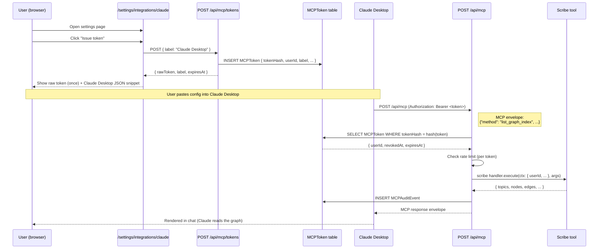

# feat: External MCP server — expose scribe tool catalog to Claude Desktop / Code / Codex

## Overview

Expose MorningForm's existing scribe tool catalog as an external Model Context Protocol (MCP) server. After this lands, a user can connect Claude Desktop, Claude Code, or Codex (or any MCP-compatible client) to their MorningForm record and have the LLM read their health graph natively — searching nodes, fetching provenance, comparing reference ranges — without ever leaving the chat surface they're in.

This is **the asymmetric move** from [docs/strategy/cto-architecture-2026-05-12.md](../strategy/cto-architecture-2026-05-12.md) §4. Most health platforms can't be queried by an AI client at all; we're 70% of the way to being the only one Claude reads fluently. The scribe tool catalog at [src/lib/scribe/tool-catalog.ts](../../src/lib/scribe/tool-catalog.ts) — 7 stable, audit-trail-pinned tools — is the asset; this plan wraps it in an MCP transport + scope-token auth and publishes the distribution.

The plan does **three things at once**:

1. **Closes the agent-native gap** the PR #102 review surfaced. The current scribe is topic-scoped (every tool needs a `topicKey` from `ToolContext`), so an external agent can't browse the whole vault — only one topic at a time. Three new scribe tools (`list_graph_index`, `resolve_entity`, `get_topic_overview`) are the prerequisite that makes the catalog browsable from outside.
2. **Builds the external auth surface** — `MCPToken` model extending the `SharedView` HMAC-and-domain-separation pattern. Scope tokens are read-only in MVP, user-issued via a settings UI, revocable, scoped to a single user, audit-logged on every call. Same posture as the share-link tokens, different domain-separation prefix.
3. **Publishes the transports** — streamable HTTP (for Claude Desktop and remote clients) and stdio (for Claude Code) as separate concerns: HTTP runs in the existing Next.js app; stdio is a tiny npm package (`@morningform/mcp`) that proxies to HTTP. Two transports, one tool catalog, one audit trail.

**Five phases:**

- **Phase 1 — Foundation (~2 days):** three new scribe tools (`list_graph_index`, `resolve_entity`, `get_topic_overview`) + `MCPToken` model + scope-token primitive.
- **Phase 2 — HTTP transport (~2 days):** `@modelcontextprotocol/sdk` install + `/api/mcp` route handler + tool exposure + audit.
- **Phase 3 — User UX (~1 day):** `/settings/integrations/claude` page for issuing/revoking tokens + Claude Desktop config snippet generator.
- **Phase 4 — stdio transport (~1 day):** tiny npm package proxying stdio → HTTP, published to npm as `@morningform/mcp`.
- **Phase 5 — Hardening + launch (~1 day):** rate limiting, fuzz fixtures, security review, submit to Anthropic MCP directory + Cursor + VS Code listings.

Total: ~7 working days. Maps cleanly to Week 7 of the [CTO brief §8 MVP](../strategy/cto-architecture-2026-05-12.md#8-the-8-week-mvp).

## Decision Frame

| Decision | Stance |
|---|---|
| **Tool scope (MVP)** | Read-only. Eight tools exposed (seven existing scribe + `list_graph_index` from Phase 1). Write tools (`add_observation`, `add_symptom_episode`) require per-session consent UX we don't have yet — defer to Phase 6+. |
| **Auth model** | Bearer-token, not full OAuth 2.1 + PKCE. The MVP user is sitting at our settings page issuing themselves a token for their own Claude client — OAuth's authorization-code dance with redirect URIs is unnecessary friction for a single-user, single-tenant integration. Promote to OAuth 2.1 when partners want to integrate. Same call wso2/fhir-mcp-server's review surfaced ("scope explosion risk… overkill for our use case"). |
| **Token model** | `MCPToken` table extending the `SharedView` pattern: `tokenHash` (HMAC-SHA256 with `"mcp:"` domain-separation prefix), `scope` (JSON), `label`, `expiresAt`, `revokedAt`, `lastUsedAt`, `useCount`. Same shape as `SharedView`; different table because lifecycles differ (MCP tokens are long-lived; share links are one-off). |
| **Transports** | Streamable HTTP at `/api/mcp` (the production-stable MCP spec for remote clients). stdio via a separately-published npm package `@morningform/mcp` that proxies stdio ↔ HTTP. **Drop SSE** — it's the legacy path obsidian-claude-code-mcp still uses; per CTO brief §10, not worth the maintenance. |
| **Topic scoping** | Tools that operate on the whole graph (`list_graph_index`, `resolve_entity`) ignore `topicKey`. Topic-scoped tools (`search_graph_nodes`, `get_topic_overview`) require the caller to pass `topicKey` as a parameter — which they can discover via `list_graph_index`. |
| **Audit** | Separate `MCPAuditEvent` table (not folded into `ScribeAudit`) so external calls have their own trail and ScribeAudit stays internal-only. Same columns: userId, requestId, toolName, parameters (JSON), result (JSON or error), latency, tokenId. |
| **Hosting** | Same Vercel deployment. The MCP server is a Next.js route handler — no separate microservice. Future scale-out (per-tenant or per-region) is a deferred infrastructure decision; the route-handler architecture allows the move without rewriting the tool catalog. |
| **Per-token rate limiting** | 60 requests / minute / token. Bucket via Postgres counter on `MCPToken.useCount` over `lastUsedAt` window. Hard cap, no burst. Phase 5 hardens. |
| **Connect UX** | `/settings/integrations/claude` page. Issue token → show once → "copy to clipboard" → never displayable again (the hash is what we persist). Existing-token list with `label`, `lastUsedAt`, `useCount`, and a `Revoke` button. Claude Desktop config snippet auto-generated; Claude Code receives a one-liner `npx @morningform/mcp connect <token>` instead. |
| **Tool catalog source of truth** | Single export from `src/lib/scribe/tool-catalog.ts`. The MCP route adapter calls into the same handlers the internal scribe uses. Drift-prevention is structural: there is no parallel catalog to keep in sync. |
| **Per-user vs per-app scoping** | Per-user. Each `MCPToken` is bound to exactly one user; no multi-tenant or org concepts in MVP. |

## Requirements

| # | Requirement | Source |
|---|---|---|
| **R1** | A user can issue an MCP scope token from `/settings/integrations/claude`. The raw token is shown exactly once at issue time. The DB persists only `HMAC-SHA256("mcp:" + raw, SESSION_SECRET)`. Same shape as the existing share-link tokens at [src/lib/share/tokens.ts](../../src/lib/share/tokens.ts). | Brief §4 auth model |
| **R2** | A user can revoke any active token. Revoked tokens fail auth on the very next call. The token list shows label, lastUsedAt, useCount, expiresAt. | Same posture as `SharedView.revokedAt` |
| **R3** | An external MCP client (Claude Desktop, Claude Code, Codex, Cursor, VS Code MCP extension) can connect using a bearer token in the `Authorization: Bearer <token>` header. Token resolution: hash → MCPToken row → user → context for the call. | MCP spec + bearer-token auth |
| **R4** | The MCP server exposes 8 tools as read-only operations: `search_graph_nodes`, `get_node_detail`, `get_node_provenance`, `compare_to_reference_range`, `recognize_pattern_in_history`, `route_to_gp_prep`, `refer_to_specialist`, plus the new `list_graph_index`. Tool names match the existing scribe catalog so audit/tracing stays consistent. | Existing scribe catalog + CTO brief §4 |
| **R5** | `list_graph_index` is a NEW scribe tool. It returns the user's whole-graph index (topics, recent activity, importance-scored nodes capped at 200) — same shape as the `RecordIndex` wire shape from `/api/record`. Doesn't require `topicKey` in `ToolContext`. | Agent-native review on PR #102 |
| **R6** | `resolve_entity` is a NEW scribe tool. It maps a `canonicalKey` to its node id (and 200-OK if the entity exists, 404 if not). Doesn't require `topicKey`. Pairs with the URL-state pattern in `<VaultLayout>` — agents can navigate the vault by canonical key the same way humans deep-link. | Agent-native review on PR #102 |
| **R7** | `get_topic_overview` is a NEW scribe tool. It wraps `aggregateRecord`'s per-topic output (the same `TopicStatus` shape `/api/record` returns) for a single topic. Requires `topicKey`. | Agent-native review on PR #102 |
| **R8** | Every external tool call writes one `MCPAuditEvent` row: `userId`, `tokenId`, `toolName`, `parameters` (JSON-serialised), `resultStatus` (success / error / rate-limited), `latencyMs`, `createdAt`. Audit failures don't block the tool response — same posture as `ScribeAudit`. | CTO brief §7 (audit on every tool call) |
| **R9** | Per-token rate limit: 60 calls / minute, enforced server-side. Over-limit returns the MCP-standard rate-limit error (status code TBD by spec). | CTO brief §12 risk #9 |
| **R10** | Streamable HTTP transport: `/api/mcp` accepts the MCP protocol's JSON-RPC envelope over POST. stdio transport: separate npm package `@morningform/mcp` that proxies stdio ↔ HTTP. Both call the same internal route. | CTO brief §4 transport choices |
| **R11** | The MCP server is submitted to: Anthropic MCP directory, Cursor MCP marketplace, VS Code MCP extension catalog. Submissions happen in Phase 5 after security review. | CTO brief §13 sequence step 10 |
| **R12** | Every tool exposed via MCP has a Zod schema (already true for scribe tools) that converts to a JSON Schema in the MCP `inputSchema`. This is the contract MCP clients use to construct valid calls. | MCP spec |
| **R13** | Tools that can't run without a `topicKey` (`search_graph_nodes`, `get_topic_overview`, etc.) require the caller to pass it as a parameter. Tools that operate on whole-graph (`list_graph_index`, `resolve_entity`) ignore it. The MCP `inputSchema` reflects the difference. | Topic-scoping model |
| **R14** | No write tools in MVP. The MCP server explicitly rejects any tool name not in the read-only set. Phase 6+ adds write tools behind a per-session consent flow. | CTO brief §4 + §12 risk #4 |
| **R15** | The user's session cookie is NOT a valid MCP auth credential. MCP tokens are the only auth mechanism. This keeps the attack surfaces isolated — a leaked session cookie can't grant programmatic graph access, and a leaked MCP token can't impersonate the user in the web app. | Security boundary clarity |

## Key Technical Decisions

| # | Decision | Rationale |
|---|---|---|
| **D1** | **Bearer-token auth, not OAuth 2.1.** Authorization header carries the raw token; server hashes with `HMAC-SHA256("mcp:" + raw, SESSION_SECRET)`; matches against `MCPToken.tokenHash`. | Matches the single-tenant, user-issues-to-themselves use case. OAuth's redirect dance is friction without payoff for MVP. Token revocation is one DB write; token rotation is delete + reissue. |
| **D2** | **`MCPToken` is a new table, not a `SharedView` row with a different scope.** Same shape, different lifecycle. SharedView tokens are short-lived and read a topic; MCPToken tokens are long-lived and operate on the whole graph. Keeping them in one table couples the lifecycles and forces every share-link query to scan past MCP tokens. | Lifecycle separation. The shapes can converge again if we ever want a unified "external access" table. |
| **D3** | **Tool exposure is declarative via the existing scribe catalog, not a parallel registration.** The MCP route reads `SCRIBE_TOOL_HANDLERS` from `tool-catalog.ts` and exposes the read-allowlist. No second source of truth. | Drift prevention. Adding a new scribe tool to the catalog auto-exposes it (subject to the read-allowlist filter), and the MCP audit trail uses the same `name`. |
| **D4** | **MCP audit is a separate `MCPAuditEvent` table.** Same column shape as ScribeAudit but populated only by external calls. | Lets us run separate retention policies. Lets us answer "who accessed this user's vault from outside the app" with one table scan. ScribeAudit stays internal-call-only. |
| **D5** | **stdio transport is an npm package, not a TS file in the repo.** `@morningform/mcp` is a 50-line Node.js script that reads stdin, posts to the user's `/api/mcp` endpoint with their bearer token, writes stdout. Versioned via npm. | Claude Code expects a stdio binary it can spawn; HTTP is for Desktop. The proxy keeps the server-side as a single transport (HTTP) and ships the stdio compat layer separately so Claude Code users get a one-line install. |
| **D6** | **No SSE.** The MCP spec is moving toward Streamable HTTP; SSE is deprecating. | CTO brief §10. |
| **D7** | **Tools that require topic-scoping take `topicKey` as an explicit parameter.** The MCP `inputSchema` for `search_graph_nodes` adds a `topicKey: string` field that wasn't in the scribe-internal-only signature (where it came from `ToolContext`). | Internal scribes know the topic from page context; external agents have to be told. The parameter is just promoted from context to schema. |
| **D8** | **The bearer token never appears in any URL, log line, or response body.** Only the hash is persisted. The `MCPAuditEvent` row records `tokenId` (the FK), not the raw token. | Pen-test posture from CTO brief §12. |
| **D9** | **Rate limit via Postgres, not Redis.** Atomic upsert on `MCPToken.useCount` + windowed `lastUsedAt` check. | Avoids adding a Redis dependency just for rate limiting. 60 calls/min/token is well within Postgres capacity. Promote to Redis if we ever cross 1000 active tokens. |
| **D10** | **One token issuance UI, not separate flows for "Claude Desktop" vs "Claude Code".** The settings page issues a token; the page renders both: the Claude Desktop JSON snippet (HTTP transport) AND the Claude Code one-liner (stdio via `@morningform/mcp`). User picks based on their client. | Single UX, two install paths. Avoids the UX trap of "wait, which token type do I need?" |

## Output Structure

```
prisma/
  schema.prisma                          # MODIFY — add MCPToken, MCPAuditEvent
src/
  lib/
    mcp/
      tokens.ts                          # NEW — HMAC tokens for MCPToken (mirrors share/tokens.ts)
      audit.ts                           # NEW — write MCPAuditEvent
      rate-limit.ts                      # NEW — per-token rate limiter
      tool-adapter.ts                    # NEW — map scribe handlers to MCP tool definitions
      types.ts                           # NEW — MCP-specific request/response shapes
    scribe/
      tools/
        list-graph-index.ts              # NEW — whole-graph listing (Phase 1)
        list-graph-index.test.ts         # NEW
        resolve-entity.ts                # NEW — canonicalKey → node lookup (Phase 1)
        resolve-entity.test.ts           # NEW
        get-topic-overview.ts            # NEW — per-topic overview (Phase 1)
        get-topic-overview.test.ts       # NEW
      tool-catalog.ts                    # MODIFY — register the three new tools
  app/
    api/
      mcp/
        route.ts                         # NEW — Streamable HTTP transport
        route.test.ts                    # NEW — auth + dispatch + audit integration test
        tokens/
          route.ts                       # NEW — GET (list) / POST (issue)
          [id]/route.ts                  # NEW — DELETE (revoke)
    (app)/
      settings/
        integrations/
          claude/
            page.tsx                     # NEW — issue/list/revoke UI
            claude-tokens-client.tsx     # NEW — client component
mcp-package/                             # NEW — separate npm package for stdio transport
  package.json                           # NEW — @morningform/mcp
  src/index.ts                           # NEW — stdio ↔ HTTP proxy
  README.md                              # NEW — install + usage
docs/
  solutions/best-practices/
    mcp-bearer-token-pattern-2026-05-XX.md  # /ce:compound output after Phase 5
```

## End-to-end flow (issue → connect → call)



## Implementation Units

### Phase 1 — Foundation (~2 days)

#### U1 · `MCPToken` + `MCPAuditEvent` schema

**Goal.** Add the two Prisma models. Push schema. Confirm no breaking changes to other tables.

**Files.**
- Modify: [prisma/schema.prisma](../../prisma/schema.prisma) — add `MCPToken` and `MCPAuditEvent`.
- DB: `pnpm prisma db push --accept-data-loss` (same pattern as Phase 0 SEO/GEO + priority-markers pivot).

**Schema sketch:**

```prisma
model MCPToken {
  id           String    @id @default(cuid())
  userId       String
  user         User      @relation(fields: [userId], references: [id], onDelete: Cascade)
  tokenHash    String    @unique
  label        String
  expiresAt    DateTime?
  revokedAt    DateTime?
  lastUsedAt   DateTime?
  useCount     Int       @default(0)
  createdAt    DateTime  @default(now())
  updatedAt    DateTime  @updatedAt
  auditEvents  MCPAuditEvent[]

  @@index([userId, revokedAt])
  @@index([expiresAt])
}

model MCPAuditEvent {
  id            String   @id @default(cuid())
  tokenId       String
  token         MCPToken @relation(fields: [tokenId], references: [id], onDelete: Cascade)
  userId        String
  toolName      String
  parameters    String   // JSON-serialised
  resultStatus  String   // 'success' | 'error' | 'rate_limited' | 'unauthorized'
  errorMessage  String?
  latencyMs     Int
  createdAt     DateTime @default(now())

  @@index([userId, createdAt])
  @@index([tokenId, createdAt])
}
```

**Verification.** `pnpm prisma generate && pnpm tsc --noEmit` clean. Quick `pnpm prisma studio` browse confirms tables exist.

**Dependencies.** None — this is the foundation.

---

#### U2 · `src/lib/mcp/tokens.ts` — token primitive

**Goal.** Mirror [src/lib/share/tokens.ts](../../src/lib/share/tokens.ts) with the `"mcp:"` domain-separation prefix. Functions: `generateRawMcpToken`, `hashMcpToken`, `createMcpToken`, `findMcpTokenByRaw`, `revokeMcpToken`, `listMcpTokensForUser`.

**Patterns to follow.** [src/lib/share/tokens.ts](../../src/lib/share/tokens.ts) is the direct analog. Same HMAC + domain-separation strategy.

**Test scenarios.** Token-roundtrip (hash matches), domain separation (mcp hash ≠ share hash ≠ session hash for same raw token), revoke makes `findMcpTokenByRaw` return null, expired tokens return null, use-count increments on successful resolve.

**Verification.** Unit tests green.

**Dependencies.** U1.

---

#### U3 · Three new scribe tools — `list_graph_index`, `resolve_entity`, `get_topic_overview`

**Goal.** Three new entries in [src/lib/scribe/tool-catalog.ts](../../src/lib/scribe/tool-catalog.ts). All three handle the agent-native gaps from the PR #102 review.

**Files.**
- Create: `src/lib/scribe/tools/list-graph-index.ts` — calls `aggregateRecord` directly. Returns `{ topics, recentActivity, nodes, edges, nodeTypeCounts, truncated, totalNodes }` (the same `RecordIndex` wire shape). No `topicKey` required.
- Create: `src/lib/scribe/tools/resolve-entity.ts` — given `canonicalKey`, returns `{ found: true, node: {...} } | { found: false }`. Direct Prisma query against `GraphNode` filtered by `userId`. No `topicKey` required.
- Create: `src/lib/scribe/tools/get-topic-overview.ts` — given `topicKey`, returns the `TopicStatus` row for that topic from `aggregateRecord`. Requires `topicKey`.
- Modify: `src/lib/scribe/tool-catalog.ts` — register all three.
- Modify: `src/lib/scribe/tools/types.ts` — extend `ToolContext` so `topicKey` is optional (was required). Whole-graph tools omit it; topic-scoped tools require it via Zod schema, not via context.

**Approach.** Each tool follows the existing scribe-tool pattern (Zod schema + execute function). The signature matches existing handlers exactly. The catalog auto-registers via the `SCRIBE_TOOL_HANDLERS` tuple.

**Test scenarios.**
- Happy path each: empty graph → empty results; populated graph → correct shapes.
- `resolve_entity`: unknown canonicalKey → `{ found: false }`; cross-user canonicalKey → `{ found: false }` (user-scoped filter).
- `list_graph_index`: matches `/api/record` shape; uses same nodeCap (200).
- `get_topic_overview`: unknown topicKey → returns the stub state (matches `aggregateRecord` behavior).

**Verification.** `pnpm vitest run src/lib/scribe/tools/` green; tool-catalog test confirms 10 handlers registered.

**Dependencies.** U1, U2.

**Execution note.** Test-first on the wire-shape matches (so MCP consumers get the same shape as `/api/record` consumers).

---

### Phase 2 — HTTP transport (~2 days)

#### U4 · Install `@modelcontextprotocol/sdk` + add `src/lib/mcp/tool-adapter.ts`

**Goal.** Install the official MCP SDK. Create the adapter that translates scribe `ToolHandler<Args, Result>` into MCP tool definitions. Specifically: Zod schema → JSON Schema for `inputSchema`; tool name + description verbatim; result handling.

**Files.**
- Modify: `package.json` — `pnpm add @modelcontextprotocol/sdk`.
- Create: `src/lib/mcp/tool-adapter.ts` — `scribeToolToMcpDefinition(handler)` and `runScribeToolViaMcp(handler, args, context)`.
- Create: `src/lib/mcp/types.ts` — narrow types for the read-only allowlist.

**Approach.** The adapter is a thin shim. Read-allowlist enforced via a frozen `READ_ALLOWED` set. Tools that aren't on the allowlist throw at registration time (compile-error if possible via const-assertion).

**Patterns to follow.** [src/lib/scribe/tool-catalog.ts](../../src/lib/scribe/tool-catalog.ts) for the catalog shape. The Zod-to-JSON-Schema conversion is well-trodden — use `zod-to-json-schema` if needed.

**Test scenarios.** Adapter produces a valid MCP tool definition for every scribe tool in the read-allowlist; rejects unknown tool names; rejects write-tool names if any leak into the catalog.

**Verification.** Unit tests + a fixture comparing one tool's full MCP definition to a snapshot.

**Dependencies.** U3.

---

#### U5 · `/api/mcp/route.ts` — Streamable HTTP transport with bearer-token auth

**Goal.** A POST endpoint at `/api/mcp` that:
1. Reads `Authorization: Bearer <raw>` header.
2. Resolves the token via `findMcpTokenByRaw`. 401 on miss, expired, or revoked.
3. Checks rate limit (60/min/token). 429 on over-limit.
4. Parses the MCP request envelope (JSON-RPC over HTTP).
5. For `tools/list`: returns the adapted scribe-tool definitions.
6. For `tools/call`: dispatches to the matching scribe handler with a synthetic `ToolContext` (userId from token, topicKey from args if present).
7. Writes `MCPAuditEvent` row regardless of outcome.
8. Returns MCP-formatted response.

**Files.**
- Create: `src/app/api/mcp/route.ts`.
- Create: `src/lib/mcp/audit.ts` — `writeMcpAuditEvent`.
- Create: `src/lib/mcp/rate-limit.ts` — `checkRateLimit(tokenId): { allowed: boolean, retryAfter?: number }`.

**Approach.** Implement the MCP JSON-RPC dispatch directly using the SDK's server primitives. The MCP SDK provides `Server` and a request-handler registration API; we register one handler for `tools/list` and one for `tools/call`. The route wraps both behind the auth gate.

**Patterns to follow.** [src/app/api/scribe/compile/route.test.ts](../../src/app/api/scribe/compile/route.test.ts) for the existing route-test pattern; [src/app/api/record/route.test.ts](../../src/app/api/record/route.test.ts) for `getCurrentUser`-style auth tests (adapted to bearer-token).

**Test scenarios.**
- 401: missing Authorization header.
- 401: invalid bearer token.
- 401: revoked token.
- 401: expired token.
- 429: over rate limit.
- 200 + `tools/list`: returns 8 read-allowlist tools.
- 200 + `tools/call list_graph_index`: returns the merged shape.
- 200 + `tools/call search_graph_nodes` with `topicKey`: returns topic-scoped results.
- 400: `tools/call` with unknown tool name.
- 400: `tools/call` with invalid args (Zod parse failure).
- MCPAuditEvent row written on every call (success + 4xx + 5xx).

**Verification.** Integration tests via the existing route-test harness; smoke against a local Claude Desktop install.

**Dependencies.** U2, U3, U4.

---

### Phase 3 — User UX (~1 day)

#### U6 · `/api/mcp/tokens` REST endpoints + `/settings/integrations/claude` page

**Goal.** Issue/list/revoke endpoints + a settings UI.

**Files.**
- Create: `src/app/api/mcp/tokens/route.ts` — `GET` (list user's tokens), `POST` (issue new). POST response returns the raw token exactly once.
- Create: `src/app/api/mcp/tokens/[id]/route.ts` — `DELETE` (revoke). Idempotent.
- Create: `src/app/(app)/settings/integrations/claude/page.tsx` — server component loading the existing token list.
- Create: `src/app/(app)/settings/integrations/claude/claude-tokens-client.tsx` — client component: list tokens, "Issue new" button, copy-to-clipboard on issue, revoke confirmation, Claude Desktop config snippet auto-generated using the issued token + base URL.

**Approach.** Auth via session cookie (the standard web-app pattern). Token issue uses `createMcpToken`. The page renders Claude Desktop's JSON config block with a "Copy" button:

```json
{
  "mcpServers": {
    "morningform": {
      "url": "https://morning-form.vercel.app/api/mcp",
      "headers": { "Authorization": "Bearer <token>" }
    }
  }
}
```

And the Claude Code one-liner:

```bash
npx @morningform/mcp connect <token>
```

**Patterns to follow.** [src/app/(app)/settings/shared-links/](../../src/app/%28app%29/settings/shared-links/) (the existing SharedView management UI) for the exact pattern: server-component page + client-component table + token-issue dialog.

**Test scenarios.**
- POST: issues new token, returns raw value + label.
- GET: lists tokens with masked tokens (only show `lastUsedAt`, `label`, `useCount`).
- DELETE: revokes, returns 204.
- Unauthed: 401 on all endpoints.
- Issuing a duplicate label: allowed (labels aren't unique).

**Verification.** Manual smoke through the UI on dev.

**Dependencies.** U1, U2, U5.

---

### Phase 4 — stdio transport (~1 day)

#### U7 · `@morningform/mcp` npm package

**Goal.** A standalone npm package that runs as a Claude Code stdio MCP server, proxying every call to the HTTP transport.

**Files.**
- Create: `mcp-package/package.json` — name `@morningform/mcp`, bin entry, `@modelcontextprotocol/sdk` dependency.
- Create: `mcp-package/src/index.ts` — reads `MORNINGFORM_TOKEN` env var (or arg); creates an MCP stdio server; forwards every request to `https://morning-form.vercel.app/api/mcp` with `Authorization: Bearer <token>`.
- Create: `mcp-package/README.md` — install + usage.

**Approach.** The package is intentionally tiny (~50 lines). It exists because Claude Code expects to spawn a stdio binary; HTTP is not its native pattern. The proxy keeps server-side simple (one transport) while making stdio a one-line install.

**Test scenarios.** Manual: install in a local Claude Code session; verify a `tools/list` call returns the same 8 tools as the HTTP endpoint; verify a `tools/call list_graph_index` returns the same shape.

**Verification.** Local Claude Code roundtrip. Then `npm publish`.

**Dependencies.** U5 (the HTTP endpoint that this proxies to).

---

### Phase 5 — Hardening + launch (~1 day)

#### U8 · Rate limiting + fuzz fixtures + security review + directory submissions

**Goal.** Production-readiness pass.

**Files.**
- Modify: `src/lib/mcp/rate-limit.ts` — enforce the 60/min/token cap.
- Create: `src/lib/mcp/route.fuzz.test.ts` — fuzz the route handler with malformed envelopes, oversize payloads, invalid bearer tokens, unicode-edge-case tool names.
- Modify: `src/middleware.ts` — add `/api/mcp/:path*` to the matcher so Edge-level rate-limit + bot-detection runs before the route.
- Submit to: Anthropic MCP directory (process TBD), Cursor MCP marketplace, VS Code MCP extension catalog.

**Approach.** Phase 5 doesn't add new functionality — it hardens what U1-U7 built. Bug-bounty-style fuzz tests catch the obvious attacks (token-leak via timing, oversize payloads, malformed JSON-RPC). Security review is a /ce:review pass focused on auth + audit + rate-limit.

**Verification.** All fuzz tests green; /ce:review surfaces no P0/P1 findings; directory submissions filed.

**Dependencies.** U6, U7.

**Execution note.** A /ce:compound write-up after Phase 5 captures the bearer-token + audit + rate-limit pattern as institutional knowledge — first time the project has issued external programmatic access.

---

## Risks

| Risk | Likelihood | Impact | Mitigation |
|---|---|---|---|
| **MCP spec ships a breaking change between Phases 2 and 5** | Medium | Medium | Pin `@modelcontextprotocol/sdk` to a minor version. Subscribe to MCP spec release notes. If a breaking change lands mid-build, it's a one-PR adapter update — most logic is in the scribe layer, not the transport. |
| **Token leakage via accidental log line or audit row** | Low | High | Token never appears in any log statement (D8). MCPAuditEvent stores `tokenId` FK, not raw token. /ce:review pass in Phase 5 specifically audits this. |
| **Stale tool catalog: scribe team adds a tool that should be agent-visible but isn't on the MCP allowlist** | Medium | Low | The allowlist is a positive list — new scribe tools are NOT auto-exposed. Phase 5 includes a doc note: "When adding a scribe tool, decide MCP-exposure intentionally." Adding a tool to the allowlist is a one-line code change reviewable in PR. |
| **Rate limit too tight for legitimate agent workflows** | Medium | Low | 60/min is generous for a single-user agent loop. If users hit it, raise per-user via the `MCPToken` row (per-token override field added in a follow-up). |
| **Auth bypass via stdio proxy** | Low | High | The stdio proxy holds the bearer token but adds no auth bypass — it just forwards the token to the HTTP endpoint, which is the same gate. The proxy itself has no privileged access. |
| **Anthropic MCP directory rejects the submission** | Medium | Low | Cursor + VS Code listings are independent. Even without the Anthropic directory listing, the install path (paste config snippet) works. Resubmit if rejected after a security review pass. |
| **Adversarial topicKey injection — caller passes a topic they don't own** | Low | Medium | All scribe tools accept `topicKey` and look it up by `userId` (from token) + `topicKey` join. Unknown / cross-user topics return empty results, never errors. Topic-scoping is by-construction at the query layer. |
| **User issues 100 tokens and forgets to revoke** | Low | Low | List page shows all tokens with `lastUsedAt`. UI nudges revoke for any token unused for 30+ days. No hard cap on issuance in MVP. |
| **MCP client expects a server-feature we don't implement (e.g., `resources`, `prompts`)** | Medium | Low | MVP exposes only `tools`. The MCP spec defines several capability categories (`tools`, `resources`, `prompts`); we advertise only `tools` in the initial `serverInfo` handshake. Clients that need `resources` get a clean "unsupported" response. |
| **Per-user Postgres rate-limit bottleneck at scale** | Low | Low | At 1000+ active tokens, promote to Redis (CTO brief §9). For MVP, Postgres handles it. |

## Scope Boundaries (NOT in this plan)

- **Write tools.** `add_observation`, `add_symptom_episode`, `add_intervention_event`. These need per-session consent UX we don't have. Defer to a separate plan post-MVP. CTO brief §4 has the framing.
- **OAuth 2.1 + PKCE.** Bearer-token MVP is sufficient. OAuth ships when partners (not end-users) want to integrate.
- **Bidirectional FHIR sync to clinician systems.** Long-tail; CTO brief §9 production goal.
- **Multi-tenant or org-level scoping.** One token = one user. Org features come with the multi-tenant schema migration (CTO brief §9 step 15).
- **Real-time updates / subscriptions / notifications.** Read-only request/response only in MVP. The MCP spec supports streaming results but we don't need it for the current tool set.
- **Tool-level redactions (e.g. "expose `search_graph_nodes` but hide mental-health-tagged nodes").** Token-level scope is binary (read or revoked) in MVP. Add granular redactions when ClinicianBrief lands (CTO brief §5) — the redaction model there can be reused.
- **MCP-specific UI surfaces (e.g. a "Tools" page where the user sees which tools their AI has access to).** Defer to post-launch UX iteration.

## Deferred to Implementation

- **Exact Anthropic MCP directory submission process** — researched and executed in U8.
- **The MCP server `serverInfo` block** (name, version, capabilities) — chosen in U5 at code-time.
- **Per-tool rate-limit overrides** (some tools are heavier than others). Default uniform 60/min/token in MVP; per-tool weights deferred.
- **Whether to expose `tools/list` to unauthenticated callers** (a common pattern — lets clients introspect before auth). MVP: auth-required for everything. Revisit if friction.
- **JSON Schema vs Zod-to-JSON-Schema library choice.** `zod-to-json-schema` is the obvious pick; confirm in U4.

## Phased Delivery

| Phase | Units | Cost | Gate |
|---|---|---|---|
| **Phase 1 — Foundation** | U1, U2, U3 | ~2 days | Code review |
| **Phase 2 — HTTP transport** | U4, U5 | ~2 days | Code review + integration test |
| **Phase 3 — User UX** | U6 | ~1 day | Code review + manual smoke |
| **Phase 4 — stdio transport** | U7 | ~1 day | Manual Claude Code smoke + npm publish |
| **Phase 5 — Hardening + launch** | U8 | ~1 day | /ce:review pass + directory submissions |

Total elapsed: ~7 working days. Ships as 4 stacked PRs (Phase 1, Phase 2, Phase 3, Phase 4+5).

Phase 4 (npm package) is independent of the web app's deploy cycle once Phase 5 publishes it. Phase 5 directory submissions are external waiting periods, not eng work.

## Linked artifacts

- Upstream brief: [docs/strategy/cto-architecture-2026-05-12.md](../strategy/cto-architecture-2026-05-12.md)
- Vault unification plan (predecessor): [docs/plans/2026-05-12-001-feat-record-vault-unification-plan.md](2026-05-12-001-feat-record-vault-unification-plan.md)
- Existing scribe tool catalog: [src/lib/scribe/tool-catalog.ts](../../src/lib/scribe/tool-catalog.ts)
- Existing token/HMAC pattern: [src/lib/share/tokens.ts](../../src/lib/share/tokens.ts) and [src/lib/session.ts](../../src/lib/session.ts)
- Existing audit pattern: `ScribeAudit` in [prisma/schema.prisma](../../prisma/schema.prisma)
- Existing settings-UI pattern: [src/app/(app)/settings/shared-links/](../../src/app/%28app%29/settings/shared-links/)
- Agent-native review (PR #102) that surfaced the topic-scoping gap
- MCP spec: https://modelcontextprotocol.io
