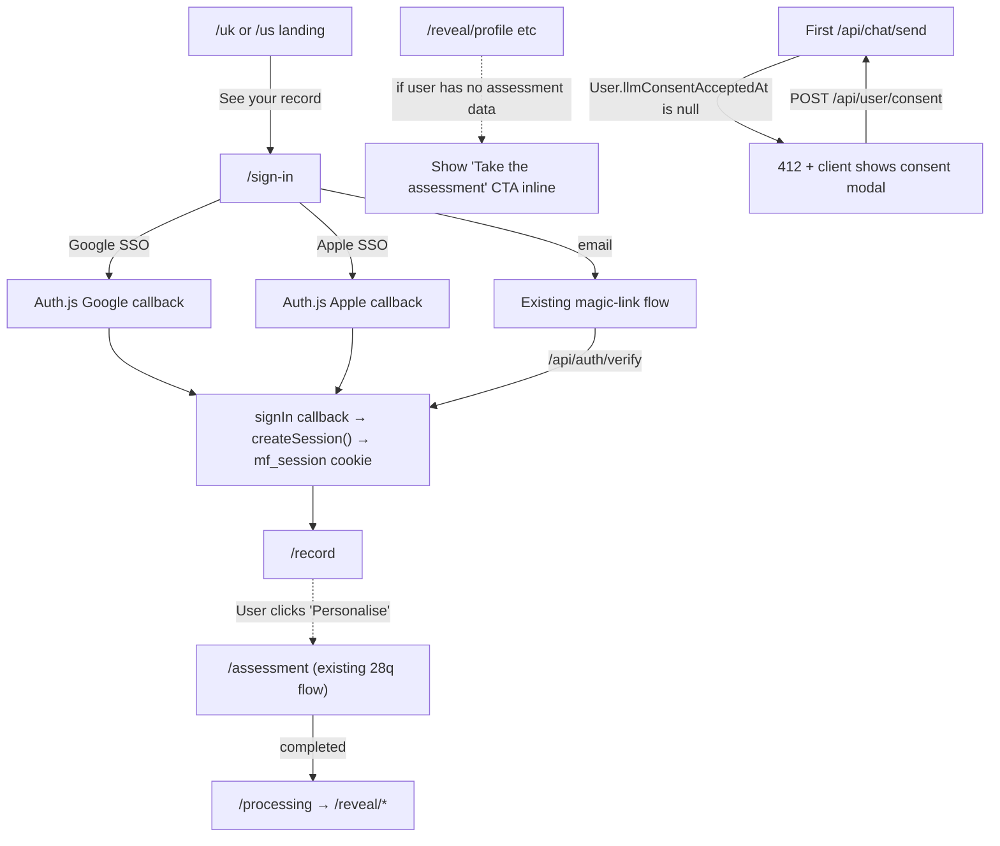

# feat: Lead-gen-first activation — SSO signup + optional assessment

## Overview

Re-architect the new-user activation funnel so the 28-question assessment is **optional personalisation** rather than a hard gate. Replace the current "land → onboarding → 8-min assessment → reveal → sign-in" sequence with "land → frictionless signup (SSO or magic-link) → home → optional assessment when the user wants personalisation."

The current shape forces 8 minutes of work before anyone has signed up — wrong end of the funnel. The new shape gets commitment first (low friction via Google / Apple SSO) and offers the assessment as the moment the user wants the product to "know them" personally.

## Problem Frame

Current flow:

```
/uk or /us  →  /onboarding (4 slides + consent)  →  /assessment (28q, ~8 min)  →
/processing  →  /reveal/profile  →  /reveal/priorities  →  /reveal/begin  →
/sign-in (magic-link)  →  /api/auth/verify  →  /record
```

Problems:
- ~17 minutes from landing to first signed-in state (per Cowork's MVP walkthrough)
- The assessment is the *most expensive* moment in the funnel and lands *before* commitment, so abandonment costs ~10 minutes of typing every time
- The "no signup" claim on the landing page is technically true (reveal pages render from localStorage) but functionally false — every interactive surface (`/ask`, `/intake`) hard-redirects to `/sign-in`. The architecture's elegance becomes a rug-pull
- Personalisation that comes *before* the user wants it is overhead; personalisation that comes *because* they asked for it is a feature

Target flow:

```
/uk or /us  →  /sign-in (SSO buttons + magic-link)  →  /record (or /home)  →
       │
       └─ at user's discretion, from /home:  →  /assessment (optional)
```

The reveal pages (state-profile narrative, priorities) continue to exist; they live behind the "Personalise your record" CTA rather than as an unavoidable middle of the funnel.

## Requirements Trace

- **R1.** A brand-new visitor can sign up via Google SSO, Apple SSO, or magic-link from the landing page in under 30 seconds (no onboarding slides, no consent modal, no assessment)
- **R2.** A signed-in user with no assessment lands on a usable `/record` (or `/home`) — not on `/assessment`. The reveal pages are reachable only after the user has explicitly chosen to take the assessment
- **R3.** The assessment is reachable from a visible "Personalise your record" CTA on the post-signup home, and the existing 28-question flow runs unchanged once initiated
- **R4.** Google and Apple SSO sessions land in the same `Session` table + `mf_session` cookie as magic-link sessions, so every downstream auth check (`getCurrentUser`, MCP bearer, etc.) is unchanged
- **R5.** LLM consent is captured separately from signup — the first time a user triggers an LLM-bearing route (`/api/chat/send`, `/api/assessment`, `/api/topics/[topicKey]`), they see a one-time inline modal that persists their acceptance to `User.llmConsentAcceptedAt`
- **R6.** Existing users (already signed up, already assessed) see no behaviour change. The migration is new-user-flow only
- **R7.** Funnel events (the A7 instrumentation) reflect the new funnel: `signup_initiated` / `signup_completed` (with provider) become core funnel events; `assessment_started` / `assessment_completed` continue to fire but are reframed as optional personalisation milestones, not funnel gates
- **R8.** The MCP server (`/api/mcp` + the 8 read-only tools) sees no contract change. It was already user-scoped and never read assessment state

## Scope Boundaries

- **Not** migrating existing users — they're already signed up, already onboarded; this plan changes the new-user flow only
- **Not** redesigning the post-signup experience itself — the goal is to UNGATE the funnel, not rebuild what comes after. The post-signup home page (`src/app/(app)/home/page.tsx`) gets one CTA addition; full home-page redesign is its own plan
- **Not** removing `/onboarding`, `/assessment`, or any `/reveal` route. They continue to exist; they stop being mandatory
- **Not** redesigning consent UX — the existing onboarding consent text moves into the LLM-first-use modal verbatim
- **Not** picking a specific SSO library at planning time — the plan favours Auth.js (NextAuth v5) as the standard play, but the implementer may swap to a hand-rolled Google/Apple OAuth flow if Auth.js doesn't fit cleanly with our existing Session model. The decision matrix is captured below
- **Not** multi-tenancy, team accounts, or organisation auth — strictly individual users

### Deferred to Separate Tasks

- **Home-page redesign** to lead with conversation (audit A5) — separate plan. The post-signup home will get one CTA addition in this plan ("Personalise your record" → `/assessment`), but reordering the existing cards is out of scope
- **Mobile-responsive canvas** — separate audit item
- **Source-document detail surface + `get_source_document` MCP tool** — separate, signal-gated work
- **Migration tooling for existing magic-link users** to link Google/Apple accounts — not needed for the new-user flow; future enhancement if existing users ask for it

## Context & Research

### Relevant code and patterns

- [src/app/api/auth/verify/route.ts](../../src/app/api/auth/verify/route.ts) — magic-link verify, the **single onboarding gate site** in the codebase (line 62: `const onboarded = Boolean(user.assessment && user.stateProfile)`). This is where the post-signin redirect decision lives and where the change concentrates
- [src/app/api/auth/request-link/route.ts](../../src/app/api/auth/request-link/route.ts) — magic-link issuance, stays unchanged in this plan
- [src/lib/session.ts](../../src/lib/session.ts) — `createSession(userId, opts)` is the auth primitive every signin path must call; SSO callbacks invoke this same function so the resulting session is indistinguishable from a magic-link one
- [src/lib/auth/magic-link.ts](../../src/lib/auth/magic-link.ts) — existing magic-link issuance + verification logic; the pattern Auth.js will live alongside
- [src/app/sign-in/page.tsx](../../src/app/sign-in/page.tsx) — current sign-in UI; magic-link only today, will gain SSO buttons
- [src/app/onboarding/page.tsx](../../src/app/onboarding/page.tsx) — the 4-slide intro + consent UI that becomes optional rather than required. Consent text gets lifted into the new LLM-consent modal
- [src/app/assessment/page.tsx](../../src/app/assessment/page.tsx) — 28-question assessment, runs unchanged when triggered. Already has autosave (PR #115) so the abandonment cost is much lower now
- [src/app/(app)/home/page.tsx](../../src/app/(app)/home/page.tsx) — gets one new CTA: "Personalise your record" → `/assessment`. Visible only when the user hasn't taken the assessment yet
- [src/lib/hooks/use-assessment-data.ts](../../src/lib/hooks/use-assessment-data.ts) — already returns a discriminated `'not-onboarded'` state; reveal pages already handle it (currently by redirecting to `/assessment`, which is now a hint not a force). Reveal pages get a small reroute: `not-onboarded` users go to `/home` (or get an inline "Take the assessment to see this" callout) rather than being bounced into `/assessment` automatically
- [src/app/(app)/record/page.tsx](../../src/app/(app)/record/page.tsx) — already renders cleanly for users without assessment (empty graph, empty list). No change needed
- [src/lib/funnel/event.ts](../../src/lib/funnel/event.ts) — funnel-event constants from the A7 instrumentation. New event names added here
- [prisma/schema.prisma](../../prisma/schema.prisma) — `User` model gains `llmConsentAcceptedAt: DateTime?`. SSO accounts table is added (Auth.js convention) for the Google/Apple identity links. No backfill needed for existing users (`llmConsentAcceptedAt` defaults null; the consent modal fires lazily on first LLM use)

### Institutional learnings

- `docs/solutions/` has no prior auth-pattern writeups. Magic-link is the only existing auth, and its rollout was its own plan
- The MCP launch (#105–#119) established the bearer-token primitive + the `getSessionSecret()` HMAC pattern. SSO doesn't touch those — it produces an `mf_session` cookie via the same `createSession()` call
- PR #115 (assessment autosave) and PR #116 (funnel events) are the two adjacent activation-flow PRs. The autosave makes assessment-abandonment much less painful (drafts survive 7 days), which is what makes this plan safe — even users who *don't* finish in one sitting can return to it later

### External references

- [Auth.js v5 (NextAuth)](https://authjs.dev/getting-started) — the standard play. Has first-class Google + Apple providers, a Prisma adapter, and a `signIn` callback hook that lets us bypass the default session-creation and call `createSession()` from `src/lib/session.ts` instead. This keeps `mf_session` as the single auth-cookie primitive
- [Apple Sign In requirements](https://developer.apple.com/sign-in-with-apple/get-started/) — needs Apple Developer membership + a Services ID + a private key (JWT signing). Founder-action item: provision before launch
- [Google Identity OAuth](https://developers.google.com/identity/protocols/oauth2) — needs a GCP project + OAuth consent screen + client credentials. Founder-action item: provision before launch
- [Vercel Auth integrations](https://vercel.com/docs/integrations/auth) — Clerk is the marketplace-native option. Considered and rejected for this plan: Clerk *replaces* the auth layer, which conflicts with R4 (keep magic-link + Session table unchanged). If we ever rebuild auth from scratch, revisit

## Key Technical Decisions

| Decision | Choice | Rationale |
|---|---|---|
| Auth library | **Auth.js v5 (NextAuth)** with Google + Apple providers, **wired to our existing Session table** via a `signIn` callback that calls `createSession()` | Coexists with magic-link cleanly. Industry-standard. Lots of free OAuth quirk handling. Custom callback keeps `mf_session` as the single auth-cookie primitive — every downstream auth check sees the same shape. Clerk was rejected because it'd replace magic-link too. Hand-rolling Apple Sign In specifically is significant work (private-key JWT signing, key rotation); Auth.js abstracts it |
| SSO providers at launch | **Google + Apple only** | Cover ~95% of consumer signups. Twitter / GitHub / Facebook adds vendor relationships without proportional reach. Email magic-link covers the long tail |
| Session shape under SSO | **Identical to magic-link** — same `Session` table row, same `mf_session` cookie, same `getCurrentUser()` resolution path | R4 invariant. Every server-side auth check stays unchanged. MCP bearer-token path also unchanged (orthogonal) |
| User dedup across SSO + magic-link | **Email-keyed merge** — if a user signs in via Google with an email already in the `User` table (from a prior magic-link signup), the same `User` row is reused | Standard Auth.js Prisma-adapter behaviour. The alternative (separate User rows per provider) would split history. Email-keyed merge is the right default at our scale; account-linking UI is a future enhancement |
| Onboarding routing post-signin | **Always land on `/record`** for any signed-in user, regardless of assessment status | Eliminates the verify route's onboarded-vs-not-onboarded fork. `/record` already renders cleanly for empty-graph users (`<GraphListEmpty />`). Pre-assessment users see an empty vault with the "Personalise your record" CTA. Post-assessment users see their nodes. The route stops gating on data state |
| Consent placement | **Lazy, at first LLM use** — User gets `llmConsentAcceptedAt: DateTime?`; `/api/chat/send`, `/api/assessment`, `/api/topics/[topicKey]` check it and return a 412 with `{ requiresConsent: true }`; client shows a one-shot modal with the existing onboarding consent text, posts to `/api/user/consent`, retries the original request | Consent is captured at the moment of relevance, not as a doorman task. The user's *first* action that needs LLM access surfaces the modal — this maps to "you're about to use AI, here's what that means" rather than "before you do anything, sign this thing." For signups that never use the LLM (just look around `/record`), no consent is captured at all, which is also correct |
| What "onboarded" means after this plan | **"Has session"** — drop the `user.assessment && user.stateProfile` check entirely | The check existed to gate the reveal pages and post-signin routing. Both go away. The activation funnel's `onboarded` event becomes `signup_completed`. The reveal pages key on their own state (`use-assessment-data` already returns `'not-onboarded'` discriminated state, which now means "no assessment data yet, show a CTA" rather than "redirect to /assessment") |
| Reveal-page behaviour for assessment-less users | **Soft fallback**: render an inline "Take the assessment to see your state profile" CTA instead of auto-redirecting | Today `/reveal/profile` auto-redirects to `/assessment` when the data isn't ready. That auto-redirect IS the gate — removing it means the page no longer forces. Anyone who navigates to `/reveal/profile` without assessment data sees an explainer card with a button into `/assessment`. Same UI primitive that `<GraphListEmpty />` uses |
| Funnel-event taxonomy | **Additive change** — keep all existing events, add `signup_initiated` + `signup_completed` as new core events, and add a `provider` property to `signup_completed` (`google` / `apple` / `magic_link`) | Doesn't break the A7 instrumentation; analytics queries continue to work. The "funnel" is just a different selection of events for the new flow. Existing `assessment_started` / `assessment_completed` events still fire from `/assessment` — they're now post-signup personalisation metrics rather than funnel gates |
| Where the `assessment_offered` event fires | **On `/home` first paint** when the user has no assessment data | Lets us compute `signup_completed → assessment_offered → assessment_started → assessment_completed` as a sub-funnel. The "offered" event is the moment the CTA renders, not when the user clicks. Click is `assessment_started` |

## Open Questions

### Resolved during planning

- **Clerk vs Auth.js vs hand-rolled?** Auth.js — see Key Decisions
- **Should SSO replace or coexist with magic-link?** Coexist — magic-link is fine for the email tail, no reason to remove it
- **Where does consent live after `/onboarding` becomes optional?** First-LLM-use modal — see Key Decisions
- **Should existing users be migrated to merge their magic-link account with Google?** No — out of scope. Future enhancement if requested
- **Does the assessment becoming optional break the priority-markers feature?** No — priority-markers reads `User.stateProfile`, which is null for un-assessed users. The feature handles null cleanly (returns no markers). Users who don't assess see no priority markers, which is the right behaviour
- **Should `/onboarding` and its 4 slides be deleted?** No — keep them as accessible-but-unforced. If we later add a "What is this?" link on the landing page, it can point at `/onboarding`. Cheap to keep; expensive to delete-and-restore later
- **Does the consent text need a lawyer review for the new placement?** Same text, different timing. The DPIA already covers "consent at first LLM use" as an acceptable placement. No new lawyer review needed for this plan
- **What landing page is the signup CTA on after this change?** Same one — `/uk` and `/us` continue to be the landing pages. The "See your record" CTA changes to point at `/sign-in` directly (currently points at `/onboarding`)

### Deferred to implementation

- **Exact text for the LLM consent modal.** The implementer can lift the prose from `src/app/onboarding/page.tsx`'s `ConsentStep`. If word changes are needed, route through the founder for sign-off
- **Whether Auth.js needs the full Prisma adapter or just the `signIn` callback.** Likely just the callback (we control session creation), but the implementer can decide based on Auth.js's setup ergonomics
- **Apple's `name` claim handling** — Apple only returns the user's name on the *first* signin (privacy feature). Auth.js handles this, but the implementer should verify the User row's `name` field is populated correctly on the first Apple signin
- **Whether to also expose `signup_initiated` events for magic-link's "Sent! Check your email" step.** Probably yes for symmetry; the implementer can decide while wiring R7
- **Whether to lift the existing onboarding 4-slide intro to a *post*-signup "welcome tour" on `/home`** — the user's prompt left this open. Default for this plan: don't move it, keep the slides accessible at `/onboarding` as a "what is this?" surface. If post-signup user research shows people miss them, that's a follow-up

## High-Level Technical Design

> *This illustrates the intended approach and is directional guidance for review, not implementation specification. The implementing agent should treat it as context, not code to reproduce.*



Three things to read out of the diagram:

1. **Three signin paths converge on `createSession()`.** The new SSO paths don't fork the session model — they share the same primitive as the existing magic-link.
2. **`/record` is now the universal post-signin destination.** No more "have they done the assessment" fork in the verify route.
3. **Consent is lazy, not eager.** A user who lands and just looks at `/record` never sees a consent modal. They only see it when they're about to use an LLM-bearing surface.

## Implementation Units

- [ ] **Unit 1: Install Auth.js + Google + Apple providers, wired to existing Session table**

  **Goal:** Add SSO without changing the auth-cookie primitive. Google and Apple SSO sign-ins produce the same `mf_session` cookie and same `Session` row as magic-link.

  **Requirements:** R1, R4

  **Dependencies:** None.

  **Files:**
  - Create: `src/app/api/auth/[...nextauth]/route.ts` (Auth.js handler)
  - Create: `src/lib/auth/nextauth.ts` (provider config + `signIn` callback)
  - Modify: `prisma/schema.prisma` — add `Account` table per Auth.js convention if the Prisma adapter is used (otherwise no schema change)
  - Modify: `src/lib/env.ts` — add `AUTH_GOOGLE_CLIENT_ID`, `AUTH_GOOGLE_CLIENT_SECRET`, `AUTH_APPLE_CLIENT_ID`, `AUTH_APPLE_TEAM_ID`, `AUTH_APPLE_KEY_ID`, `AUTH_APPLE_PRIVATE_KEY` env vars (or whatever Auth.js's Apple provider expects)
  - Test: `src/lib/auth/nextauth.test.ts` — unit-test the `signIn` callback's User-row dedup + createSession behaviour with mocked profile data

  **Approach:**
  - Install `next-auth@beta` (v5) + provider modules
  - Configure providers in `nextauth.ts`. Hook into the `signIn` callback: on first Google/Apple signin, upsert a `User` row by email; call `createSession(user.id, { userAgent, ipHash })` from `src/lib/session.ts`; return `true` to allow the redirect
  - **Critical:** do NOT use Auth.js's default JWT session strategy. Either configure session-strategy to `'database'` with a Prisma adapter that points at our existing `Session` table, OR (simpler) keep `signIn` as a side-effect that mints our own session and let Auth.js's own session machinery sit unused. The implementer should verify which approach plays cleanest with cookie management
  - Apple's first-signin-only name claim should populate `User.name` if absent

  **Patterns to follow:**
  - [src/lib/auth/magic-link.ts](../../src/lib/auth/magic-link.ts) — how the existing flow creates a User row and mints a session
  - [src/app/api/auth/verify/route.ts](../../src/app/api/auth/verify/route.ts) — the createSession call site to mirror

  **Test scenarios:**
  - **Happy path** — fresh Google signin → User upserted by email, Session row created, mf_session cookie set
  - **Happy path** — fresh Apple signin → same as above, plus name claim populates `User.name`
  - **Edge case** — user with magic-link history (existing User row) signs in via Google with the same email → existing User reused, new Session row added, name preserved (don't clobber)
  - **Edge case** — user with magic-link history signs in via Google with a *different* email → new User row created (we don't auto-link by name; only email)
  - **Error path** — Google returns no email (unverified account) → reject with a clear error, no User row created
  - **Integration** — after SSO signin, `getCurrentUser()` returns the same shape as after magic-link; downstream auth checks see no difference

  **Verification:**
  - End-to-end: sign in with Google in an incognito window, land on `/record`, verify `mf_session` cookie set, `/api/auth/whoami` (or similar) returns the user
  - Same for Apple
  - Existing magic-link flow continues to work unchanged

- [ ] **Unit 2: Redesign `/sign-in` page with SSO buttons + magic-link side-by-side**

  **Goal:** Single sign-in surface that surfaces Google, Apple, and email-magic-link with appropriate emphasis. Mobile- and desktop-friendly.

  **Requirements:** R1

  **Dependencies:** Unit 1 (the OAuth routes need to exist for the buttons to work).

  **Files:**
  - Modify: `src/app/sign-in/page.tsx` — add SSO button surface above the existing email input

  **Approach:**
  - Three primary surfaces: "Continue with Google" button (Auth.js's `signIn('google')`), "Continue with Apple" button (Auth.js's `signIn('apple')`), email input below with "Send sign-in link" button (existing magic-link flow)
  - Visual hierarchy: SSO above magic-link (modern UX convention). Magic-link is the long-tail fallback
  - Reuse existing button/input components (`src/components/ui/button.tsx`, etc.)
  - The page is a Client Component (it already is) — `signIn()` is a client-side call

  **Patterns to follow:**
  - Existing `<Button>` and form-input styling from elsewhere in the marketing tree (e.g. `src/app/onboarding/page.tsx` for layout cues)

  **Test scenarios:**
  - Test expectation: visual UX change verified manually. Click each button, verify routing to the right OAuth provider / magic-link request flow. No new unit tests beyond what Unit 1 already provides

  **Verification:**
  - All three signin paths visible on `/sign-in`. Clicking each one initiates the correct flow

- [ ] **Unit 3: Remove forced onboarding redirect; route all signed-in users to `/record`**

  **Goal:** A signed-in user always lands on `/record` regardless of whether they've taken the assessment. Eliminate the verify-route fork on `user.assessment && user.stateProfile`. The "See your record" landing CTA points at `/sign-in` directly (skipping `/onboarding`).

  **Requirements:** R1, R2, R6

  **Dependencies:** None directly (Unit 1 helps so SSO users get the same routing, but this unit's change applies to magic-link too).

  **Files:**
  - Modify: `src/app/api/auth/verify/route.ts` — drop the onboarded check, always redirect to `/record?signed_in=1`
  - Modify: `src/app/api/auth/verify/route.test.ts` — update the two "onboarded vs non-onboarded" assertions to reflect the new universal redirect
  - Modify: `src/app/[market]/page.tsx` — change the "See your record" CTA's href from `/onboarding` to `/sign-in`

  **Approach:**
  - Single-line change in the verify route: `const redirectTo = '/record?signed_in=1'`
  - Update tests so they no longer pre-create `assessment + stateProfile` rows to test the routing fork — that fork no longer exists
  - Landing-page CTA href change is two characters

  **Patterns to follow:**
  - None — this is a deletion

  **Test scenarios:**
  - **Happy path** — fresh magic-link signin (no assessment) → lands on `/record?signed_in=1` (currently lands on `/assessment?signed_in=1`)
  - **Happy path** — magic-link signin for user with completed assessment → lands on `/record?signed_in=1` (unchanged)
  - **Edge case** — user manually navigates to `/onboarding` after signing in → still works as a self-serve "what is this?" surface (unchanged)

  **Verification:**
  - `/api/auth/verify` always redirects to `/record?signed_in=1`
  - Landing-page "See your record" button routes to `/sign-in`
  - Existing users (with assessment data) see no behaviour difference

- [ ] **Unit 4: Make `/assessment` optional + add "Personalise your record" CTA**

  **Goal:** The assessment is accessible from a visible CTA on `/home` (or `/record`) for users who haven't taken it. The reveal pages no longer force the assessment.

  **Requirements:** R2, R3

  **Dependencies:** Unit 3 (which establishes `/record` as the universal post-signin home).

  **Files:**
  - Modify: `src/app/(app)/home/page.tsx` — add a "Personalise your record" CTA card that links to `/assessment`, visible only when the user hasn't taken the assessment yet
  - Modify: `src/app/reveal/profile/page.tsx` — when `state.kind === 'not-onboarded'`, render an inline "Take the assessment to see your state profile" card instead of auto-redirecting to `/assessment`
  - Modify: `src/app/reveal/priorities/page.tsx` — same treatment
  - Modify: `src/app/reveal/begin/page.tsx` — same treatment
  - Modify: `src/app/reveal/rationale/page.tsx` (and any other `/reveal/*` page that auto-redirects)
  - Modify: `src/lib/hooks/use-assessment-data.ts` — the hook keeps returning the `'not-onboarded'` discriminated state, the change is in the consuming pages

  **Approach:**
  - The "Personalise your record" CTA on `/home` reads from `useRecordIndex` (already loaded) — show the CTA when `state.data.totalNodes === 0` OR when there's no `StateProfile` for the user. Simpler heuristic: load a tiny `/api/user/profile-status` that returns `{ hasAssessment: boolean }`. Implementer's call which is cleaner
  - Reveal pages get a soft fallback UI — same shape as `<GraphListEmpty />` in the canvas work
  - Keep the existing visual styling; add a `<Button>` that hrefs to `/assessment`

  **Patterns to follow:**
  - [src/components/graph/graph-list-view.tsx](../../src/components/graph/graph-list-view.tsx) — `<GraphListEmpty />` is the precedent for "data-not-yet, here's a CTA" cards

  **Test scenarios:**
  - **Happy path** — user without assessment lands on `/home`, sees the "Personalise your record" CTA, clicks it, lands on `/assessment` (existing flow)
  - **Happy path** — user with completed assessment lands on `/home`, CTA is not visible
  - **Edge case** — un-assessed user navigates directly to `/reveal/profile` → sees the inline "Take the assessment" card, not a redirect to `/assessment`
  - **Edge case** — assessment-in-progress (draft saved per PR #115) → CTA still visible on `/home` so user can resume; clicking it lands on `/assessment` and the draft rehydrates
  - **Integration** — completing the assessment from the CTA-driven entry produces the same StateProfile / Priorities rows as before (existing `/processing` flow). No regression on the reveal-page rendering after assessment completes

  **Verification:**
  - Fresh-signup user lands on `/home` with the CTA visible. Clicking it walks through the existing 28-question flow. Completion routes through `/processing` and lands on `/reveal/profile` as today

- [ ] **Unit 5: Refactor "onboarded" inference; remove the assessment-gate semantics from auth**

  **Goal:** "Onboarded" now means "has session." Remove the `user.assessment && user.stateProfile` check from anywhere it gates routing or feature access.

  **Requirements:** R6

  **Dependencies:** Units 3 and 4 (which remove the gate's primary consumers).

  **Files:**
  - Grep `user.assessment` and `user.stateProfile` across `src/`; the audit found two non-test occurrences ([src/app/api/auth/verify/route.ts](../../src/app/api/auth/verify/route.ts), [src/app/api/assessment/route.ts](../../src/app/api/assessment/route.ts)). Unit 3 already handles the verify route; this unit confirms there's nothing else
  - Modify: [src/app/api/assessment/route.ts](../../src/app/api/assessment/route.ts) — the docstring's claim about the verify route's behaviour is now stale; update the comment to reflect the new semantics
  - Update [src/lib/hooks/use-assessment-data.ts](../../src/lib/hooks/use-assessment-data.ts)'s docstring to clarify that `'not-onboarded'` now means "no assessment data" rather than "needs to be onboarded"

  **Approach:**
  - Pure rename/refactor — no behaviour change beyond what Units 3 + 4 already shipped
  - Run a grep on the whole codebase as a final check that nothing else gates on the assessment

  **Patterns to follow:**
  - None — this is documentation alignment

  **Test scenarios:**
  - Test expectation: none beyond what Units 3 + 4 already cover. This unit is documentation cleanup so the next reader doesn't get the wrong mental model

  **Verification:**
  - Grep confirms no remaining gates on assessment + stateProfile presence
  - All docstrings reflect the new semantics

- [ ] **Unit 6: LLM consent flow — `User.llmConsentAcceptedAt` + lazy modal at first LLM use**

  **Goal:** Capture LLM consent the first time a user triggers an LLM-bearing route, not as a doorman task at signup.

  **Requirements:** R5

  **Dependencies:** None (orthogonal to the auth + assessment changes).

  **Files:**
  - Modify: `prisma/schema.prisma` — add `llmConsentAcceptedAt: DateTime?` to `User`
  - Create: `src/app/api/user/consent/route.ts` — POST endpoint that sets `llmConsentAcceptedAt = now()` for the current user
  - Modify: `src/app/api/chat/send/route.ts` — at top of handler, return 412 with `{ requiresConsent: true }` if `user.llmConsentAcceptedAt` is null
  - Modify: `src/app/api/assessment/route.ts` — same 412 gate
  - Modify: `src/app/api/topics/[topicKey]/route.ts` — same 412 gate
  - Create: `src/components/auth/llm-consent-modal.tsx` — client component that renders when its `open` prop is true, shows the consent text (lifted from `src/app/onboarding/page.tsx`), posts to `/api/user/consent` on accept, calls a passed-in `onAccepted` callback
  - Modify: client callers of those LLM-bearing routes — `/ask` page's chat-send wiring, `/processing` page, topic-detail page — to handle the 412 response by showing the consent modal and retrying on accept
  - Test: `src/app/api/user/consent/route.test.ts` — endpoint test
  - Test: `src/components/auth/llm-consent-modal.test.tsx` — component test (if React Testing Library lands in this PR; otherwise visual verify)

  **Approach:**
  - Schema change is single-column-add, no backfill. Existing users have null `llmConsentAcceptedAt` and will see the modal on their next LLM interaction — which is the correct behaviour for the new placement (we *want* them to acknowledge LLM use at the moment of relevance)
  - Three routes need the gate. They could share a small `requireLlmConsent(user)` helper in `src/lib/llm/consent.ts`
  - The client-side modal is the only new UI primitive. Reuse the consent prose verbatim from `src/app/onboarding/page.tsx`
  - Existing users who *have* gone through `/onboarding`'s consent step have a localStorage flag (`mf_consent_llm_accepted_at`) — we should backfill `User.llmConsentAcceptedAt` from that flag on next login to avoid showing the modal to users who've already consented. Implementer's call whether to do this in a one-shot client→server sync or via a server-side migration

  **Patterns to follow:**
  - [src/app/onboarding/page.tsx](../../src/app/onboarding/page.tsx) — `ConsentStep` for the prose
  - [src/app/api/mcp/tokens/route.ts](../../src/app/api/mcp/tokens/route.ts) — for the pattern of "session-required POST endpoint that updates the User row"

  **Test scenarios:**
  - **Happy path** — user without consent calls `/api/chat/send` → 412 with `{ requiresConsent: true }`. POST `/api/user/consent`, retry, succeeds
  - **Happy path** — user with `llmConsentAcceptedAt` set → request proceeds normally (no 412)
  - **Edge case** — user calls the consent endpoint twice → idempotent, doesn't update timestamp the second time (or does; implementer's call — pin the behaviour)
  - **Error path** — unauthenticated user calls `/api/chat/send` → 401 (existing behaviour), 412 only applies after auth
  - **Error path** — consent endpoint called without auth → 401
  - **Integration** — full flow from `/ask` page: send first message, see modal, accept, message goes through. Send second message, no modal

  **Verification:**
  - Fresh-signup user navigates to `/ask`, sends "hello" → modal appears, accepts, response streams
  - Same user sends "second message" → no modal, response streams immediately
  - `User.llmConsentAcceptedAt` is set in DB

- [ ] **Unit 7: Funnel-event taxonomy update — new SSO + assessment-offered events**

  **Goal:** Reflect the new funnel shape in the A7 instrumentation so post-launch analytics work cleanly.

  **Requirements:** R7

  **Dependencies:** Unit 1 (so we can fire the provider-specific event), Unit 4 (so the "assessment_offered" CTA exists to fire from).

  **Files:**
  - Modify: `src/lib/funnel/event.ts` — add `SIGNUP_INITIATED`, `SIGNUP_COMPLETED`, `ASSESSMENT_OFFERED` to `FUNNEL_EVENTS`
  - Modify: `src/app/sign-in/page.tsx` — fire `SIGNUP_INITIATED` with `provider` property when the user clicks an SSO button or submits the email form
  - Modify: `src/lib/funnel/signed-in-tracker.tsx` — fire `SIGNUP_COMPLETED` alongside the existing `SIGN_IN_COMPLETED` if this is the user's first session ever (i.e. `User.createdAt === user's only session timestamp`). For SSO, `provider` is on the Account row; for magic-link, `provider: 'magic_link'`
  - Modify: `src/app/(app)/home/page.tsx` — fire `ASSESSMENT_OFFERED` on first paint when the CTA is visible
  - Test: `src/lib/funnel/event.test.ts` — add coverage for the new event names being write-allowed by `writeFunnelEvent`

  **Approach:**
  - Three new events, additive (the A7 instrumentation already supports arbitrary event names; the constants in `FUNNEL_EVENTS` are documentation)
  - `provider` is a property on `signup_completed`, captured at the moment the session lands
  - `signup_initiated` vs `signup_completed` lets us see drop-off mid-OAuth or magic-link-email-not-clicked
  - The existing `SIGN_IN_COMPLETED` event continues to fire for *every* session start (including returning users); `SIGNUP_COMPLETED` fires only for the first session ever. Both are useful and additive

  **Patterns to follow:**
  - [src/lib/funnel/event.ts](../../src/lib/funnel/event.ts) — existing `FUNNEL_EVENTS` const
  - [src/lib/funnel/signed-in-tracker.tsx](../../src/lib/funnel/signed-in-tracker.tsx) — existing `?signed_in=1` query-param consumer

  **Test scenarios:**
  - **Happy path** — SSO signup fires `signup_initiated` (provider) → `signup_completed` (provider) → `sign_in_completed`
  - **Happy path** — un-assessed user lands on `/home` → `assessment_offered` fires once
  - **Edge case** — returning user signs in → `sign_in_completed` fires but `signup_completed` does NOT (this is their N+1th session, not their first)
  - **Edge case** — un-assessed user navigates from `/home` to `/ask` and back to `/home` → `assessment_offered` fires once total, not on each visit (idempotency check via the `mf_funnel_id` localStorage key)
  - **Edge case** — assessed user lands on `/home` → no `assessment_offered` fires (CTA isn't rendered, event isn't fired)

  **Verification:**
  - DB query: a fresh SSO signup produces exactly 4 funnel events under the same `funnelId` (landing_viewed, signup_initiated, signup_completed, sign_in_completed)
  - Query produces clean conversion ratios: e.g. "% who reached `signup_completed` who also reached `assessment_completed`" is a meaningful number, not affected by sign-in noise from returning users

## System-Wide Impact

- **Interaction graph:** Three signin paths (Google / Apple / magic-link) converge on `createSession()`. The verify-route fork goes away. `/record` becomes the universal post-signin destination. Three LLM-bearing routes (`/api/chat/send`, `/api/assessment`, `/api/topics/[topicKey]`) gain a 412-consent gate. The MCP route (`/api/mcp`) is unchanged
- **Error propagation:** New error class — 412 with `{ requiresConsent: true }`. Clients of LLM-bearing routes need to handle this and surface the modal. A 412 response without the consent payload should still display as a transient error, not a hard failure
- **State lifecycle risks:** SSO User-row merge by email is the riskiest path — if Google returns an unverified email, we could create a duplicate User. Mitigation: Auth.js's Google provider requires `email_verified: true` by default; verify this in the `signIn` callback
- **API surface parity:** `/api/auth/verify` continues to exist and continues to mint magic-link sessions — same shape, just a different destination redirect. `/api/auth/[...nextauth]/*` is a new route family. Both produce `mf_session` cookies via the same `createSession()` path. The MCP bearer-token path is orthogonal
- **Integration coverage:** End-to-end fresh-signup flow needs manual verification on a real device (Cowork or founder) before declaring done. SSO providers have real-world quirks (Apple's name claim, Google's `hd` claim for Workspace accounts) that mock-only tests won't catch
- **Unchanged invariants:** `Session` table shape, `mf_session` cookie semantics, `getCurrentUser()` resolution, MCP bearer-token path, the 28-question assessment itself (`/assessment` route is unchanged, just no longer mandatory), the reveal pages' content (just their entry path changes), the priority-markers feature, the existing magic-link flow

## Risks & Dependencies

| Risk | Mitigation |
|---|---|
| Apple Sign In needs Apple Developer membership ($99/yr) + Services ID setup before launch | Founder-action item, called out in the launch checklist. Block Unit 1's Apple branch from shipping until credentials are provisioned. Google's setup is free but also needs founder action (GCP project + OAuth consent screen). Both should be queued *now* so they're ready when Unit 1 lands |
| Auth.js v5 is still in beta as of writing | v5 has been beta since late 2024 and is in production at major scale; the breaking changes from v4 are minor and well-documented. Pin to a specific version (e.g. `5.0.0-beta.25`) and upgrade later when stable. Alternatives (Auth.js v4, hand-rolled OAuth, Clerk) all have larger downsides for this plan |
| Existing users with magic-link history who later sign in via Google with the same email get auto-linked — could be surprising | This is the standard Auth.js behaviour and the right default. Users who *don't* want this can use a different email for Google. A surprise-link is much better than a duplicate-account split (which loses history). If user feedback is bad, account-linking UI can come later |
| The 412 consent gate is a new error class — clients need to handle it cleanly | Three client sites need updating in Unit 6. A 412 not handled produces a generic error toast — not a great UX but not catastrophic. Risk is bounded; the modal is the right pattern |
| Existing users have `llmConsentAcceptedAt: null` after the migration → they'll see the modal on their next LLM interaction | This is *intentional* — the prior consent was on localStorage only (per the comment in `onboarding/page.tsx`: "Server-side persistence of the acceptance timestamp lands in a follow-up"). Lifting it to the DB is the right correctness move, and showing the modal once to all existing users is the right consent posture. If we want to avoid this, the implementer can backfill from localStorage during Unit 6 — but it's a real ask of users to re-consent at the new placement |
| Removing the `/onboarding` slides from the funnel could lose context that helped users understand the product | The slides are *kept* at `/onboarding` (just not auto-routed). If activation funnel data shows new users churning quickly post-signup, we can add a soft "what is this?" link on `/home` or a one-time post-signup welcome card. Defer until data tells us we need it |
| The new flow has fewer steps before a user can submit data — they might submit garbage in `/ask` before realising what the product is | The LLM consent modal at first use is a natural moment to remind them of the product's scope. The modal copy can include a short "what to expect" framing if needed |

## Documentation / Operational Notes

- **Founder action queue** (block Unit 1's launch on these): provision Google OAuth credentials (GCP project, consent screen, client ID/secret), provision Apple Sign In credentials (Apple Developer membership, Services ID, private key). Add all to Vercel env vars (Production + Preview)
- **Funnel-event changes** should be flagged in the next post-launch review so analytics users know to expect new event names alongside the existing ones
- **Privacy posture** — moving consent to first-LLM-use is a more honest placement than "before you can even start." The DPIA already supports this; no legal review needed. Worth a one-line note in the privacy doc when it's updated
- **Mobile testing** — Apple Sign In's iOS native flow differs from web; test both. Google's web flow is universal
- **Vercel deploy-skew window** — when Unit 3 (verify-route always-redirect-to-/record) deploys, any in-flight magic-link verification *during* the deploy could land on the old fork briefly. Acceptable; the window is seconds

## Sources & References

- **Origin:** in-session founder call after the activation audit and the canvas PR landed
- **Auth.js docs:** https://authjs.dev/getting-started
- **Apple Sign In:** https://developer.apple.com/sign-in-with-apple/get-started/
- **Activation audit context:** the original audit lives in this session's conversation; A1 / A4 / A5 were the per-step findings, with A1 (email-gate placement) being the founder's primary trigger for this re-architecture
- **Related PRs:** [#115](https://github.com/contactxyz-admin/morning-form/pull/115) (assessment autosave — the reason assessment-abandonment is now low-cost), [#116](https://github.com/contactxyz-admin/morning-form/pull/116) (funnel events — the instrumentation this plan extends), [#121](https://github.com/contactxyz-admin/morning-form/pull/121) (in flight — `MIN_DWELL_MS` reduction; orthogonal but in-flight)
