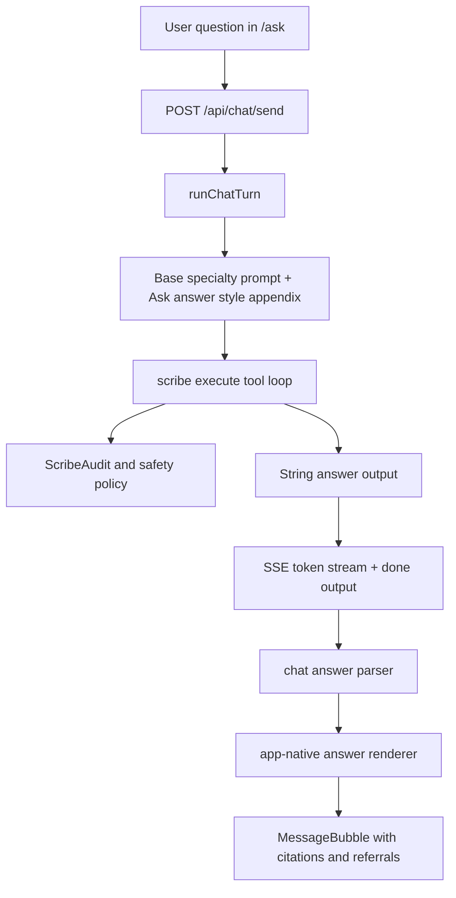
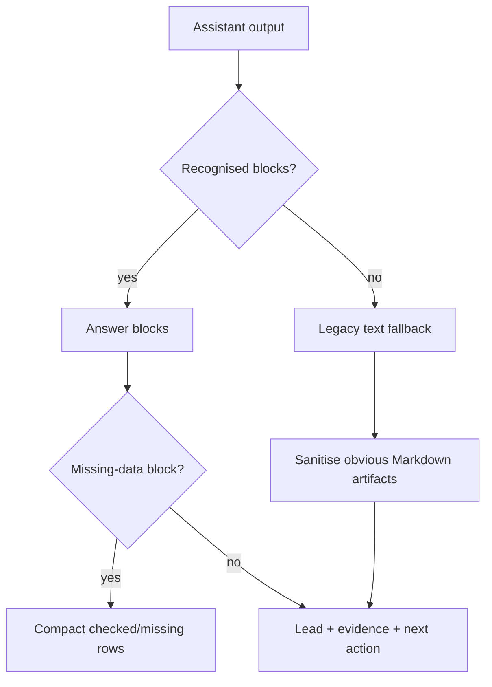

# feat: World-class Ask answer formatting and scribe response UX

## Summary

Upgrade `/ask` answers from raw report-style Markdown into a calm, structured health conversation surface. The work combines a shared scribe response-style contract with an app-native answer renderer, so answers feel designed even when the record is sparse, while preserving the existing streaming, audit, citation, and safety contracts.

## Problem Frame

The current Ask experience can produce answers like:

```text
I've done a thorough search across your iron topic and here's what I found:
---
### What Your Record Shows
| What I Checked | Result |
...
```

That content has two distinct problems. First, the model is free to write generic report Markdown: horizontal rules, emoji, table syntax, "thorough search" preambles, and long lists that feel more like a system transcript than a premium health assistant. Second, `src/components/chat/message-bubble.tsx` renders assistant content as a plain string inside one bubble, so Markdown tables/headings/separators are visible as raw syntax instead of becoming designed UI.

The fix should treat Ask as a first-class product surface: concise answer first, evidence second, clear missing-data state when the vault has no relevant data, and gentle next actions. It must not weaken the health-safety posture: user-scoping, `ScribeAudit`, `SourceChunk` citations, and safe fallback behavior remain load-bearing.

## Requirements

### Response Quality

- R1. Ask answers lead with the useful answer, not a process report. Avoid "I searched thoroughly" framing unless the user explicitly asks how the search worked.
- R2. Empty-record answers are compact and reassuring: state that no relevant values are on record, show what was checked, and offer the smallest useful next action.
- R3. Scribes must not emit raw Markdown tables, horizontal rules, emoji decoration, or oversized heading stacks for Ask answers.
- R4. Answers preserve clinical safety: no diagnosis, no prescription, no medication or dosage naming, and no imperative treatment instructions.
- R5. Claims about the user's own record remain grounded in graph tool results and citations. General education must be clearly framed as general context.

### UX And Rendering

- R6. Assistant bubbles render structured sections, bullets, short checked/missing lists, and next actions as app-native UI, not raw Markdown syntax.
- R7. Rendering is resilient to legacy or malformed output already stored in `ChatMessage.content`; old Markdown-ish answers should degrade gracefully instead of looking broken.
- R8. Streaming remains smooth: partial text can stream in the existing bubble, then the completed answer renders in the richer structured view once `done` lands.
- R9. History rehydration displays the same formatted answer as the live turn, using the persisted `ChatMessage.content` and metadata.
- R10. The design works on mobile: no wide tables, no horizontal overflow, no dense nested cards inside the chat bubble.

### Contracts And Operations

- R11. `POST /api/chat/send` keeps its current SSE event names and `done.output` shape for compatibility with existing clients and tests.
- R12. The solution does not add a broad Markdown dependency unless implementation proves the existing constrained parser approach cannot meet the UI requirements.
- R13. Demo Ask examples should show the new answer feel so product review does not need a real LLM call.

## Scope Boundaries

**In scope:**

- Shared Ask answer style contract for runtime scribe answers.
- Prompt integration for `/ask` runtime turns.
- A constrained chat-answer parser and renderer for assistant bubbles.
- Better empty-record and missing-data presentation.
- Regression tests for prompt contract, parsing, and chat rendering behavior where practical.
- Visual verification of `/ask` and `/demo/ask` on desktop and mobile.

**Deferred:**

- Changing the underlying retrieval, embedding, or graph tool logic.
- New specialist domains or new medical reasoning capability.
- Full multi-thread chat history UX.
- Replacing the SSE protocol or persisting a new structured answer JSON column.
- Domain verification for a Morning Form sender address; this is unrelated to Ask response formatting.

**Non-goals:**

- Turning Ask into a diagnostic chatbot.
- Hiding uncertainty when data is missing.
- Building a general-purpose Markdown renderer for the whole app.

## Current State And Patterns

- `src/app/(app)/ask/page.tsx` owns the signed-in Ask surface, history loading, optimistic user bubble, consent retry, and streaming assistant state.
- `src/app/api/chat/send/route.ts` exposes the current SSE contract: `routed`, `token`, `done`, and `error`.
- `src/lib/chat/turn.ts` resolves the routed topic, loads the specialty prompt, calls `execute()`, streams chunks, and persists the final assistant message.
- `src/lib/scribe/execute.ts` owns the tool-use loop, policy enforcement, and `ScribeAudit` write. This should stay unchanged except where tests need to prove the response-style prompt reaches the LLM request.
- `src/lib/scribe/specialties/*/system-prompt.md` files define domain and safety behavior but do not define a product-quality answer format.
- `src/components/chat/message-bubble.tsx` renders assistant content as plain text and separately renders citations/referrals.
- `src/components/topic/three-tier-section.tsx` already uses a constrained Markdown-esque renderer rather than a full Markdown dependency. That is the closest local pattern: parse a small subset and keep the output predictable.
- `src/app/demo/ask/page.tsx` shares `MessageList` and `MessageBubble`, making it a useful visual fixture for the new answer surface.

## Key Technical Decisions

- KTD1. Fix both generation and rendering. Prompt changes alone cannot repair stored history or model drift, and rendering alone cannot make verbose report-style answers feel conversational.
- KTD2. Use a constrained answer renderer, not a broad Markdown renderer. The app already favors predictable block parsing over full Markdown, and chat answers need product-specific blocks like missing-data checks and next actions.
- KTD3. Keep the chat wire contract stable. `done.output` remains a string; the client derives presentation from it. This avoids a risky API contract migration while still improving the UI.
- KTD4. Add the response-style contract at the runtime chat layer. Compile-time topic pages and specialist prompt identity should not be rewritten globally just to improve `/ask`; Ask can append a shared runtime answer appendix when calling `execute()`.
- KTD5. Treat "no data yet" as a designed state. Empty graph/tool results should render as a compact, useful state with checked areas and next steps, not a long apology or a table.
- KTD6. Make malformed output survivable. If the model emits a table or legacy headings anyway, the renderer should avoid raw syntax where feasible and fall back to readable prose when parsing is uncertain.

## High-Level Technical Design



The model still produces a string, but the string is constrained to a small, human-readable answer grammar. The renderer parses that grammar into blocks such as lead, evidence, missing-data checks, bullets, and next actions. If parsing fails, the answer still renders as safe text.



## Implementation Units

### U1. Define the Ask answer style contract

- **Goal:** Create a single shared contract for how runtime Ask answers should read: concise lead, optional evidence, optional missing-data check, optional next action, no raw tables, no decorative emoji, no horizontal rules.
- **Requirements:** R1, R2, R3, R4, R5
- **Files:**
  - Create: `src/lib/chat/answer-style.ts`
  - Test: `src/lib/chat/answer-style.test.ts`
  - Modify: `src/lib/scribe/specialties/core-specialists.test.ts`
- **Approach:** Express the style as a small exported string or builder used only for runtime chat. Keep it separate from specialty identity prompts so product formatting can evolve without editing every specialty prompt file.
- **Patterns to follow:** `src/lib/scribe/specialties/load-prompt.ts` keeps prompts memoized and testable; `src/lib/scribe/specialties/core-specialists.test.ts` already pins prompt invariants.
- **Test scenarios:**
  - Contract contains explicit bans for tables, horizontal rules, and emoji decoration.
  - Contract instructs concise empty-record handling.
  - Contract repeats safety boundaries without weakening existing specialty rules.
  - Contract names citation discipline for user-record claims.

### U2. Append the style contract to Ask runtime scribe calls

- **Goal:** Ensure `/ask` runtime turns send the shared answer contract to the scribe LLM without changing compile-time topic generation or public tool contracts.
- **Requirements:** R1, R3, R4, R5, R11
- **Files:**
  - Modify: `src/lib/chat/turn.ts`
  - Test: `src/lib/chat/turn.test.ts`
  - Test: `src/app/api/chat/send/route.test.ts`
- **Approach:** Build the runtime system prompt from the specialty prompt plus the Ask answer style appendix before calling `execute()`. Keep `execute()` generic; the chat orchestration layer owns the Ask-specific product shape.
- **Patterns to follow:** `src/lib/chat/turn.ts` already resolves the specialty prompt and owns runtime chat concerns; avoid moving product UX instructions into `src/lib/scribe/execute.ts`.
- **Test scenarios:**
  - Scripted LLM captures the system prompt and sees the Ask answer style appendix.
  - `POST /api/chat/send` still emits `routed`, `token`, `done` in the same order.
  - `done.output` remains the exact string returned by the scribe on clinical-safe output.
  - Rejected output still uses the existing fallback and does not leak unsafe text.

### U3. Add a constrained chat answer parser

- **Goal:** Convert safe, predictable answer text into typed presentation blocks while preserving a readable fallback for old or malformed content.
- **Requirements:** R6, R7, R9, R12
- **Files:**
  - Create: `src/lib/chat/answer-format.ts`
  - Test: `src/lib/chat/answer-format.test.ts`
- **Approach:** Parse only the subset the prompt contract asks for: short headings, paragraphs, `- ` bullets, numbered next actions, and simple checked/missing rows. Add light cleanup for legacy artifacts such as `---`, `###`, and pipe tables so existing stored answers are less ugly.
- **Patterns to follow:** `src/components/topic/three-tier-section.tsx` parses blocks directly rather than mounting a full Markdown renderer.
- **Test scenarios:**
  - A well-formed answer becomes ordered lead/evidence/next-action blocks.
  - The sample raw Markdown table does not render as pipe syntax in the fallback parse.
  - Empty-record wording yields a missing-data block with checked items.
  - Unrecognised text returns a single prose block without throwing.
  - Long words and long bullet content do not require horizontal overflow in the data model returned by the parser.

### U4. Render assistant answers with app-native structure

- **Goal:** Replace the single raw-text assistant body with a polished answer renderer inside `MessageBubble`, while keeping SpecialistChip, ReferralChips, and CitationList behavior.
- **Requirements:** R6, R7, R8, R9, R10
- **Files:**
  - Create: `src/components/chat/answer-renderer.tsx`
  - Modify: `src/components/chat/message-bubble.tsx`
  - Test: `src/components/chat/answer-renderer.test.tsx` if the existing test environment can support React rendering; otherwise cover parser behavior in U3 and verify visually.
- **Approach:** Render paragraphs, bullets, missing-data rows, and next actions as unframed internal sections within the assistant bubble. Avoid nested card styling inside the bubble. During streaming, render the simple text body; once `done` or history rehydration supplies final content, use the structured renderer.
- **Patterns to follow:** Chat bubbles already use restrained border/surface tokens; topic sections use compact text hierarchy and predictable block spacing.
- **Test scenarios:**
  - Clinical-safe assistant message with final content uses the answer renderer.
  - Pending streaming message remains stable and does not flicker between partial block parses.
  - Out-of-scope fallback keeps its existing GP-prep styling.
  - Citations still render as `Mention` chips below the answer.
  - Mobile widths do not produce table-like overflow.

### U5. Upgrade demo and empty-state examples

- **Goal:** Make `/demo/ask` and the real `/ask` empty state demonstrate the desired answer feel without requiring a live LLM call.
- **Requirements:** R2, R10, R13
- **Files:**
  - Modify: `src/app/demo/ask/page.tsx`
  - Modify: `src/app/(app)/ask/page.tsx`
- **Approach:** Update canned demo answers to the new answer contract and add at least one sparse-record example. Keep public demo citations empty by contract, as today.
- **Patterns to follow:** `src/app/demo/ask/page.tsx` already documents why demo citations stay empty and uses the shared chat components.
- **Test scenarios:**
  - Demo canned turns parse into structured blocks.
  - Demo page still avoids authenticated citation chips.
  - Empty-state suggestion chips remain short and do not imply medical advice.

### U6. Visual verification and regression gate

- **Goal:** Prove the new answer UX works in the actual surfaces before shipping.
- **Requirements:** R6, R7, R8, R9, R10, R13
- **Files:**
  - No durable file required unless a screenshot script already exists and is worth extending.
- **Approach:** Run the relevant test suite, start the app, verify `/demo/ask` and `/ask` with desktop and mobile widths, and inspect a response matching the user's iron empty-record sample.
- **Patterns to follow:** Recent production work used focused tests, `npm test`, and Vercel/browser smoke checks before merge.
- **Test scenarios:**
  - Desktop `/demo/ask` shows no raw Markdown syntax.
  - Mobile `/demo/ask` has no horizontal overflow and no overlapping text.
  - Signed-in `/ask` history rehydrates a formatted assistant answer.
  - A live or scripted sparse iron answer renders as missing-data UX, not a raw table.

## Acceptance Examples

- AE1. Given the user asks "what do you know about my iron?" and no ferritin/iron labs exist, the assistant answers with a short "I don't have iron results in your record yet" lead, a compact checked/missing list, and a next action to add or upload results. It does not emit a Markdown table.
- AE2. Given the user asks about a biomarker that exists with citations, the answer starts with the interpretation, then shows the supporting value/trend and keeps citations visible through the existing citation chips.
- AE3. Given an old stored assistant answer containing `---`, `###`, and pipe-table rows, history rehydration strips or adapts the syntax into readable blocks instead of displaying raw table markup.
- AE4. Given the scribe output is rejected by policy, the existing safe fallback still renders and the rejected raw content is not shown.
- AE5. Given a streaming answer is mid-turn, the bubble remains stable; once `done` arrives, the final content is rendered with the structured answer renderer.

## Risks And Mitigations

| Risk | Impact | Mitigation |
|---|---|---|
| The model ignores the style contract | Raw or verbose output still appears | Renderer handles legacy/malformed text and tests pin common failure shapes |
| Parser grows into a fragile Markdown clone | Maintenance burden and inconsistent output | Keep the parsed subset small and tied to the prompt contract |
| Formatting instructions weaken safety instructions | Clinical-risk regression | Append style after preserving safety language; tests assert safety phrases remain present |
| Rich rendering hides citation context | User cannot inspect evidence | Keep existing `CitationList` and `Mention` chips; do not inline unverifiable claims |
| Streaming parser flicker | Poor live-answer feel | Render simple text while pending and structured blocks only after final content |

## Verification Plan

- Run `npx vitest run src/lib/chat/answer-style.test.ts src/lib/chat/answer-format.test.ts src/lib/chat/turn.test.ts src/app/api/chat/send/route.test.ts`.
- Run `npm test`.
- Run `npx tsc --noEmit`.
- Start the app locally and visually verify `/demo/ask` at desktop and mobile widths.
- Verify a signed-in `/ask` answer or scripted equivalent using the sparse iron-data example from the prompt.
