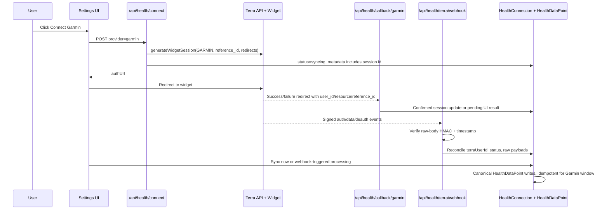

# feat: Make Garmin work through Terra

## Summary

Ship Garmin as a real Terra-mediated health integration: users connect through Terra's Garmin widget, Morning Form reconciles the Terra user back to `HealthConnection`, ingests Garmin daily/sleep/activity data into canonical `HealthDataPoint` rows, and processes signed Terra webhooks without relying on mock fallback in production.

---

## Problem Frame

Garmin is already present in the product surface and provider registry, but the current path is only a scaffold. `src/app/api/health/connect/route.ts` starts a mock Terra widget session, `src/app/api/health/callback/[provider]/route.ts` treats Garmin as `mock_or_terra`, `src/lib/health/sync.ts` ignores the stored Terra user id and pulls canned daily data, and `src/app/api/health/terra/webhook/route.ts` checks only that a signature header exists before logging the payload.

From first principles, the right route is Terra now, direct Garmin later. Morning Form's strategic asset is the user's evidence-grounded health graph, not provider-auth plumbing. The business outcome is trustworthy Garmin data flowing into the graph quickly and safely. Direct Garmin requires partner-program approval, evaluation access, OAuth/token lifecycle ownership, webhook tooling, commercial licensing, and Garmin-specific parser maintenance before a user sees value. Terra already provides the Garmin user-authentication widget, owns token refresh/provider edge cases, sends auth/data events to our backend, and matches the existing repo direction for Apple Health/Garmin aggregation.

---

## Requirements

**Provider Route**

- R1. Garmin must use Terra's Health & Fitness API widget flow, not the direct `GarminClient`, for this implementation pass.
- R2. The Terra widget session must be generated by the backend with `providers: "GARMIN"`, a non-PII `reference_id` that resolves to the Morning Form user, and explicit success/failure redirect URLs.
- R3. Production must fail loud when Terra credentials are missing or invalid; mock Terra sessions are allowed only in local/test environments.

**Connection Reconciliation**

- R4. A successful Terra Garmin connection must create or update exactly one `HealthConnection` row for `(userId, provider="garmin")` with `status="connected"`, the Terra `user_id` in `terraUserId`, and useful metadata such as provider/resource, scopes, widget session id, and connected timestamp.
- R5. The redirect callback must not blindly trust query parameters. If it stores Terra identifiers from the redirect, it must either be attached to the current authenticated user and match the expected reference id, or be confirmed through Terra's user info API. Otherwise the signed auth webhook is authoritative.
- R6. Terra auth failure, deauth, revoked-access, and unknown-user events must be visible through `HealthConnection.status`/metadata and diagnostics instead of disappearing into logs.

**Data Ingestion**

- R7. Garmin sync must use the stored `terraUserId` and Terra's live endpoints for daily summaries, sleep sessions, and activity/workout data over the requested date window.
- R8. Garmin data must normalize through the existing canonical metric layer before writing `HealthDataPoint` rows. Existing aliases such as `steps`, `duration`, `resting_hr`, `avg_hr`, `max_hr`, `hrv`, and `recovery_score` remain stable.
- R9. Garmin-specific values that are product-relevant but not yet consumed by suggestions, such as stress, Body Battery, VO2 max, or training load, must either map to explicit canonical metrics or be retained in raw payload storage; they must not be silently dropped without trace.
- R10. Re-running a Garmin sync for the same user/window must not create unbounded duplicate points.
- R11. Raw Terra payloads for Garmin pull and push events must be captured before normalization for replay/debugging, using the existing `RawProviderPayload` table.

**Security and Operations**

- R12. Terra webhooks must verify the `terra-signature` HMAC against the raw request body, use timing-safe comparison, reject stale timestamps, and fail closed when `TERRA_WEBHOOK_SECRET` is configured.
- R13. Webhook processing must be idempotent enough for Terra retries and safe for unauthenticated public ingress.
- R14. Disconnecting Garmin in Morning Form must clear local connection state and, when a Terra user id is present, attempt Terra deauthentication so user intent is honored outside our database too.
- R15. Setup docs and env examples must describe Terra as the live Garmin route and direct Garmin credentials as deferred/unneeded for this path.
- R16. The existing direct `GarminClient` stub must be deleted, quarantined, or clearly marked as non-production/deferred so no live code can accidentally wire it instead of Terra.

---

## Key Technical Decisions

- **KTD1. Terra is the Garmin route for now.** Terra matches the existing architecture, gives faster access to Garmin data, reduces auth/parser maintenance, and avoids blocking on Garmin partner approval/commercial terms. Direct Garmin is deferred until Garmin-specific depth becomes a product differentiator rather than a connectivity requirement.
- **KTD2. Signed webhook is the authoritative reconciliation path; redirect is UX assist.** Terra redirects include useful `user_id`, `resource`, and `reference_id` parameters, but query params are not a security boundary. Use the redirect for immediate UI feedback only when it can be tied to the authenticated session or confirmed server-to-server; otherwise wait for the signed auth event.
- **KTD3. Keep the existing flat health-data model.** `HealthConnection.terraUserId`, `HealthDataPoint`, and `RawProviderPayload` are enough for Garmin v1. Do not introduce `TerraUser`, `SleepSession`, `Workout`, or device-mapping tables in this pass.
- **KTD4. Normalize only what the product can use; retain the rest raw.** Map high-signal wearable fields into canonical metrics and keep richer provider-specific payloads in `RawProviderPayload` until a graph/backfill plan turns them into cited `SourceDocument`/`SourceChunk` evidence.
- **KTD5. No silent production mocks.** The repo's historical Dexcom issue showed how connected users can receive fake data when credentialed paths fall through to mocks. Garmin/Terra should keep deterministic mocks for tests/dev, but production missing credentials should set a visible error instead of pretending to connect.
- **KTD6. Idempotence is scoped to Garmin/Terra writes.** The broader health sync path may still deserve a general dedupe plan, but this work only needs to stop Garmin sync/webhook retries from compounding duplicate rows.
- **KTD7. Retire the direct Garmin stub from the live surface.** The existing `GarminClient` is not a real direct integration and its OAuth assumptions are stale relative to Garmin's current OAuth2/PKCE developer material. Leaving it exported as if it were usable creates the exact wrong implementation path.

---

## Scope Boundaries

### In Scope

- Real Terra widget session generation for Garmin.
- Terra callback and signed webhook reconciliation into `HealthConnection`.
- Terra pull client methods for Garmin daily, sleep, and activity data.
- Garmin/Terra normalization into existing canonical metrics and raw-payload capture.
- Garmin-specific settings UI status/error clarity only where needed to reflect the backend states.
- Documentation and environment setup for Terra-backed Garmin.
- Removal or quarantine of the direct Garmin scaffold from live exports.

### Deferred to Follow-Up Work

- Direct Garmin Health API integration, including Garmin partner approval, OAuth2/PKCE token lifecycle, direct Garmin webhooks, and Garmin deauthorization endpoints.
- First-class workout/activity entities, sleep-session tables, device mapping, and graph `SourceDocument` generation for wearable windows.
- Full mobile-app parity in `morning-form-mobile`. The sibling app currently lists Garmin but does not perform browser handoff and expects `status === "active"` while the web API returns `connected`; fix after the web backend path is real.
- General dedupe semantics for every provider in `HealthSyncService`.
- Apple Health mobile SDK improvements.

---

## High-Level Technical Design

The data flow deliberately has two reconciliation paths. The redirect keeps the user's browser from feeling stuck. The webhook carries the security boundary for unauthenticated provider events and eventual consistency if the browser loses session context.

---

## Implementation Units

### U1. Terra Client Real Auth and Pull Surface

**Goal:** Replace `TerraClient`'s mock-only Garmin behavior with a live, typed client surface for widget sessions, user info/deauth, and historical pull endpoints while preserving deterministic local/test mock behavior.

**Requirements:** R1, R2, R3, R7, R11, R16

**Dependencies:** None

**Files:**

- `src/lib/health/terra.ts`
- `src/lib/health/terra.test.ts`
- `src/lib/health/garmin.ts`
- `src/lib/health/index.ts`
- `src/lib/env.ts`
- `.env.example`

**Approach:** Add Terra typed errors and bounded retry behavior following `src/lib/health/libre.ts` and `src/lib/health/dexcom.ts`. `generateWidgetSession` should POST to Terra with the existing `dev-id` and `x-api-key` headers, `providers: "GARMIN"`, `reference_id: user.id`, and explicit Garmin success/failure redirects. Add user-info and deauthenticate helpers so callback and disconnect logic can verify or revoke Terra-side state. Implement live `getDaily`, `getSleep`, and `getActivity` pull methods that accept `terraUserId`, `startDate`, `endDate`, and return typed/passthrough payloads suitable for normalization and raw capture. Remove the direct Garmin client export from the live provider surface, or leave only a clearly documented deferred stub that no route imports.

**Execution note:** Characterization-first for current mock outputs before replacing method bodies, because `sync.test.ts` already locks the Terra daily canonical contract for Apple Health.

**Patterns to follow:** `src/lib/health/libre.ts` for typed errors/retry; `src/lib/health/dexcom.ts` for zod validation around vendor responses; existing `captureRawPayload` call pattern in `src/lib/health/sync.ts`.

**Test scenarios:**

- Happy path: `generateWidgetSession` with Terra env vars sends `providers: "GARMIN"`, reference id, and success/failure redirect URLs, then returns Terra's `url`, `session_id`, and expiry.
- Error path: production-like env with missing Terra API key or dev id throws a typed configuration error; it does not return a mock widget URL.
- Error path: Terra 401 becomes a typed auth/configuration error; 429/5xx use bounded retry and surface a transient/rate-limit error.
- Happy path: daily/sleep/activity methods call the expected Terra endpoint with `user_id`, `start_date`, `end_date`, and `to_webhook=false` for synchronous sync.
- Edge case: malformed Terra response fails visibly with a typed transient error and does not normalize an empty success.
- Edge case: no live route or sync path imports `GarminClient`; any remaining direct stub is marked deferred and covered by a test or import check.
- Dev/test path: with no Terra env in test mode, methods return deterministic mock data matching existing characterization expectations.

**Verification:** Terra client tests pass; existing Apple Health/Terra sync tests still pass; manual local connect still works in mock mode.

### U2. Garmin Connection Launch and Callback Reconciliation

**Goal:** Make the Garmin Connect button launch a real Terra Garmin session and reconcile the redirect safely into `HealthConnection`.

**Requirements:** R2, R3, R4, R5, R6

**Dependencies:** U1

**Files:**

- `src/app/api/health/connect/route.ts`
- `src/app/api/health/callback/[provider]/route.ts`
- `src/app/api/health/connect/route.test.ts`
- `src/app/api/health/callback/[provider]/route.test.ts`
- `src/types/index.ts`

**Approach:** In the Garmin branch, call the real Terra widget helper and persist a `syncing` connection with metadata that records the Terra widget session id and connection attempt timestamp. Update the generic callback to detect Terra-style query params for Garmin, validate the current authenticated user where possible, and either store confirmed Terra state or leave a pending/syncing row for the signed webhook to complete. Extend the local HealthConnection status type/UI interpretation if implementation keeps using `needs_reauth` or introduces a more precise `pending` state.

**Patterns to follow:** Existing `connect/route.ts` upsert pattern; `src/app/api/health/connections/route.ts` metadata response shape; Dexcom/Libre "no silent mock" lesson in `docs/plans/2026-04-15-003-fix-dexcom-real-path-hardening-plan.md`.

**Test scenarios:**

- Happy path: authed Garmin connect returns a Terra `authUrl`, persists `(userId, garmin)` as `syncing`, and stores widget session metadata without access/refresh tokens.
- Error path: unauthenticated Garmin connect returns 401 and does not call Terra.
- Error path: Terra config/auth failure returns a non-200 response and persists a visible error state only when a row already exists for that user/provider.
- Happy path: callback with authenticated user, matching `reference_id`, `resource=GARMIN`, and server-confirmed Terra user updates `terraUserId`, `status=connected`, and metadata.
- Edge case: callback with no session or mismatched reference id does not write another user's connection; it redirects with a pending/error message and waits for webhook reconciliation.
- Error path: callback `error` query sets a visible error metadata value rather than swallowing the failure.

**Verification:** Route tests pass; clicking Garmin in local dev produces a Terra/mock widget URL and returns to `/settings/integrations` with a clear status message.

### U3. Signed Terra Webhook Receiver

**Goal:** Turn the Terra webhook route from a logging stub into the authoritative, signed ingestion/reconciliation endpoint for Garmin auth, deauth, and data events.

**Requirements:** R4, R6, R11, R12, R13

**Dependencies:** U1

**Files:**

- `src/app/api/health/terra/webhook/route.ts`
- `src/app/api/health/terra/webhook/route.test.ts`
- `src/lib/health/terra.ts`
- `src/lib/health/raw-payload.ts`
- `src/lib/marketing/diagnostic.ts`

**Approach:** Read the raw request body with `request.text()` before JSON parsing. Verify Terra's `terra-signature` header using the documented timestamp + raw-body HMAC scheme, reject stale timestamps, and compare signatures with `timingSafeEqual`. Parse auth events to update `HealthConnection` by `reference_id` + provider, store `terraUserId`, and mark failures/deauth/revocations visibly. Capture every accepted webhook payload into `RawProviderPayload` with `source: "push"` before processing. Unknown users, unknown providers, invalid signatures, and malformed payloads should increment diagnostics using existing kebab-case counter conventions.

**Patterns to follow:** `src/lib/marketing/diagnostic.ts` counter convention; raw payload capture helper; `src/middleware.ts` already leaves `/api/health/terra/webhook` outside the cookie gate.

**Test scenarios:**

- Happy path: valid signed Garmin `auth` success event with `reference_id` updates the matching connection to `connected`, stores `terraUserId`, and captures the raw payload.
- Edge case: valid signed auth event for an unknown `reference_id` returns 200 or 202 per retry policy but increments a `terra-webhook-unmatched-user` diagnostic and does not create an orphan connection.
- Error path: missing signature with `TERRA_WEBHOOK_SECRET` configured returns 401/400 and performs no DB write.
- Error path: invalid signature returns 401/400 and performs no DB write.
- Error path: stale timestamp returns 401/400 and performs no DB write.
- Happy path: deauth/revoked event marks the Garmin connection disconnected or needs reauth and clears `terraUserId` where appropriate.
- Edge case: non-Garmin Terra data event is captured but not processed by Garmin-specific normalization.

**Verification:** Webhook route tests pass; a manually signed fixture updates a local connection row; unsigned fixtures fail closed when the secret is set.

### U4. Garmin/Terra Normalization and Idempotent Persistence

**Goal:** Pull and normalize real Garmin data through Terra using the stored `terraUserId`, then persist useful canonical health points without duplicate growth.

**Requirements:** R7, R8, R9, R10, R11

**Dependencies:** U1, U2 or U3 for a stored `terraUserId`

**Files:**

- `src/lib/health/sync.ts`
- `src/lib/health/canonical.ts`
- `src/lib/health/canonical.test.ts`
- `src/lib/health/sync.test.ts`
- `src/lib/health/normalize.ts`

**Approach:** Replace the current Garmin branch that calls `this.terra.getDaily("user", ...)` with connection-aware Terra pulls using `connection.terraUserId`. Normalize daily, sleep, and activity payloads into existing canonical aliases, adding a small number of new canonical metrics only if Garmin/Terra provides stable fields that the product should retain as first-class `HealthDataPoint`s. Prefer nullable/tolerant mapping over brittle all-or-nothing parsing: one missing optional field should not discard the whole day. Before writing Garmin points for a sync window, remove or skip existing Garmin points for the same user/provider/window/metric/timestamp so manual sync and webhook retry do not compound duplicates.

**Patterns to follow:** Current `sync.ts` `capture()` wrapper; `pointFromCanonical`; Apple Health route's replace-window behavior in `src/app/api/health/apple-health/route.ts`; sync characterization tests.

**Test scenarios:**

- Happy path: connected Garmin row with `terraUserId` pulls Terra daily/sleep/activity data and emits steps, resting HR, HRV, sleep duration/stages, average/max HR, active minutes/calories where available.
- Edge case: missing `terraUserId` sets a visible sync error and does not fall back to mock data in production-like mode.
- Edge case: Terra payload missing optional stress/body-battery/training fields still writes the cross-provider canonical metrics that are present.
- Error path: Terra auth/config error marks the connection as needs reauth or error with a stable `syncError` code.
- Error path: Terra transient failure leaves existing data untouched and records failure metadata.
- Idempotence: running `syncConnection` twice for the same Garmin window does not double row count for the same metric/timestamp values.
- Raw capture: each Terra pull response is captured with provider `garmin`, source `pull`, and request-window context.

**Verification:** `src/lib/health/sync.test.ts` covers Garmin real-path and idempotence; existing provider characterization tests remain green; local manual sync on a connected/mock Garmin row returns non-zero data points and stable repeated row counts.

### U5. Disconnect, Status UI, and Operational Visibility

**Goal:** Make Garmin connection state understandable to users/operators and make disconnect honor user intent in both Morning Form and Terra.

**Requirements:** R4, R6, R14, R15

**Dependencies:** U1, U2, U3, U4

**Files:**

- `src/app/api/health/connections/route.ts`
- `src/app/(app)/settings/integrations/page.tsx`
- `src/app/api/health/connections/route.test.ts`
- `docs/HEALTH_PROVIDER_SETUP.md`
- `.env.example`

**Approach:** Extend disconnect so a Garmin row with `terraUserId` attempts Terra deauthentication before clearing local state. Keep the local clear resilient if Terra deauth fails, but record the failure in metadata/diagnostics for operator follow-up. Update settings copy/status rendering only enough to show pending, connected, error, needs reauth, and disconnected states coherently for Garmin. Update docs so operators configure Terra dashboard sources/destination, `TERRA_API_KEY`, `TERRA_DEV_ID`, `TERRA_WEBHOOK_SECRET`, and the deployed webhook URL; direct Garmin consumer credentials remain documented as deferred and unused by the current flow.

**Patterns to follow:** Existing settings card state rendering; `incrementDiagnostic` naming convention; Health Provider Setup's provider-by-provider sections.

**Test scenarios:**

- Happy path: deleting a connected Garmin connection with `terraUserId` calls Terra deauthenticate and clears local connection state.
- Error path: Terra deauth failure still clears local state if the user requested disconnect, but stores a `terraDeauthError` metadata/diagnostic signal.
- UI state: Garmin `syncing`/pending shows as in-progress rather than falsely disconnected.
- UI state: Garmin `needs_reauth` or `error` shows a reconnect prompt with the stored `syncError`.
- Docs check: setup guide includes Terra dashboard source/destination setup and no longer implies direct Garmin keys are required for live Garmin.

**Verification:** Connections route tests pass; settings page manual smoke shows correct Garmin state transitions; docs match the implemented env requirements.

---

## Acceptance Examples

- AE1. Given an authenticated user with Terra credentials configured, when they click Connect Garmin, then Morning Form redirects them to a Terra widget session limited to Garmin and stores a pending/syncing Garmin connection attempt.
- AE2. Given Terra sends a valid signed Garmin auth-success webhook with that user's `reference_id`, when the webhook route receives it, then the Garmin `HealthConnection` becomes connected and stores the Terra user id.
- AE3. Given a connected Garmin row with `terraUserId`, when the user clicks Sync now, then Morning Form pulls Terra Garmin data, writes canonical `HealthDataPoint` rows, captures raw payloads, and repeated sync does not duplicate the same window.
- AE4. Given Terra sends an invalidly signed webhook, when the route receives it, then no connection or health data is written and the request fails closed.
- AE5. Given the user disconnects Garmin, when a Terra user id is present, then Morning Form attempts Terra deauthentication and clears local state with a visible diagnostic if Terra cannot be reached.

---

## System-Wide Impact

- **Health data trust:** This removes a mock-data path for a user-visible provider. The plan should be implemented with the same fail-loud posture as the Dexcom real-path hardening work.
- **Public webhook ingress:** `/api/health/terra/webhook` remains outside cookie middleware. HMAC verification, timestamp tolerance, and raw-body handling are load-bearing security controls.
- **Article 9 / special-category data:** Garmin payloads can contain detailed sleep, stress, heart-rate, and activity data. Raw payload capture is useful but increases retained sensitive data; keep the existing admin-only/raw-payload posture and revisit retention in a later data-lifecycle plan.
- **Graph pipeline:** This plan only writes `HealthDataPoint` and raw payloads. The health graph can consume wearable windows later through the existing graph/backfill plans.
- **Mobile sibling app:** The mobile app has a stale integrations surface. It should not be treated as proof that Garmin is fully wired until the web backend is live.

---

## Risks & Mitigations

| Risk | Mitigation |
|---|---|
| Terra payload shapes differ from the current mock interfaces | Use zod/passthrough parsing, raw payload capture, and tolerant field-level mapping; do not require optional Garmin-specific fields to write core metrics. |
| Browser redirect loses user session or is spoofed | Treat redirect as UX assist; only signed webhook or server-confirmed user info writes authoritative Terra identifiers. |
| Webhook signature verification fails because JSON parsing changes the body | Read `request.text()` first and verify against the raw body before parsing. |
| Production silently uses mock data | Gate mocks to dev/test and add production config errors for missing Terra credentials. |
| Replayed webhooks or repeated manual sync duplicate data | Add Garmin-window idempotence in persistence and capture raw payloads for retry analysis. |
| Terra is a paid dependency | This is already the documented Apple Health/Garmin route. If active-user economics become unfavorable, revisit direct Garmin after real Garmin demand is proven. |

---

## Documentation and Operational Notes

- Configure Terra dashboard sources so Garmin is enabled for the project.
- Configure Terra destination/webhook to the deployed `/api/health/terra/webhook` URL.
- Set `TERRA_API_KEY`, `TERRA_DEV_ID`, and `TERRA_WEBHOOK_SECRET` in every environment that should support real Garmin.
- Keep `NEXT_PUBLIC_APP_URL` set to the canonical deployed origin so Terra redirects land on the correct callback.
- Do not require `GARMIN_CONSUMER_KEY` or `GARMIN_CONSUMER_SECRET` for this flow; keep them only as placeholders for a future direct-Garmin plan.
- Manual production smoke should use a real Garmin account through Terra, verify the connection row stores a Terra user id, run manual sync, and inspect `HealthDataPoint`/`RawProviderPayload` rows for the same user.

---

## Sources & Research

- Local implementation: `src/app/api/health/connect/route.ts`, `src/app/api/health/callback/[provider]/route.ts`, `src/app/api/health/terra/webhook/route.ts`, `src/lib/health/terra.ts`, `src/lib/health/sync.ts`, `src/lib/health/providers.ts`, `prisma/schema.prisma`.
- Local docs: `docs/HEALTH_PROVIDER_SETUP.md`, `docs/strategy/cto-architecture-2026-05-12.md`, `docs/plans/2026-04-15-003-fix-dexcom-real-path-hardening-plan.md`, `docs/plans/2026-04-14-003-feat-health-data-normalization-and-cgm-plan.md`.
- Terra widget flow: https://docs.tryterra.co/health-and-fitness-api/user-authentication/authentication-flow and https://docs.tryterra.co/health-and-fitness-api/user-authentication/implementation-terra-widget.
- Terra redirects and auth events: https://docs.tryterra.co/health-and-fitness-api/user-authentication/customising-authentication-redirects and https://docs.tryterra.co/health-and-fitness-api/user-authentication/handling-authentication-events.
- Terra API reference for widget sessions, user info, deauth, and historical endpoints: https://docs.tryterra.co/reference.
- Terra webhook signature requirements: https://docs.tryterra.co/health-and-fitness-api/integration-setup/setting-up-data-destinations/webhooks.
- Garmin Health API overview: https://developer.garmin.com/gc-developer-program/health-api/.
- Garmin Connect Developer Program overview and OAuth2/PKCE reference: https://developerportal.garmin.com/developer-programs/connect-developer-api and https://developerportal.garmin.com/sites/default/files/OAuth2PKCE.pdf.
