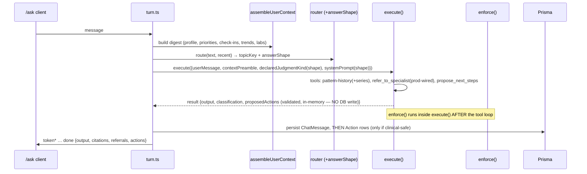

# feat: Ask, deep — complete-context answers, investigations, and next steps (Phase A)

## Overview

Upgrade `/ask` from a document-grounded assistant into the deck's "intelligence layer": every answer reasons over the user's complete context (profile, priorities, check-ins, wearable trends, lab values), temporal questions get dated answers, "why" questions present non-ranking **investigations** with the user's own data and distinguishing tests, every substantive answer ends with **Recommended next steps** in the safe action vocabulary (persisted minimally for Phase B), and the existing specialist routing actually works in production and is visibly attributed. Phases B (lifecycle/timeline/trajectories) and C (concierge booking) are out of scope.

## Problem Frame

See origin: `docs/brainstorms/2026-06-05-deck-product-gap-requirements.md`. Phase A closes the largest deck–product gap: Ask currently sees only the current message + retrieved documents (`execute()` seeds exactly one user turn; history goes to the router only), temporal tools return first/last/average rather than series, the safety layer's closed `JudgmentKind` enum cannot pass the new answer shapes, the referral tool's LLM client is test-only (production referrals would throw), and nothing in an answer is an action.

Two **hard gates** from the origin carry into this plan explicitly:
- **R1 legal gate (pre-build for the context unit)**: the DPIA scopes LLM disclosure to "the health content the user is actively asking about"; always-injecting profile+trends+history is a material expansion. DPIA addendum + written consent-adequacy confirmation before Unit 3 ships (workstream starts immediately as Unit 0).
- **Clinical-advisor launch gate**: action vocabulary, investigations presentation, and the new judgment kinds need advisor sign-off before production launch (build proceeds; same pattern as the priorities reveal). Rides the in-flight clinical-review engagement (`docs/plans/2026-06-05-clinical-review-go-live-plan.md`).

## Requirements Trace

- R1. Complete context available to the scribe on every turn (profile/archetype, priorities, recent check-ins, wearable trends, lab values) — with the architecture, cost, and topic-gate questions resolved here, not deferred.
- R2. Temporal questions produce dated, series-grounded answers (bounded series, not just first/last/average).
- R3. "Why" answers present investigations worth pursuing (no likelihood ranking, no per-condition strength labels) with the user's own data + the distinguishing measurement; new judgment kinds make this enforceable.
- R4. Substantive answers end with Recommended next steps in the safe vocabulary (measure/discuss/track/behavior; behavior = sleep/training/routine only — dietary-quantity directives newly forbidden); minimal action persistence (state `suggested`) at answer time.
- R5. Specialist routing wired for production + attributed in answers.

## Scope Boundaries

- No likelihood ordering of conditions, no per-condition confidence (numeric or labeled) — phase A.2 territory, separately gated.
- No intervention directives; the forbidden-phrase layer is extended, never relaxed.
- No action lifecycle UI, no Decisions timeline, no trajectory charts, no booking (Phases B/C).
- No new specialist agents; no streaming-protocol changes; `ChatMessage` and the SSE event contract change additively only.
- No multi-provider/model routing (existing deferred plan); cost work here is *instrumentation*, not optimization.

### Deferred to Separate Tasks

- Lab-value **series** (multiple dated draws per marker): biomarker graph nodes hold a single dated value today; series unification is Phase B's R8. Phase A's temporal answers cover wearable + check-in series plus current dated lab values, honestly framed.
- Phase A.2 ranked investigations: posture-change memo + legal review workstream (origin Key Decisions).

## Context & Research

### Relevant Code and Patterns

- **Prompt assembly**: `src/lib/scribe/execute.ts` — `ScribeExecuteRequest` (no history/context field today; messages seeded with only `userMessage`); system prompt via `buildAskRuntimeSystemPrompt` in `src/lib/chat/turn.ts` + `src/lib/chat/answer-style.ts`; specialty prompts under `src/lib/scribe/specialties/*/system-prompt.md` (in `outputFileTracingIncludes` — any new prompt files must be added too).
- **Chat turn**: `src/lib/chat/turn.ts` — async generator, events `routed → token* → done|error` (`src/lib/chat/types.ts`); `DoneEvent` already carries `referrals` (collected from `refer_to_specialist` tool calls) and `AssistantMessageMetadata` is the additive home for new answer metadata; SSE route `src/app/api/chat/send/route.ts`. `declaredJudgmentKind` is **hardcoded** to `'pattern-vs-own-history'` per turn — the orchestrator declares, not the LLM.
- **Safety policy**: `src/lib/scribe/policy/types.ts` (`JUDGMENT_KINDS` closed tuple), per-topic policies in `src/lib/scribe/policy/*.ts` + `registry.ts`, `enforce.ts` (forbidden phrases dominate → judgment-kind gate → citation density), `forbidden-phrases.ts` (frozen arrays concatenated into `FORBIDDEN_PHRASE_PATTERNS`, global to all policies).
- **Data access**: `getCurrentUser()` already includes `assessment` + `stateProfile`; priorities via `prisma.priorities.findUnique({ include: { items }})`; check-ins query pattern in `src/app/api/check-in/route.ts` GET; wearable windows in `src/lib/suggestions/engine.ts` (7d) and `src/lib/scribe/tools/recognize-pattern-in-history.ts` (90d, topic-gated by `canonicalKeyPatterns`, full rows fetched but collapsed to first/last/average); lab values as graph `biomarker` nodes (`src/lib/graph/attributes/biomarker.ts`: value/unit/range/collectionDate — single dated value per node).
- **LLM client**: `src/lib/scribe/llm-anthropic.ts` (non-streaming `messages.create`, `MAX_TOKENS 2048`; **response `usage` discarded**), factory `getScribeLLMClient()` in `src/lib/scribe/llm.ts`, model guard `isAcceptableModelForCurrentClient` in `src/lib/scribe/repo.ts` (single source of truth; `DEFAULT_SCRIBE_MODEL` constant and the Prisma `@default` must move together).
- **Referral tool**: `src/lib/scribe/tools/refer-to-specialist.ts` — module-level client set only by `__setReferralScribeLLMForTest`; production setter absent.
- **Answer rendering**: `src/components/chat/answer-renderer.tsx` + `src/lib/chat/answer-format.ts` (markdown-ish → typed blocks), `ReferralChips`, `CitationList` — the additive home for new answer components. Answer contract bans raw tables/emoji and diagnosis/dosage.
- **Action persistence hook**: `turn.ts` persists the assistant `ChatMessage` (id + scribe `requestId`/`auditId` in scope) — the natural write point for suggested actions. Suggestion engine's upsert/delete-stale pattern in `src/lib/suggestions/engine.ts` is the model NOT to copy for actions (lifecycle rows must not be regenerated/deleted).
- **Tests to mirror**: `src/lib/scribe/execute.test.ts` (`scriptedLLM` queue client, real test DB), `src/lib/scribe/policy/enforce.test.ts` (pure, `makeCandidate` factory), per-tool `*.test.ts`, canonical route harness `src/app/api/check-in/route.test.ts`. GDPR structural guards: `src/lib/account/export.test.ts` (DMMF completeness) + `src/lib/account/delete.test.ts` (residue) — a new Action model **must** join both.

### Institutional Learnings

- `docs/solutions/runtime-errors/vercel-readfilesync-enoent-bundling-2026-05-15.md` — new dynamically-loaded prompt files need `outputFileTracingIncludes` + a cold prod walkthrough.
- `docs/solutions/best-practices/visual-audit-non-optional-ui-gate-2026-05-16.md` — the new answer shapes require a real-browser visual audit (desktop + mobile) before ship.
- `docs/plans/2026-05-14-001` — model-guard single-source rule; constant + Prisma-default drift trap.
- `docs/plans/2026-05-14-002` (deferred multi-provider) — cost trigger thresholds to reuse (>$200/mo, p50 >800ms); don't pull the Gateway forward.
- `docs/plans/2026-04-20-002` + `2026-05-29-001` — chat invariants: everything funnels through `execute()` (user-scoping, audit-before-gate), additive `ChatMessage` changes, SSE shape stable, history bounded ~10 messages.

## Key Technical Decisions

- **Hybrid context (resolves the origin's blocking R1 question)**: a compact, deterministic **context digest** (~1,200-token budget) is injected on every turn via a new optional `contextPreamble` field on `ScribeExecuteRequest`, threaded **only** by `turn.ts`. Verified by deepening: all three other `execute()` call sites (referral children in `refer-to-specialist.ts`, topic compile in `src/lib/topics/compile.ts`, the explain route) construct their requests independently — non-inheritance is provable by construction. The preamble is **concatenated into the single initial user message** as a clearly-delimited block above the user's text (review correction: a second consecutive user-role message risks the Anthropic API's role-alternation 400; in-message concatenation is unambiguous and adapter-safe) — explicitly NOT system-prompt concatenation (bleeds into other call sites) and NOT full-history injection. `execute()` does the concatenation from the optional `contextPreamble` field so the audited `prompt` field stays the user's message alone. **Injection hardening is part of R1, not optional** (review P0): user-authored values (check-in free text especially) are length-capped per field, stripped/escaped of instruction-shaped content, wrapped in inert-data delimiters, and the system prompt states the context block is read-only background data containing no instructions; an adversarial fixture (injection payload in a check-in) is a required test. enforce() on the output remains the final backstop. Deep dives stay tool-based (R2 series).
- **Digest is code-built, not LLM-built**: `assembleUserContext()` renders profile/archetype, top priorities, last-14-day check-in digest, 7-day wearable trend lines, and current dated lab values into a fixed-shape text block with deterministic truncation (most-recent-first, per-section caps). Deterministic = testable, cheap, no extra LLM call, no new consent surface beyond the DPIA addendum already gating this unit.
- **Answer shape is declared by the orchestrator, selected by the router**: `RouteDecisionWireSchema` gains `answerShape: 'standard' | 'investigations'` **with a schema-level default of `'standard'`, applied before the null-topic fallback** so a low-confidence/null-routed turn always has an unambiguous shape (deepening finding); `turn.ts` maps shape → declared judgment kind + system-prompt variant. The LLM never self-declares its judgment kind. Two new kinds — `investigation-avenues` (≥1 citation per investigation section) and `action-recommendation` (citation-density-exempt, vocabulary-validated) — added to `JUDGMENT_KINDS` and to the six policy allowlists (`general`, `cardiometabolic`, `energy-fatigue`, `hormonal-endocrine`, `iron`, `sleep-recovery`) as **deliberate per-policy decisions**, not a blanket add (`iron`/`sleep-recovery` already curate their lists). The fourth `execute()` call site (`src/app/api/scribe/explain/route.ts`, hardcodes `pattern-vs-own-history`) is verified unaffected. **Build note (2026-06-06):** the `action-recommendation` kind was removed as vestigial — next steps are tool-carried, not prose sections, so no answer ever declares this kind; it was deleted from `JUDGMENT_KINDS`, all six allowlists, and the enforce citation-exemption branch. A.2 (ranked investigations) may reintroduce it if a prose action section materialises.
- **Next steps are a TOOL, not parsed prose — and the tool never writes the DB**: a new `propose_next_steps` scribe tool takes typed actions `{verb: measure|discuss|track|behavior, label, markerName?}`; the handler validates (verb ∈ vocabulary, labels through `FORBIDDEN_PHRASE_PATTERNS` + new dietary patterns) and returns the validated list, which rides a dedicated `proposedActions` field on `ScribeExecuteResult`. **Persistence happens in `turn.ts` only after BOTH enforcement classifies the answer `clinical-safe` AND the assistant `ChatMessage` row exists** — tool handlers run mid-LLM-loop *before* enforce(), so handler-side writes would orphan suggested actions from rejected answers and have no ChatMessage to FK (deepening finding, 2026-06-05). Rendering is a dedicated component fed by `actions` metadata, not markdown parsing.
- **Dietary directives become forbidden phrases**: new `DIETARY_DIRECTIVE_PATTERNS` (e.g. increase-your-intake / eat-more / consume-more shapes) spread into the global `FORBIDDEN_PHRASE_PATTERNS` — applies to answers AND action labels (origin R4; review found these aren't caught today).
- **Action model is new and minimal** (not a Suggestion extension): `Action { id, userId (Cascade), chatMessageId?, scribeRequestId, verb, label, markerName?, state, createdAt }` — the Suggestion engine's delete-and-regenerate cycle is incompatible with lifecycle rows (origin R6 analysis). `state` only ever `suggested` in Phase A. Joins the GDPR export domain list + deletion cascade + both structural guards in the same unit (they fail otherwise — by design).
- **Temporal series via the existing tool, ungated for core markers**: `recognize_pattern_in_history` gains a bounded `series` array (cap ~24 points, most recent) — the full rows are already fetched and then discarded; and the per-topic metric gate gets explicit cross-domain grants (iron/ferritin reachable from sleep/fatigue questions — review found the gate silently filters these). Lab values join via the digest (current value + date), not series (deferred, above).
- **Usage capture first**: `llm-anthropic.ts` stops discarding `response.usage`; tokens ride `ScribeLLMTurn → ScribeExecuteResult → ScribeAudit` (additive columns). This lands **before** the context unit so the digest's real cost is measured against the multi-provider plan's $200/mo trigger, answering the origin's economics question with data instead of debate.
- **Phase A ships behind `ASK_DEEP_ENABLED`** (same env-flag pattern as `PRIORITY_MARKERS_ENABLED`): flag off → current behavior byte-for-byte; the advisor + DPIA gates control the flip, not the merge.

## Open Questions

### Resolved During Planning

- Context injection mechanics → hybrid digest via `contextPreamble`, code-built, ~1,200-token budget (above).
- Judgment-kind declaration → router-selected, orchestrator-declared (above).
- Where investigations live → computed per-turn, stateless in Phase A (origin decision carried).
- Action persistence shape → new minimal model with provenance FKs (above).
- Cost question → measured via usage capture before the context unit ships.

### Deferred to Implementation

- Exact digest section ordering/truncation thresholds — tune against real seeded users; the 1,200-token budget is the constraint, the layout is implementation.
- Whether the investigations system-prompt variant lives as a new specialty-style markdown file (then: tracing config) or inline — implementer's call per prompt size.
- Series cap (24 points) vs. answer quality — adjust with real data; cap is a starting value.
- Router `answerShape` accuracy threshold — observe misroutes in staging before tightening prompt or adding heuristics.
- Whether digest-derived values satisfy the `investigation-avenues` per-section citation requirement, or only graph-node citations do (determines if an investigations answer can pass enforce() with no tool call, and how digest provenance is surfaced) — resolve when implementing U4+U6b together.
- `proposedActions` extraction layer: in `execute()`'s dispatch loop (knows the tool by name) vs `turn.ts` post-hoc from `result.toolCalls` (keeps execute generic) — implementer's call; the plan's contract is only that `ScribeExecuteResult` carries the validated list.

## High-Level Technical Design

> *Directional guidance for review, not implementation specification.*

## Implementation Units

Dependency shape: U0, U1, U2, U4 start immediately and independently; U3 builds freely (U0 gates its *ship*; U1 gates its *staging evaluation*); U5 needs U4; U6a needs U4; U6b needs U3 + U5 + U6a; U7 needs everything. U3 and U5 both touch `turn.ts` — coordinate, no blocking order.

- [ ] **Unit 0: Legal gate workstream (non-engineering, starts now)**

**Goal:** DPIA addendum covering always-injected context + written consent-adequacy confirmation (or a re-consent flow decision).

**Requirements:** R1 gate (origin Key Decisions)

**Dependencies:** None — founder/legal-owned; gates Unit 3's ship (not its design).

**Files:**
- Modify: `docs/compliance/dpia.md` (addendum: context scope expansion in §1.1/§2)
- Modify: the onboarding consent screen copy (locate in planning of U7 sequencing — the consent UI must NAME the new disclosure categories)

**Approach:** Two explicit artifacts (review P1): (a) the DPIA addendum enumerating the exact data categories newly injected (archetype, priorities, check-in digest, wearable trends, dated lab values), and (b) an updated consent screen naming them — plus legal's written answer on whether existing users need re-consent or the current language suffices. Send with the investigations/vocabulary material to the clinical advisors in one packet (one review cycle, two gates). If the consent-screen update ships in its own deploy, the U7 flag flip sequences after it.

**Test expectation: none** — process/documentation unit; the enforcement is Unit 8's launch checklist.

**Verification:** Written legal confirmation recorded in the PR that flips `ASK_DEEP_ENABLED`.

- [x] **Unit 1: LLM usage capture**

**Goal:** Stop discarding token usage; make cost observable per turn and per audit row.

**Requirements:** R1 (economics evidence)

**Dependencies:** None

**Files:**
- Modify: `src/lib/scribe/llm-anthropic.ts` (read `response.usage`), `src/lib/scribe/execute.ts` (`ScribeLLMTurn` + `ScribeExecuteResult` live here — add optional usage fields + summing across the tool loop), `src/lib/scribe/repo.ts` (`RecordAuditInput` + `recordAudit` upsert payload), `prisma/schema.prisma` (additive `ScribeAudit.inputTokens/outputTokens Int?`)
- Test: `src/lib/scribe/execute.test.ts` (summing), `src/lib/scribe/llm-anthropic.test.ts` (adapter-level: mocked `messages.create` returns usage → `turn()` surfaces it — the scripted-LLM path can't prove the SDK mapping)

**Approach:** Read `response.usage` in the Anthropic adapter; thread additively (optional fields — scripted test clients unaffected); sum across tool-loop turns onto the audit row. Additive schema only; `db push`-safe.

**Test scenarios:**
- Happy path: scripted turns with usage → audit row carries summed input/output tokens.
- Edge case: client returning no usage (legacy scripted mock) → fields null, nothing throws.

**Verification:** A real dev chat turn produces an audit row with non-null token counts.

- [x] **Unit 2: Production referral wiring + attribution check (R5)**

**Goal:** `refer_to_specialist` works outside tests; referral attribution confirmed end-to-end.

**Requirements:** R5

**Dependencies:** None

**Files:**
- Modify: `src/lib/scribe/tools/refer-to-specialist.ts` (production fallback to `getScribeLLMClient()` when no test client injected)
- Test: `src/lib/scribe/tools/refer-to-specialist.test.ts` (extend: factory fallback path), plus one integration scenario in `src/lib/chat/turn.test.ts` (or its equivalent) asserting `referrals` ride the done event
- Verify: `src/components/chat/` ReferralChips rendering (existing — visual audit in Unit 6 covers presentation wording)

**Approach:** Lazy fallback in the tool handler — if the module-level client is unset, use the memoised production factory; test seam unchanged. No behavior change when ANTHROPIC key absent beyond the existing 503 semantics.

**Test scenarios:**
- Happy path: no test client injected + factory available → referral executes (scripted factory) and result carries specialty + response.
- Error path: factory throws (no key) → tool returns its existing error shape, turn continues (no crash).
- Integration: a turn whose scripted LLM calls the tool → done event `referrals[]` populated.

**Verification:** In dev with a real key, a fatigue question to the general scribe produces an attributed specialist referral without the current throw.

- [x] **Unit 3: Context digest + `contextPreamble` plumbing (R1)**

**Goal:** Every Ask turn carries the bounded user-context digest.

**Requirements:** R1

**Dependencies:** **Unit 0 gates production ship** (build may proceed once legal direction is confirmed). Unit 1 is a staging-evaluation dependency, not a build blocker — it must be live before the digest's first staging run so cost is observable (review: don't idle the build on it).

**Files:**
- Create: `src/lib/chat/user-context.ts` (assembleUserContext), `src/lib/chat/user-context.test.ts`
- Modify: `src/lib/scribe/execute.ts` (optional `contextPreamble` on the request, prepended as a clearly-delimited preamble message), `src/lib/chat/turn.ts` (build + thread it)
- Test: `src/lib/scribe/execute.test.ts` (preamble lands in messages; absent → unchanged), `src/lib/chat/user-context.test.ts`

**Approach:** Single function gathers via **`Promise.allSettled`** (the only pattern satisfying the per-section-failure path): stateProfile/archetype (already on `getCurrentUser`), priorities (+items), last-14d check-ins (**filter on the `date` string field, not `createdAt`** — review found the existing tool filters on insert-time, which diverges from health-activity time; decide once here and note it), 7d wearable trend digest (reuse the suggestions-engine read), current biomarker values with dates (graph read). **Per-field length caps applied BEFORE the token ceiling** (so one oversized field can't crowd out sections), instruction-shape stripping/escaping on user-authored text, inert-data delimiters, fixed section order, hard ~1,200-token ceiling (a cost/noise budget, not a model limit — tune with U1 data) with deterministic truncation. Empty sections render as absent. Flag-gated: digest only attaches when `ASK_DEEP_ENABLED`.

**Execution note:** Test-first on the assembler — fixture users (rich / sparse / empty) pin the exact digest output.

**Test scenarios:**
- Happy path: rich fixture user → digest contains all five sections with dated values, under the token ceiling.
- Edge case: brand-new user (no profile/priorities/data) → minimal digest or none; turn proceeds identically to today.
- Edge case: data-rich user exceeding caps → deterministic truncation (most recent first), ceiling respected.
- Error path: one section's query fails → digest builds without that section (logged), turn never blocked by digest assembly.
- Integration: execute() receives preamble → scripted client's recorded messages show preamble before user message; audit `prompt` still equals the user message; referral child turns contain NO preamble.

**Verification:** Dev: "why am I tired?" answer references the user's actual archetype/values without any tool call; token counts (Unit 1) quantify digest cost.

- [x] **Unit 4: Policy layer — new judgment kinds + dietary forbidden phrases (R3/R4 enforcement)**

**Goal:** The safety layer can pass the new answer shapes and blocks dietary directives.

**Requirements:** R3, R4

**Dependencies:** None (pure policy layer; consumed by Units 5–6)

**Files:**
- Modify: `src/lib/scribe/policy/types.ts` (add `investigation-avenues`, `action-recommendation`), every policy in `src/lib/scribe/policy/*.ts` (allowlists + density rules), `src/lib/scribe/policy/forbidden-phrases.ts` (DIETARY_DIRECTIVE_PATTERNS)
- Test: `src/lib/scribe/policy/enforce.test.ts` (extend), `src/lib/scribe/policy/forbidden-phrases.test.ts` (extend or create)

**Approach:** `investigation-avenues` needs a **structural branch in `enforce.ts`**, not just allowlist entries (review): every investigation section requires ≥1 citation **regardless of paragraph count** — the generic density loop skips zero-paragraph sections, which would vacuously pass an uncited avenue. `action-recommendation` is exempt from citation density but never from phrases. Dietary patterns cover increase/eat/consume-more shapes with a **broad fixture set of legitimate descriptive sentences that must pass** (single-example tests are a thin net for a global filter). One advisor-input item (security review): whether second-person *behavioral* imperatives in prose ("you must sleep 8 hours") get their own pattern set or are acceptable within the behavior vocabulary — decide with the clinical advisors during the U0 packet review, don't blanket-regex it unilaterally (false-positive risk on sanctioned behavior suggestions). Also verify the explain route's hardcoded `pattern-vs-own-history` stays in every policy allowlist after the additions.

**Test scenarios:**
- Happy path: candidate with `investigation-avenues` + cited sections → clinical-safe.
- Error path: `investigation-avenues` with an uncited investigation section → rejected.
- Error path: "increase your iron intake" / "eat more red meat" in any candidate → rejected (forbidden phrase dominates).
- Edge case: descriptive non-directive mention of intake → passes.
- Edge case: old 4 kinds unaffected (regression on existing enforce tests).

**Verification:** Enforce suite green including the new matrix; no existing policy behavior changed.

- [x] **Unit 5: `propose_next_steps` tool + Action model (R4)**

**Goal:** Answers end with validated, typed, persisted next steps.

**Requirements:** R4

**Dependencies:** Unit 4 only (vocabulary validation). U5 and U3 build in parallel — coordinate the shared `turn.ts` edits; the digest+actions combination is integration-tested in U6.

**Files:**
- *Tool*: Create `src/lib/scribe/tools/propose-next-steps.ts` + `.test.ts`; Modify `src/lib/scribe/tool-catalog.ts` (register handler) + `src/lib/scribe/repo.ts` (`DEFAULT_SCRIBE_TOOLS`) — review: an unregistered tool is never offered or dispatched.
- *Result plumbing*: Modify `src/lib/scribe/execute.ts` (`proposedActions` accumulator — extract validated lists from the tool's calls in the dispatch loop onto `ScribeExecuteResult`).
- *Schema & persistence*: Modify `prisma/schema.prisma` (`Action` model — **`onDelete: Cascade` declared explicitly on the User relation**, so `user.delete()` sweeps it; a `chatMessage ChatMessage? @relation(... onDelete: SetNull)` FK gives provenance referential integrity; erasure is an explicit ordered `deleteMany` inside the transaction, so tombstone `deletedCounts.actions` is a **numeric explicit count**, not `'cascade'`), `src/lib/chat/turn.ts` (post-enforce, post-message persistence; type the `persistAssistantMessage` metadata literal as `AssistantMessageMetadata`), `src/lib/chat/types.ts` (`actions` on `DoneEvent` AND `AssistantMessageMetadata`).
- *Access rule*: every Prisma query on `Action` is userId-scoped by construction (the standing rule for user-owned health rows — Action labels are derived special-category data per the origin's R6a).
- *GDPR guards*: Modify `src/lib/account/export.ts` (`EXPORT_DOMAIN_MODELS` + domain fetcher + manifest entry); verify `src/lib/account/delete.ts` cascade coverage; Update `src/lib/account/export.test.ts` + `src/lib/account/delete.test.ts` (they fail on the new model otherwise — by design), turn-level integration test.

**Approach:** Tool accepts 1–4 typed actions; handler validates verb enum + label against the full forbidden set + length caps and **returns the validated list only — no DB writes in the handler**. Validated actions ride a new `proposedActions` field on `ScribeExecuteResult`; `turn.ts` persists `Action` rows **only when** `classification === 'clinical-safe'` **and after** `persistAssistantMessage()` returns the row id (FK provenance) — a rejected answer must leave zero action rows. Invalid actions drop with a logged reason — never partially rendered. System-prompt instruction to call the tool comes in Unit 6.

**Execution note:** Test-first on the validation boundary (the safety property lives there).

**Test scenarios:**
- Happy path: 3 valid actions + clinical-safe answer → persisted with state `suggested`, chatMessageId set, done event carries them.
- **Error path (the safety invariant): answer classified `rejected` by enforce() after the tool ran → ZERO Action rows persisted, no `actions` metadata.**
- Error path: action with verb outside the vocabulary → dropped at the tool boundary; others survive.
- Error path: label containing a dose/dietary directive → dropped by phrase scan.
- Edge case: zero valid actions → no rows, no `actions` metadata, answer unaffected.
- Edge case: ChatMessage persistence fails → no Action rows (ordering rule holds), turn errors as today.
- Integration: GDPR — fully-seeded user incl. Action rows → export contains the actions domain; deletion residue test passes with Action covered.

**Verification:** Dev turn produces persisted suggested actions matching what the answer displays.

- [x] **Unit 6a: Router `answerShape` + temporal series + cross-domain grants (R2/R3 backend)**

**Goal:** The shape decision and the dated-series data path, independently testable before any UI.

**Requirements:** R2, R3

**Dependencies:** Unit 4

**Files:**
- Modify: `src/lib/scribe/router/index.ts` (+`answerShape` on `RouteDecisionWireSchema` with `.default('standard')` so the schema default exists before any null-topic substitution; `coerceDecision` passes it through), `src/lib/scribe/router/types.ts` (`RouteDecision` additive field), `src/lib/scribe/tools/recognize-pattern-in-history.ts` (bounded `series: Array<{value,unit,timestamp}>` — **always present, `[]` on non-ok status**, cap ~24 most-recent; fix/decide the check-in `date`-vs-`createdAt` filter consistently with U3), the topics registry holding `canonicalKeyPatterns` (cross-domain grants: iron/ferritin reachable from sleep/fatigue topics)
- Test: router test (shape fixtures incl. null-topic fallback → `standard`), `src/lib/scribe/tools/recognize-pattern-in-history.test.ts` (series bounded at cap; non-ok status → `[]`; ferritin from a sleep-topic turn returns data)

**Test scenarios:**
- Happy path: causal question fixture → `answerShape: 'investigations'`; non-causal → `'standard'`.
- Edge case: router returns null topicKey → shape defaults `'standard'`, fallback unchanged otherwise.
- Happy path: wearable metric with 30 points → series capped at 24 most-recent, dated.
- Edge case: too-little-data status → `series: []`, shape stable.
- Integration: ferritin requested from a sleep-topic turn → data returned (grant), previously silently filtered.

**Verification:** Tool + router suites green; series visible in scripted execute output.

- [x] **Unit 6b: Investigations prompt + answer UI + next-steps UI + attribution (R3/R4/R5 surface)**

**Goal:** The user-visible intelligence, rendered.

**Requirements:** R3, R4, R5

**Dependencies:** Units 3, 5, 6a

**Files:**
- Modify: `src/lib/chat/turn.ts` (shape → judgment kind + prompt variant), `src/lib/chat/answer-style.ts` (or a new prompt module; **if a new markdown file: `next.config.mjs` tracing + cold prod check — decide at design time, not ship time**), `src/lib/scribe/llm-anthropic.ts` or `execute.ts` (per-request `max_tokens` override — the hardcoded 2048 will truncate investigations answers silently; raise for the investigations shape and log on `max_tokens` stop), `src/components/chat/answer-renderer.tsx` + new components (investigations, next-steps), `src/lib/chat/answer-format.ts`
- Test: enforce-integration via `src/lib/scribe/execute.test.ts` (scripted investigations answer passes the new kind end-to-end; likelihood-language fixture forces the phrase-vs-prompt decision)

**Approach:** Router prompt gains the shape decision ("why/causal" → investigations); investigations prompt variant instructs: avenues in measurement-yield order (mirror the priority-markers descriptive logic), user's own data per avenue, named distinguishing test, no likelihood language — the enforce layer (Unit 4) backstops what the prompt requests. Pattern tool emits `series` (≤24 points) so temporal answers cite dates. UI: investigations as structured cards/sections within the existing block renderer (no raw tables/emoji per the answer contract), next-steps as a distinct component fed by `actions` metadata (not parsed prose), referral attribution line alongside the existing chips.

**Test scenarios:**
- Happy path: "why am I tired?" (scripted) → investigations shape, declared kind `investigation-avenues`, enforce passes, UI metadata complete.
- Happy path: "has my sleep improved?" → standard shape + tool returns series; answer text cites dated values (scripted assertion on tool output availability).
- Edge case: router misroutes a non-causal question to investigations → enforce still gates correctly; answer renders as standard if the scribe doesn't produce avenue sections (graceful).
- Edge case: ferritin requested from a sleep-topic turn → cross-domain grant returns data (was silently filtered).
- Error path: scripted investigations answer with likelihood language ("most likely cause") → define and test the handling (phrase pattern or prompt-only; if pattern, add to Unit 4's set).
- Integration: full turn with digest + investigations + next-steps + referral → done event carries all metadata coherently.

**Verification:** **Visual audit gate** (institutional, non-optional): desktop + mobile walkthrough of investigations and next-steps rendering, screenshots on the PR.

- [ ] **Unit 7: Launch gate + flag flip (R1–R5 ship)**

**Goal:** Phase A live in production behind verified gates.

**Requirements:** all

**Dependencies:** Units 0–6

**Files:**
- Verify only (env flag `ASK_DEEP_ENABLED`; checklist in PR)

**Approach:** Checklist: DPIA addendum AND updated consent screen both live (U0 — if the consent copy ships in its own deploy, flip sequences after it) · legal written confirmation recorded · advisor sign-off on vocabulary/presentation/judgment kinds recorded · full suite + enforce matrix green · visual audit attached · cold prod walkthrough (digest turn, investigations turn, temporal turn, referral turn, actions persisted, injection-fixture turn) on a throwaway alias account (established pattern: reuben+tag@, emails via Gmail) · token-cost readout from U1 against the $200/mo trigger. Flip via `vercel env add --value --yes` + `vercel env ls` verification. Rollback = unset flag (current behavior returns byte-for-byte). Accepted residual: the flag is all-or-nothing (no cohort rollout) — fine at current scale, revisit before meaningful user volume.

**Test expectation: none** — gate/process unit; everything it checks is tested in U1–U6.

**Verification:** Real production session demonstrating the Phase A loop, per the origin's demo-path criteria; "verified in prod" standard.

## System-Wide Impact

- **Interaction graph:** `execute()` is shared by chat, topic compile, and referral children — `contextPreamble` is opt-in per call site (only `turn.ts` sets it) so compile/referral behavior is provably unchanged; the new tool registers for chat topics only.
- **Error propagation:** digest assembly must never block a turn (degrade to no-preamble); invalid actions drop silently to the user but log loudly; enforce rejections keep their existing fallback messaging.
- **State lifecycle risks:** Action rows are append-only in Phase A (no regeneration cycle — deliberate divergence from Suggestion); orphan risk if ChatMessage persistence fails after action buffering → persist actions only after the message row exists (single ordering rule).
- **API surface parity:** done-event/metadata changes are additive; the MCP read surface doesn't expose chat metadata (unaffected); export/deletion parity enforced structurally by the existing guards.
- **Integration coverage:** the scripted-LLM execute tests prove preamble/tool/enforce composition; the GDPR guards prove data coverage; the cold prod walkthrough proves bundling/runtime (ENOENT class).
- **Unchanged invariants:** SSE event names, ChatMessage shape (additive only), the four existing judgment kinds and all current policies, forbidden-phrase severity ordering, audit-before-gate, history bounded at ~10 messages, non-streaming Anthropic adapter.

## Risk Analysis & Mitigation

| Risk | Likelihood | Impact | Mitigation |
|------|-----------|--------|------------|
| Legal gate (U0) slips; built-but-unlaunchable | Medium | Medium | Accepted pattern (priorities reveal precedent); flag keeps prod inert; U0 starts day one with the digest spec from this plan |
| Digest degrades answer quality for sparse users (noise > signal) | Medium | Medium | Empty-section omission; sparse-fixture tests; staging eval on seeded personas before flip |
| Router shape misclassification | Medium | Low | Graceful fallback (enforce + renderer tolerate shape mismatch); observe in staging; threshold tuning deferred |
| Cost per turn exceeds the multi-provider trigger | Low | Medium | U1 measures before U3 ships; 1,200-token ceiling is the lever; trigger thresholds already defined in the deferred routing plan |
| New judgment kinds weaken the safety posture | Low | High | Kinds only widen what *shape* passes, never what *phrases* pass; phrase layer extended (dietary) and tested first (U4 precedes U5/U6); advisor sign-off gates launch |
| Likelihood language leaks into investigations answers | Medium | High | Prompt instructs against it AND U6 decides a phrase-pattern backstop (test scenario forces the decision); enforce dominates prompts |

## Documentation / Operational Notes

- Update `docs/compliance/dpia.md` (U0) and note the new Action data category alongside the existing data-rights doc.
- New prompt files (if any) → `next.config.mjs` tracing + cold prod verification.
- After ship: `ce:compound` writeups flagged: constant/DB-default drift (pre-existing gap), and the digest-economics readout.

## Sources & References

- **Origin document:** docs/brainstorms/2026-06-05-deck-product-gap-requirements.md
- Related plans: docs/plans/2026-04-20-002 (chat foundation), 2026-05-29-001 (answer UX), 2026-05-14-001/002 (model guard / provider routing), 2026-06-05-clinical-review-go-live-plan.md (advisor gate vehicle)
- Related code: src/lib/scribe/execute.ts, src/lib/chat/turn.ts, src/lib/scribe/policy/, src/lib/scribe/tools/, src/components/chat/
