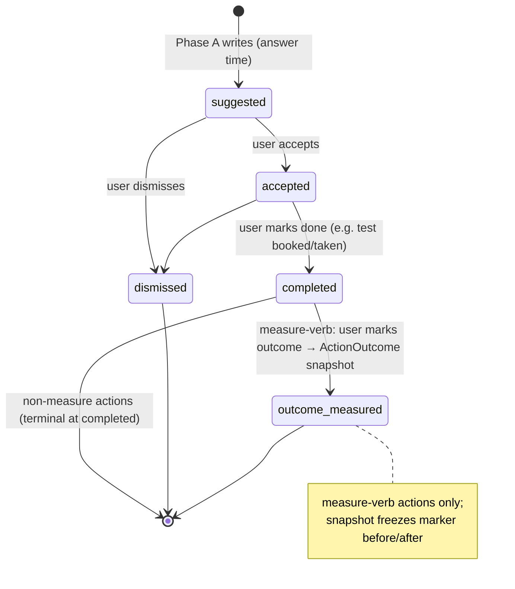

# feat: Decisions that compound — action lifecycle, Decisions timeline, marker trajectories (Phase B)

## Overview

Phase A makes Ask propose actions; Phase C lets the user book a test from one. Phase B is the connective tissue the deck calls "decisions compound": recommended actions get a **lifecycle** (suggested → accepted → completed → outcome-measured, + dismissed), a private **Decisions timeline** surface lists them across states with a link back to the answer that produced each and forward to its outcome, **marker trajectories** chart a marker over time (ferritin 25 → 41 → 62) by unifying lab values with the wearable series, and the loop **visibly closes** when the user marks an outcome — with a frozen before/after snapshot that is the moat ("this decision led to that change"). Phases A and C are built; this builds on the `Action` and `BookingRequest` models that already exist.

## Problem Frame

See origin: `docs/brainstorms/2026-06-05-deck-product-gap-requirements.md` (R6–R9). Today: `Action` rows are written at answer time always in state `suggested` (`src/lib/chat/turn.ts persistSuggestedActions`) and read by exactly one product surface (the marker page's booking link) — nothing lets a user accept/track/complete one, and there's no place actions live. The booking status block built in Phase C (`src/app/reveal/priorities/marker/[name]/booking-status-client.tsx`) is explicitly documented as "the Phase B timeline seed" and must be **absorbed**, not duplicated. Lab values (graph biomarker nodes, one dated value each) and wearable readings (`HealthDataPoint` series) are disjoint stores; no surface charts a single marker over time. The origin's document review flagged three design gaps now resolved here: timeline IA placement (→ a 5th nav tab), outcome capture (→ a frozen `ActionOutcome` snapshot), and answer-format/empty states (→ planning items in the units).

## Requirements Trace

- R6. `Action` gains a lifecycle: suggested → accepted → completed → outcome-measured; dismissed recorded too. Append-only row, atomic race-safe transitions.
- R6a. Lifecycle states + the new `ActionOutcome` model are special-category data — join GDPR export + deletion + both structural guards **and the seeded fixtures** (or the guards pass vacuously).
- R7. A private-only **Decisions timeline** (new `/decisions` surface + 5th bottom-nav tab) lists the user's actions across states, each linking back to the producing answer and forward to its outcome; **absorbs** the booking status seed.
- R8. **Marker trajectory** views render any marker with ≥2 dated values (lab + wearable unified) as a time-ordered chart, alongside related subjective trend where relevant; reachable **from the timeline and from completed/outcome-measured actions** (the "from answers" entry point is deferred — it would require an `/ask` chat-surface change this plan's scope excludes; carry it to a later pass or fold into the Phase-A answer UI).
- R9. Loop closing is **manual-first**: the user marks a `measure` action outcome-measured, capturing the snapshot; **no** automatic upload→action matching (origin: no ingest hook — don't build it).

## Scope Boundaries

- **No auto-matching** of uploads/syncs to open actions (R9 manual-only). No ingest-event hooks.
- **No new specialist/agent logic, no chat changes** — Phase B reads Action provenance; it doesn't alter how actions are produced.
- **No charting library** — extend the repo's existing plain-SVG/div-bar idiom (insights `MetricBar`, the graph-canvas `sparkline.tsx` precedent). No recharts/visx.
- **No lab-value series backfill / data-model migration of biomarkers** — trajectories read the existing single-value-per-node graph data + wearable series as-is; a marker with one lab draw simply shows one point (+ wearable points if any).
- Everything ships behind a new `DECISIONS_ENABLED` flag; off → byte-for-byte current behavior incl. the booking seed staying where it is.
- Not Phase C work (booking flow itself) or Phase A work (action production).

### Deferred to Separate Tasks

- A per-answer permalink/anchor in `/ask` (R7 back-link needs `/ask#<messageId>` + scroll-on-load) — small, but it's an Ask-surface change; do it as the first unit so the timeline can link to it, but note it touches Phase A's surface.
- Richer subjective-trend overlays on trajectories (beyond the one related check-in metric) — future polish.

## Context & Research

### Relevant Code and Patterns
- **Action model** (`prisma/schema.prisma`): `id, userId(Cascade), chatMessageId?(SetNull), scribeRequestId, verb, label, markerName?, state @default('suggested'), createdAt, bookingRequests[]`. Indexes already include **`[userId, state]`** (lifecycle-ready) and `[userId, createdAt]`. Append-only — NOT the Suggestion delete/regenerate cycle. Written only in `src/lib/chat/turn.ts`; read only by `src/lib/account/export.ts` + the marker page's booking link.
- **Transition pattern to mirror**: `src/app/api/booking/ops/status/route.ts` + `cancel/route.ts` — race-safe conditional `updateMany({ where: { id, userId, state: '<expected>' }})`, `count===0` → 404-vs-409. The canonical state-machine idiom in this repo.
- **Booking status seed** (`booking-status-client.tsx` + `UserBookingRequests` in `marker/[name]/page.tsx`): renders per-row marker names + status chip + `Ref · date` + cancel/reveal affordances; surfaced only on the marker detail route today. R7 absorbs this list.
- **Lab vs wearable** (R8): biomarker values in `GraphNode.attributes` (`value`/`latestValue`, `collectionDate`/`observedAt`) via `src/lib/graph/attributes/biomarker.ts`; wearable in `HealthDataPoint` (`metric,value,unit,timestamp`). The Phase-A tool `src/lib/scribe/tools/recognize-pattern-in-history.ts` already emits a `SeriesPoint{metric,value,unit,timestamp}` shape (≤24 pts) from HealthDataPoint — reuse that shape; add a biomarker-node→SeriesPoint mapper and merge.
- **Charting reality**: `/insights` (`src/app/(app)/insights/page.tsx`) uses inline div-bar `SleepChart`/`HrvChart` + `src/components/ui/metric-bar.tsx`; the graph-canvas plan established a plain-`d3`+Tailwind-SVG `sparkline.tsx` pattern with `role="img"`. No chart lib. **Tailwind glob trap**: SVG fill/stroke classes referenced from a `src/lib/**` color-lookup are dropped by JIT unless the glob covers `src/lib/**` and the classes are safelisted (`docs/solutions/runtime-errors/tailwind-content-glob-missing-classes-2026-05-16.md`).
- **Nav/IA**: 4-tab `src/components/ui/bottom-nav.tsx` (home/record/ask/you); `src/app/(app)/path-to-tab.ts` longest-prefix map (+ `path-to-tab.test.ts`); `NavTab` type in `src/types`. A 5th tab touches all three. Empty-state idiom: inline `
No … yet
`.
- **GDPR guards** (`export.ts`/`export.test.ts` DMMF completeness + `delete.ts`/`delete.test.ts` residue scan): `Action` and `BookingRequest` already covered. **The trap** (`docs/plans/2026-06-04-001`): a new model passes the structural scan only if the fully-seeded deletion/export fixtures actually create a row of it — otherwise the guard passes vacuously. The new `ActionOutcome` must join both guards **and** both seeds in the same unit.
- **Flags**: strict `=== 'true'`; new `DECISIONS_ENABLED` (own gate, like `PRIORITY_MARKERS_ENABLED` for a surface) — not coupled to `ASK_DEEP_ENABLED`.
- **Test reality**: zero `.test.tsx`, vitest `environment: 'node'`, no jsdom. UI is verified by the visual-audit gate + manual/prod, not component tests. Logic lives in route/lib tests against the real DB (`getTestPrisma`, `makeTestUser`). The recurring lesson (the get-tested draft shipped with zero tests): every feature-bearing unit ships real route/lib tests + GDPR seed coverage.

### Institutional Learnings
- Visual-audit gate is non-optional for the new charts + timeline (`visual-audit-non-optional-ui-gate-2026-05-16.md`) — desktop+mobile screenshots on the PR.
- Tailwind-glob class-dropping trap for any data-driven SVG color (above).
- Conditional-`updateMany` atomic transitions; append-only Action lifecycle (Phase A origin plan).
- New-model → both GDPR guards + seeded fixture, same unit (first-session-completeness plan).
- Absorb the booking seed, don't build beside it (get-tested plan).

## Key Technical Decisions

- **Lifecycle on the existing Action row, atomic transitions**: add the new states as values of the existing `state` column + `acceptedAt`/`completedAt`/`dismissedAt` timestamps rather than a new state table. Transitions go through a user-scoped conditional `updateMany({ where:{ id, userId, state:'<from>' }})` (race-safe, idempotent on terminal) mirroring the **user-facing `src/app/api/booking/cancel/route.ts`** (NOT the OPS_SECRET-gated `ops/status` route — that's the wrong, secret-scoped idiom; cancel is the userId-scoped ownership-read + conditional-update pattern). Reconcile the 403-vs-404 choice: cancel returns 403 after a successful ownership read; this plan's U2 says "another user's action → 404 (no leak)". Pick **404 for not-owned** (no existence leak) consistently and note the deliberate divergence from cancel. Valid transitions: suggested→accepted|dismissed; accepted→completed|dismissed; completed→outcome-measured (measure-verb only) OR terminal (non-measure). Matrix defined once in `src/lib/actions/lifecycle.ts`.
- **Outcome is a frozen snapshot in a new `ActionOutcome` model** (your decision): captures, at outcome-measured time, the marker value(s) the action was about — the "before/after" the deck sells. Shape (implementation-refined): `id, actionId(FK Cascade), userId(Cascade for guard-coverage), markerName, beforeValue?, beforeAt?, afterValue, afterAt, subjectiveBefore?/After? (optional check-in metric), createdAt`. **This is a brand-new model → it joins `EXPORT_DOMAIN_MODELS` + a delete `deleteMany` + BOTH structural-guard fixtures in the same unit (Unit 4), or the guards pass vacuously.** "Before" is sourced from the marker's earliest relevant dated value; "after" from the newest (or the user's just-uploaded re-test).
- **Decisions timeline = a 5th `/decisions` nav tab** (your decision), private-only, never shareable (explicitly outside the SharedView infra). It absorbs the booking status seed: the booking list moves from the marker route into the timeline (the marker route can keep a compact "your request for this marker" affordance, but the canonical list is the timeline). One read model merges Actions (by state) + their linked BookingRequests + ActionOutcomes into a single chronological surface.
- **Back-link via a new `/ask#<messageId>` anchor**: Action already carries `chatMessageId`; `/ask` currently has no scroll target, so Unit 1 adds an anchor + scroll-on-load. Forward-link to outcome points at the `ActionOutcome` (and, for booking-backed measures, the `BookingRequest`). Marker-trajectory deep-link is a soft link by `markerName`/`canonicalKey` (no FK — biomarker nodes have none).
- **Trajectory data is a unified reader, not a migration**: a lib function maps biomarker `GraphNode`s for a canonical marker → `SeriesPoint`s (one per dated node) and merges with `HealthDataPoint` rows for the same metric, ordered by date, capped (~24). Renders in the existing div-bar/SVG idiom. ≥2 points → chart; 1 point → single dated value; 0 → empty state. No new persistence.
- **Own flag `DECISIONS_ENABLED`**, off in prod through build; registered in `src/lib/env.ts` AND read inline `process.env.DECISIONS_ENABLED === 'true'` at each server surface (the `/decisions` page, the nav tab, the marker-route absorption) — mirroring how `PRIORITY_MARKERS_ENABLED` gates its server components. Off = today's behavior exactly (booking seed stays on the marker route until the flip).
- **Trajectory chart REUSES `src/components/demo/sparkline.tsx`** (scope-review catch): it's already a pure-SVG, no-dep, server-renderable n-point line with a before/after inflection rule — structurally what R8 needs, and it has no demo-only logic. Promote/generalize it out of `demo/` rather than build a second SVG chart. The div-bar idiom is the fallback only if dated x-axis labels prove awkward in it. (This also sidesteps building the Tailwind-glob workaround if sparkline already encodes its colors safely — verify at build.)

## Design Decisions (baked in — the visual audit validates, doesn't decide)

The document review correctly flagged that too much UI was deferred to "the audit decides." Resolved here:

- **Timeline is chronological descending** (newest first) with an inline state chip — a clinical decision-narrative, not a state-grouped to-do board (which would fight the "decisions compound over time" positioning, and needs a more complex read). Read model = `ORDER BY createdAt DESC`, userId-scoped.
- **Per-state card IA** (one row each — the implementer renders, doesn't invent):
  | State | Primary | Secondary | Affordances |
  |---|---|---|---|
  | suggested | `Action.label` | created date · marker | Accept · Dismiss |
  | accepted | label | accepted date · marker · linked booking status if any | Mark complete · Dismiss |
  | completed | label | completed date · marker | Mark outcome (measure-verb) — else none |
  | outcome-measured | label | **before/after diff shown ON the card face** (not behind a tap) + link to trajectory | none (terminal) |
  | dismissed | label (reduced weight) | dismissed date | none; visually subordinate, collapsible/grouped at the bottom |
- **Affordance interaction**: Accept / Mark-complete = single tap, no confirm (forward-positive). Dismiss-from-**suggested** = single tap. Dismiss-from-**accepted** = confirm ("Stop tracking this?" + one-line consequence — it abandons a commitment). **Mark outcome = a bottom sheet** showing the trajectory-derived `Before: <v> <unit> · <date>` / `After: <v> <unit> · <date>` pre-populated for review, confirm button "Close the loop"; 1-point/no-before case shows only the After row (omit the before row entirely — never a blank/"—").
- **5th nav tab**: label **"Decisions"**, **4th slot (between Ask and You)** — decisions emerge from Ask; You stays the rightmost personal anchor. Needs a new `IconName` + SVG in `src/components/ui/icon.tsx` (a clock-with-check / checklist glyph). Verify no truncation at 320px (icon-only fallback if so).
- **Empty states** (two): first-use (zero actions ever) → caption **+ CTA** "Decisions you act on appear here — start by asking a question" linking `/ask`; all-dismissed → caption only. (Without the first-use CTA the new tab reads as dead.)
- **Trajectory chart**: x-axis = **relative short dates** ("Jun 3", "Jun 10"), unit label once at the left; **1-point state = a single labeled dot** (value + date, no connecting line); subjective overlay (where present) = a muted secondary strip **below** the chart, not a dual axis. Mirror `insights` `HrvChart` as the visual baseline.
- **AI-slop guard**: the outcome-measured card's before/after diff must be visually legible on the card (the deck's moat moment); dismissed cards must be lighter-weight than active ones — not the same card in a different chip color. The visual audit checks this explicitly (Unit 6).

## Open Questions

### Resolved During Planning
- Timeline IA → 5th nav tab `/decisions` (user decision).
- Outcome capture → frozen `ActionOutcome` snapshot (user decision) + its GDPR obligations.
- Lab+wearable unification → a read-time merger to `SeriesPoint`, no data migration.
- Back-link mechanism → new `/ask#<messageId>` anchor (Unit 1).
- New flag vs reuse → `DECISIONS_ENABLED`.

### Resolved During Implementation
- **Lifecycle timestamp columns + matrix location** → `acceptedAt`/`completedAt`/`dismissedAt` on `Action`; matrix in `src/lib/actions/lifecycle.ts` (`resolveTransition`). `outcome-measured` is NOT in the transition route's BodySchema enum — it is reachable ONLY via `/outcome` (which writes the snapshot in the same `$transaction`), so a snapshot never exists without the state and vice versa.
- **`ActionOutcome` field set** → `id, actionId(@unique, Cascade), userId(Cascade), markerName, beforeValue Float?, beforeAt DateTime?, afterValue Float, afterAt DateTime?, createdAt`. The optional `subjectiveBefore/After` fields were NOT added (no related check-in metric wired this pass — additive later if needed). `afterAt` is nullable.
- **Trajectory chart form** → reused `src/components/ui/sparkline.tsx` (the promoted shared component) in the `/decisions/marker/[name]` sub-route. ≥2 points → chart; 1 point → single labelled value; 0 → empty state. The "See trajectory →" link on the outcome card is suppressed below 2 points (no dead link).
- **`before`-value selection rule** → RESOLVED: "before" = the marker value AT OR BEFORE the Action's `acceptedAt` timestamp (the value the user committed against), selected against the FULL uncapped series via `resolveBeforeValueAtAcceptance`. NOT trajectory-oldest, which is only oldest-of-the-recent-24-window and would be wrong once a marker has >24 draws. If `acceptedAt` is null or no prior dated value exists, `beforeValue` stays null (the 1-point / no-before case). The snapshot is frozen + terminal, so this is correct on first write.
- **Trajectory unit/source merge** → RESOLVED: the lab+wearable merge is now unit-aware and source-scoped. (1) `recovery`-category wearable points (composite 0–100 scores, never lab-equivalent) are excluded from the merge. (2) `reconcileUnits` drops any point whose non-empty unit conflicts with the metric's dominant (lab-first) unit — drop-on-conflict, not silent co-plot (no in-repo unit-conversion table exists). Empty-unit points are kept (no conflicting claim).
- **Marker-route absorption** → defers to the timeline with a compact "View your test requests in Decisions →" pointer when `DECISIONS_ENABLED` is on. The pointer counts all non-cancelled bookings; the timeline now surfaces BOTH action-linked bookings (in their TimelineCards) AND unlinked bookings (`actionId = null`, rendered via the absorbed `BookingStatusList` with working cancel + one-time reveal) so the pointer count matches what the timeline renders and no booking vanishes after the flag flip.
- **Timeline privacy enforcement** → `/decisions` is private by allowlist-omission: it requires `getCurrentUser()` (session-cookie-backed only; SharedView tokens never mint a `Session`), and lives in the `(app)` route group which has no SharedView serving path (SharedView is served under the separate top-level `/share` group). A SharedView-token request therefore cannot reach `/decisions` user data — it redirects to `/sign-in` for want of an app session.

## High-Level Technical Design

> *Directional guidance for review, not implementation specification.*

**Lifecycle timestamps** (additive on `Action`): `acceptedAt`, `completedAt`, `dismissedAt`; outcome-measured's timestamp of record is `ActionOutcome.createdAt` (no `outcomeAt` on Action — the snapshot row IS the outcome event). The new timestamp columns are health-behaviour data on an already-GDPR-covered model; the existing Action export/delete coverage carries them (no new guard work for the columns — only the new `ActionOutcome` model needs its own coverage, Unit 4). U2 fixtures should populate at least one transitioned `Action` so the export round-trip exercises a non-null `acceptedAt`.

The `/decisions` surface reads: Actions (grouped by state) ⨝ linked BookingRequests ⨝ ActionOutcomes → one chronological list; each row links back (`/ask#<messageId>`) and forward (outcome / trajectory `/decisions/marker/<canonicalKey>` or a shared marker view).

## Implementation Units

Dependency order: U1 (anchor — a small cross-phase pre-req, see its note) and U2 (lifecycle API) are independent; U3 (trajectory reader+view) independent; U4 (ActionOutcome+GDPR) needs **U2+U3** (the outcome endpoint calls the trajectory reader for before/after); U5 (timeline surface + nav + seed absorption) needs U2+U4 and consumes U3; U6 (flag flip + audit) last.

- [x] **Unit 1: `/ask` per-answer anchor (cross-phase pre-req for the timeline back-link)**

**Goal:** Each assistant answer is addressable so the timeline can link back to it.

**Requirements:** R7 (back-link)

**Dependencies:** None. **Note: this touches the Phase-A `/ask` surface** — it's a small gap-fill Phase A's plan didn't include, done here because R7 needs it. Ships first; not gated by `DECISIONS_ENABLED` (a bare DOM `id` + hash-scroll is inert without an inbound link).

**Files:**
- Modify: `src/components/chat/message-bubble.tsx` (add `id={message.id}` to the AssistantBubble root — today the id is only a React `key` in `message-list.tsx`, not a DOM attribute), `src/app/(app)/ask/page.tsx` (scroll-to + highlight on load when `location.hash` matches)
- Test: extract the hash→target-id resolution to a pure helper + test it; the scroll/highlight DOM effect is verify-by-inspection (no jsdom)

**Approach:** Additive: surface `message.id` as the DOM `id` on each assistant bubble, add a scroll-on-mount + brief highlight when the hash matches. No data change.

**Test scenarios:**
- Happy path (pure helper, if extracted): given a hash and a list of message ids → returns the target id to scroll/highlight; no match → null.
- Edge case: empty hash / unknown id → no-op, no throw.

**Verification:** Navigating to `/ask#<id>` scrolls to and briefly highlights that answer.

- [x] **Unit 2: Action lifecycle transition API**

**Goal:** A user can move their own actions through the lifecycle, race-safely.

**Requirements:** R6, R9 (manual transitions)

**Dependencies:** None (schema: additive timestamps only)

**Files:**
- Modify: `prisma/schema.prisma` (additive lifecycle timestamps on `Action`; `npx prisma validate && db push --skip-generate && generate`)
- Create: `src/app/api/actions/[id]/transition/route.ts` (+ colocated test), a shared transition-matrix module (e.g. `src/lib/actions/lifecycle.ts` + test)
- Modify: `src/lib/chat/turn.ts` only if a write-time default needs touching (likely not)

**Approach:** POST a target state; validate against the matrix; conditional `updateMany({ where:{ id, userId, state:'<from>' }, data:{ state:'<to>', <ts> }})`; `count===0` → 409 (stale/invalid) or 404 (not owned/found, distinguished by a prior ownership read like the booking routes). Gated by `DECISIONS_ENABLED`. outcome-measured is NOT reachable here directly — it's the snapshot endpoint in U4 (so the snapshot always accompanies the state).

**Execution note:** Test-first on the transition matrix (it's the safety-bearing logic).

**Test scenarios:**
- Happy path: suggested→accepted persists state + `acceptedAt`; accepted→completed; suggested→dismissed.
- Error path: invalid transition (suggested→completed) → 409, no change; flag off → 404; unauthenticated → 401; another user's action → 404 (no leak).
- Edge case: double-submit accepted→accepted (raced) → exactly one succeeds, the loser 409 (conditional updateMany).
- Edge case: dismiss is terminal — dismissed→accepted rejected.

**Verification:** A seeded suggested action walks to completed via the API; concurrent transitions don't double-fire.

- [x] **Unit 3: Unified marker trajectory reader + view (R8)**

**Goal:** A marker with ≥2 dated values renders as a time-ordered trajectory.

**Requirements:** R8

**Dependencies:** None

**Files:**
- Create: `src/lib/markers/trajectory.ts` (merge biomarker `GraphNode`s + `HealthDataPoint` for a canonical marker → ordered `SeriesPoint[]`, capped) + test
- Modify/Create: promote `src/components/demo/sparkline.tsx` to a shared trajectory component (reuse, don't rebuild — see Key Decisions); `tailwind.config` content glob + safelist ONLY if the chart maps marker→color via a `src/lib/**` lookup (the JIT trap)
- Test: `src/lib/markers/trajectory.test.ts`

**Approach:** Reuse the Phase-A `SeriesPoint{metric,value,unit,timestamp}` shape. **Field-precedence for biomarker nodes** (the two stores differ): value = `value ?? latestValue`; date = `collectionDate ?? observedAt`; skip nodes where both dates are null. Normalize `HealthDataPoint.timestamp` (DateTime) via `.toISOString()` to match `SeriesPoint.timestamp:string` before sort/dedupe. Merge, sort by date, cap ~24 (keep most recent), dedupe same-day. Render via the promoted sparkline with `role="img"` + relative dated labels per the Design Decisions; states ≥2 → chart, 1 → single labeled dot, 0 → empty.

**Execution note:** Test-first on the reader (the data-merge correctness is the substance; the view is audited visually).

**Test scenarios:**
- Happy path: 3 dated lab nodes for ferritin → 3 ordered points with values+dates.
- Happy path: lab nodes + wearable rows for the same metric → merged, date-ordered, capped at the limit (most-recent kept).
- Edge case: 1 value → returns a single point (view shows the value, no chart); 0 → empty array.
- Edge case: same-day duplicates deduped; unit mismatch handled (documented choice).
- Integration: a real seeded user with both stores → the reader returns the unified series the view renders.

**Verification:** Visual audit (gate) of the trajectory in ≥2-point, 1-point, and empty states, desktop + mobile.

- [x] **Unit 4: `ActionOutcome` snapshot + outcome-measured transition + GDPR coverage**

**Goal:** Marking an outcome freezes the before/after and closes the loop — fully covered for export/erasure.

**Requirements:** R6, R6a, R9

**Dependencies:** Unit 2 (lifecycle), Unit 3 (trajectory reader supplies before/after values)

**Files:**
- Modify: `prisma/schema.prisma` (new `ActionOutcome` model — `actionId` FK Cascade + `userId` Cascade for guard coverage; relation back on `Action`)
- Create: `src/app/api/actions/[id]/outcome/route.ts` (+ test) — transitions completed→outcome-measured AND writes the snapshot atomically
- Modify: `src/lib/account/export.ts` (+ `actionOutcomes` domain + manifest), `src/lib/account/delete.ts` (deleteMany in the ordered transaction + tombstone count)
- Test: extend `src/lib/account/export.test.ts` + `src/lib/account/delete.test.ts` — **seed an `ActionOutcome` row in BOTH fixtures** (the vacuous-guard trap) + assert export round-trip and residue/tombstone count

**Approach:** The outcome endpoint: verify ownership + state===completed, derive before/after from the trajectory reader (U3) for the action's `markerName`, write `ActionOutcome` and flip state to outcome-measured in one `$transaction` (so a snapshot never exists without the state and vice versa). Race-safe via the conditional update on `state:'completed'`.

**Execution note:** Test-first; the GDPR seed+guard coverage is mandatory in this unit (not deferred).

**Test scenarios:**
- Happy path: completed measure-action with ≥2 marker points → outcome-measured + ActionOutcome row with before/after values+dates.
- Edge case: marker has only 1 value → outcome captured with afterValue only (beforeValue null) — defined behavior.
- Error path: outcome on a non-completed action → 409, no row; non-owner → 404; flag off → 404.
- Edge case: double-submit → exactly one snapshot (conditional state guard).
- Integration (GDPR): fully-seeded user incl. an ActionOutcome → export contains `actionOutcomes`; account deletion residue scan finds zero rows + tombstone counts it. **Guard fails if the fixture isn't seeded — that's the point.**

**Verification:** A completed action → outcome-measured produces a queryable frozen snapshot; both GDPR guards exercise a real ActionOutcome row.

- [x] **Unit 5: Decisions timeline surface + 5th nav tab + booking-seed absorption (R7)**

**Goal:** A private `/decisions` tab lists actions across states with back/forward links; the booking seed is absorbed.

**Requirements:** R7

**Dependencies:** Units 2, 4 (consumes U3)

**Files:**
- Create: `src/app/(app)/decisions/page.tsx` (+ a marker trajectory sub-view/route), the timeline card components per the Design Decisions card-IA table (state chip, back-link `/ask#<id>`, forward-link, the per-state affordances calling U2/U4, the mark-outcome bottom sheet). The Actions⨝BookingRequests⨝ActionOutcomes merge is a single userId-scoped Prisma query with includes — **inline it in the page's data fetch** (consistent with how the absorbed `UserBookingRequests` works) unless a second consumer appears; only extract `src/lib/decisions/timeline.ts` if the marker route's compact affordance reuses it.
- Modify: `src/components/ui/bottom-nav.tsx`, `src/components/ui/icon.tsx` (**new `IconName` + SVG for the Decisions tab** — closed union, compile error otherwise), `src/app/(app)/path-to-tab.ts` (+ `path-to-tab.test.ts`), `src/types` (NavTab `decisions`); `src/app/reveal/priorities/marker/[name]/page.tsx` + `booking-status-client.tsx` (absorb: when `DECISIONS_ENABLED` on, the canonical list lives in the timeline; the marker route shows a compact "View in Decisions →" pointer — not nothing, so a user navigating from a marker still finds their request)
- Test: `path-to-tab.test.ts` (new tab routing); if `timeline.ts` is extracted, `src/lib/decisions/timeline.test.ts` (merge/ordering/userId-scoping)

**Approach:** Server-component read scoped to `userId`, gated by `DECISIONS_ENABLED`, **chronological descending** (Design Decisions). Each row uses its state's card IA + affordances. Empty state: first-use caption+CTA, all-dismissed caption-only. Private-only — no SharedView path. Flag on → marker route defers to the timeline with a compact pointer (no duplicate list); flag off → marker route's `UserBookingRequests` unchanged.

**Test scenarios:**
- Happy path (read model): a user with actions in mixed states + a linked booking + an outcome → one correctly-ordered list, each row's links resolve to real ids.
- Edge case: empty (no actions) → empty-state payload, not an error; user with only the booking seed → it appears in the timeline.
- Error path: cross-user scoping — user A's timeline never contains user B's actions (the read is userId-filtered).
- Integration: `path-to-tab` maps `/decisions` to the new tab; flag off → route/tab absent, marker seed unchanged.

**Verification:** Visual audit (gate) of the timeline (populated + empty) and the 5-tab nav, desktop + mobile; back-link lands on the right answer; forward-link opens the trajectory/outcome.

- [ ] **Unit 6: Flag-flip readiness + audit checklist**

**Goal:** Phase B is shippable behind `DECISIONS_ENABLED` with the gates met.

**Requirements:** all

**Dependencies:** Units 1–5

**Files:**
- Modify: `src/lib/env.ts` (`DECISIONS_ENABLED`); docs (plan checkboxes; a short note in the data-rights/DPIA inventory that `ActionOutcome` is a new health-data category — same packet as the other gates)

**Approach:** Checklist: full suite + new tests green · GDPR guards exercise a real `ActionOutcome` · flag-off verified byte-for-byte (booking seed unmoved, marker route's `UserBookingRequests` still renders — test the negative path, not just the positive) · DPIA inventory updated for `ActionOutcome` · **named visual audit** (the only design gate — no component tests): (1) timeline — all 5 card states render distinctly, dismissed visually subordinate to active, first-use empty state shows its CTA, links are ≥44px touch targets; (2) trajectory — ≥2-point / 1-point / 0-point states each screenshotted, relative date labels + unit readable at 320px; (3) nav — 5 tabs don't truncate/crowd at 320px, active state distinct; (4) outcome card — before/after diff legible without tapping; (5) cold render confirms no missing chart colors (CSS-grep). Flip via `vercel env add --value --yes` + `ls` verify; rollback = unset (timeline/tab vanish, seed returns to the marker route).

**Test expectation: none** — gate/process unit; everything it checks is tested in U1–U5.

**Verification:** Real prod walkthrough on a throwaway account: accept an action → complete → mark outcome → see the snapshot + trajectory in the timeline; flag-off shows today's behavior.

## System-Wide Impact

- **Interaction graph:** new `/decisions` tab + route; the marker route's booking list defers to the timeline when on; Action gains transition + outcome endpoints (Phase A's write path untouched). Bottom-nav goes 4→5 tabs (types + nav + path-to-tab + its test).
- **Error propagation:** transitions are race-safe conditional updates (409 on stale, 404 on not-owned); outcome+state are one transaction (no snapshot without state); trajectory reader degrades to single-value/empty, never throws.
- **State lifecycle risks:** dismissed/outcome-measured are terminal — enforce in the matrix; the snapshot must be atomic with the state flip.
- **API surface parity:** MCP read surface unaffected (allowlist); the timeline is private-only (no SharedView).
- **Unchanged invariants:** Phase A action production; booking flow; biomarker/HealthDataPoint storage (read-only here); the GDPR guard mechanism (extended, not changed); flag-off = current behavior.

## Risks & Dependencies

| Risk | Mitigation |
|------|------------|
| New `ActionOutcome` passes GDPR guards vacuously (no seeded fixture) | U4 seeds it in BOTH export+delete fixtures and asserts real coverage — the named research trap, made a unit requirement |
| Trajectory chart colors dropped by Tailwind JIT | Extend glob to `src/lib/**` + safelist data-driven SVG classes (documented trap); CSS-grep diagnostic in the audit |
| 5-tab nav crowds mobile | Visual audit on real mobile width is a gate; tab labels kept short; reversible (flag) |
| Booking seed duplicated instead of absorbed | U5 explicitly moves the canonical list and gates the marker-route list off when `DECISIONS_ENABLED` |
| UI ships without tests (the get-tested lesson) | Logic (matrix, reader, read-model, GDPR) is route/lib tested; UI gated on visual audit — no component-test pretence |
| before/after selection ambiguous with many draws | Defined rule decided against real seeded data (deferred-to-impl, flagged) |

## Documentation / Operational Notes
- DPIA/data-rights inventory: add `ActionOutcome` (frozen marker before/after = health data) — rides the existing legal packet, not a new cycle.
- Visual-audit artifacts (timeline, trajectory, nav) on the PR.
- Tailwind glob/safelist change verified by a cold render, not just build-green.

## Sources & References
- **Origin:** docs/brainstorms/2026-06-05-deck-product-gap-requirements.md (R6–R9)
- Related plans: docs/plans/2026-06-05-001-feat-ask-deep-phase-a-plan.md (Action model), docs/plans/2026-06-06-001-feat-priority-get-tested-path-plan.md (BookingRequest, booking-status seed), docs/plans/2026-05-01-001-feat-graph-canvas-viz-plan.md (sparkline/SVG pattern), docs/plans/2026-06-04-001-feat-first-session-completeness-plan.md (GDPR guard spec)
- Code: prisma/schema.prisma (Action/BookingRequest), src/lib/chat/turn.ts, src/app/api/booking/ops/status/route.ts, src/app/reveal/priorities/marker/[name]/booking-status-client.tsx, src/lib/scribe/tools/recognize-pattern-in-history.ts, src/app/(app)/insights/page.tsx, src/components/ui/bottom-nav.tsx, src/app/(app)/path-to-tab.ts, src/lib/account/{export,delete}.ts
- Learnings: docs/solutions/best-practices/visual-audit-non-optional-ui-gate-2026-05-16.md, docs/solutions/runtime-errors/tailwind-content-glob-missing-classes-2026-05-16.md
