# feat: Close + measure the return leg

## Overview

The locked strategy is a four-touchpoint loop the *product* runs: book a draw →
draw → baseline + one action → **retest**. The gap audit found the loop is built
through touchpoint 3 (Action lifecycle, `ActionOutcome` snapshots, Decisions
timeline, "what moved" panel-diff, concierge booking) but the **return leg is
missing twice**: there is no mechanism to bring a user back for the retest (no
scheduler/cron/nudge anywhere — verified), and **retention-to-retest — the
headline pilot metric — is not even representable** because `AssessmentResponse`
is 1:1 per user (`prisma/schema.prisma:412`) and no "second draw" entity exists.

This plan closes and measures the return leg by introducing a first-class **`Draw`**
model — the heartbeat unit of the loop. One row per blood-draw/panel event per
user, ordered and dated. The same entity is (a) the retest record that makes
retention-to-retest a trivial count, (b) the cadence anchor that schedules the
next draw, and (c) the target a scheduled job nudges. Everything ships behind
`RETEST_LOOP_ENABLED`; off = today's behaviour byte-for-byte.

This is **P0-1 + P0-2 only.** P0-3 (in-lane copy-enforcement artifacts) is a
separate plan; here, only the nudge email copy must pass the existing scans.

## Problem Frame

See origins. Concretely, today:
- **No "retest" entity.** `AssessmentResponse.userId @unique` (`schema.prisma:410–417`)
  is the *onboarding subjective assessment*, 1:1, and is the wrong concept anyway —
  a retest is a **blood draw / lab panel**, not the onboarding questionnaire. Lab
  panels land as `SourceDocument` + dated `observation` `GraphNode`s, but nothing
  models "this user has drawn blood N times." So "have they come back?" is
  unanswerable.
- **No cadence / scheduler.** Verified: no `api/cron`, no `vercel.json` crons, no
  job queue. `UserPreferences.notifyProtocol`/`notifyWeekly` (`schema.prisma:589–592`)
  exist but **no code acts on them**. `BookingRequest` (`schema.prisma:847`) has no
  `dueAt`. Sync is manual-only (`src/app/api/health/sync/route.ts`).
- **The metric conflates activity with return.** The activation funnel's
  `retained-7d` stage (`src/lib/metrics/activation-funnel.ts:228–271`) counts *any*
  `ChatMessage` or `HealthDataPoint` in a 7-day window — not a return-for-retest.

The result: the product can't run the most important step of its own loop, and the
pilot can't validate its core bet (people who can't be Amy still come back because
the work was removed).

## Requirements Trace

- **R1 (P0-2 spine).** A first-class `Draw` model: one row per draw event per user,
  decoupled from `AssessmentResponse`. Carries an ordinal (`sequence`), `status`
  (`scheduled` | `completed` | `cancelled`), optional `scheduledFor` / `completedAt`,
  and soft links to the `BookingRequest` that intended it and the `SourceDocument`
  (panel) that fulfilled it. Health-adjacent data → joins GDPR export + delete +
  **both seeded fixtures** (the vacuous-guard trap).
- **R2 (P0-2 metric).** Retention-to-retest is measurable: a `Draw`-sourced
  activation-funnel stage **`returned-for-retest`** (a user with ≥2 *completed*
  draws), plus a report extension surfacing the retest-retention rate and **median
  days-to-retest**. A `draw_completed` `FunnelEvent` is fired additively for funnel
  continuity, but the metric's source of truth is the `Draw` table (not events).
- **R3 (P0-1 creation/completion).** Completing a lab panel creates/completes the
  next `Draw` (manual-first: on lab-panel ingest, one Draw per panel `SourceDocument`);
  a `BookingRequest` links to the `Draw` it intends to fulfil.
- **R4 (P0-1 cadence).** On a Draw completing, the next retest is scheduled — a
  `scheduled` `Draw` with `scheduledFor = completedAt + RETEST_CADENCE_DAYS` (a
  single CMO-adjustable constant; quarterly default).
- **R5 (P0-1 nudge).** A daily scheduled job (Vercel Cron → a secret-gated route)
  finds due `scheduled` draws, honours the user's opt-in (`notifyRetest`), dedupes
  via `lastNudgedAt`, and sends a nudge email that deep-links to a pre-staged
  rebooking. **Idempotent** (safe to re-run; never double-sends).
- **R6 (in-lane).** Nudge copy is descriptive (measure-verb; no directive/causal
  claims) and passes the existing copy-compliance scan. Cross-ref P0-3.
- All behind `RETEST_LOOP_ENABLED`; off → current behaviour exactly.

## Scope Boundaries

- **No new ops/phlebotomy surface.** `Draw` is a *record*; fulfilment stays the
  existing concierge-voucher (`BookingRequest`) and user-upload paths. No Studio /
  Appointment / Slot models (deck Layer I deferred).
- **Manual-first, one hook only** (mirrors Phase B R9 "no auto-matching"): a Draw
  completes on lab-panel ingest or an ops mark — no inference engine matching
  arbitrary data to draws.
- **Not P0-3.** The brand-guidelines + clinician-review checklist and the new
  seductive/causal phrase patterns are a separate plan; here only the nudge copy
  must pass today's scans.
- **Not P1/P2.** No scribe-context wiring, no `LONGITUDINAL_GRAPH_ENABLED` flip, no
  passive wearable sync.
- **Email only.** Reuse the existing transport; no SMS/push (push infra absent).
- **One global cadence constant.** Per-protocol / per-marker cadence is deferred.
- **Daily cron granularity** is sufficient for a quarterly cadence (no sub-day
  scheduling; avoids depending on a paid cron tier).

## Context & Research

### Relevant Code and Patterns
- **Schema anchors**: `AssessmentResponse` 1:1 (`schema.prisma:410–417` — the
  constraint that blocks reuse), `BookingRequest` (`:847–865`, has `actionId`
  SetNull + `[userId,status,createdAt]` index — mirror for `Draw`↔booking link),
  `UserPreferences` (`:582–595`, additive `notifyRetest` goes here),
  `FunnelEvent` (`:116–128`, free-text `event`), `SourceDocument` (lab panel — the
  Draw's fulfilment link).
- **State-machine idiom**: user-scoped conditional `updateMany({ where:{ id, userId,
  status:'<from>' }})`, `count===0` → 404-vs-409 — `src/app/api/booking/cancel/route.ts`
  (the **userId-scoped** ownership pattern, NOT the OPS_SECRET `ops/status` route).
  Draw transitions reuse this.
- **Secret-gated server route**: `src/app/api/booking/ops/status/route.ts` gates on
  `Authorization: Bearer <OPS_SECRET>`. The cron route mirrors this with a
  `CRON_SECRET` (Vercel Cron sends `Authorization: Bearer ${CRON_SECRET}`).
- **Email transport**: `src/lib/auth/email.ts` (+ `email-health.ts`); the
  user-facing send precedent is the booking confirmation in
  `src/app/api/booking/request/route.ts`. Reuse — do not add a new mailer.
- **Lab ingest hook point**: `src/app/api/intake/documents/route.ts` already writes
  `SourceDocument` + dated `observation` nodes in one transaction
  (`src/lib/intake/lab-observations.ts`). Draw create/complete hangs off this
  transaction (one Draw per lab `SourceDocument`).
- **Metrics harness**: `StageDefinition` + `ACTIVATION_STAGES`
  (`src/lib/metrics/activation-funnel.ts:283–291`) — add a stage; report in
  `activation-funnel-report.ts`; CLI `scripts/metrics/activation-funnel.ts`.
  Funnel events: `FUNNEL_EVENTS` + `writeFunnelEvent` (`src/lib/funnel/event.ts`).
- **GDPR guards**: `src/lib/account/export.ts` + `delete.ts` (+ tests) — DMMF
  completeness + residue scan. **The vacuous-guard trap** (`docs/plans/2026-06-04-001`):
  a new model passes only if the fully-seeded delete/export fixtures actually create
  a row of it. `Draw` joins both guards **and** both seeds in the same unit.
- **Flags**: strict `=== 'true'`; new `RETEST_LOOP_ENABLED` in `src/lib/env.ts` +
  read inline at each surface (mirrors `DECISIONS_ENABLED`).
- **Constants SOT**: `src/lib/marketing/constants.ts` precedent (no literals in
  components) — `RETEST_CADENCE_DAYS` lives in a constants module.
- **Deploy**: Next 14 on Vercel (`package.json` `vercel-build`), Node 20, no
  `vercel.json` yet → create it for the `crons` entry.
- **Test reality**: vitest `environment: 'node'`, zero `.test.tsx`; logic is
  route/lib tested against the real DB (`getTestPrisma`, `makeTestUser`); UI by
  visual-audit gate. Every feature-bearing unit ships real tests + GDPR seed coverage.

### Institutional Learnings
- New model → both GDPR guards + a **seeded** fixture, same unit (first-session-completeness plan).
- Conditional-`updateMany` atomic transitions; terminal states enforced in a matrix (Phase B).
- Parallel-implementation check before building (`search-adjacent-dirs-before-planning-2026-05-16`):
  confirm no sibling Draw/TestEvent/Panel model exists (audit says none — re-verify at build).
- Fire-and-forget analytics must never break the user flow (`writeFunnelEvent` swallows errors).
- Absorb, don't duplicate (get-tested plan): the Draw↔booking link reuses the existing booking row, no second booking surface.

## Key Technical Decisions

- **`Draw` is the heartbeat entity, net-new — not a relaxation of
  `AssessmentResponse`.** A retest is a blood draw, not the onboarding
  questionnaire; conflating them would be wrong and would also break the 1:1
  invariant other code relies on. Rejected alternative: *derive* retest from
  distinct lab-panel dates (no model) — fragile (partial uploads, multi-date
  panels) and gives no cadence anchor or nudge target, so it pays for neither P0-1
  nor a clean P0-2. The `Draw` model serves both, so it earns its keep.
- **`Draw` shape**: `id, userId(Cascade), sequence Int, status String
  @default('scheduled'), scheduledFor DateTime?, completedAt DateTime?,
  lastNudgedAt DateTime?, bookingRequestId String?(SetNull), sourceDocumentId
  String?(SetNull), createdAt, updatedAt`. Indexes: `[userId, status, scheduledFor]`
  (the cron query) and `[userId, sequence]`. `sequence` is the per-user ordinal of
  *completed* draws (1 = baseline); a `scheduled` future draw takes the next
  sequence on completion, not at creation, to avoid gaps on cancel.
- **Completion is manual-first, one hook**: a `Draw` completes inside the existing
  intake transaction when a lab `SourceDocument` is ingested (links
  `sourceDocumentId`, sets `completedAt`, assigns `sequence`). The first ingest
  creates draw #1 (baseline) so the sequence starts even for users who never booked
  via concierge. Ops `deliver` may also complete a Draw for the concierge path. No
  other auto-matching.
- **Cadence = one constant**, `RETEST_CADENCE_DAYS` (default 90, CMO-adjustable), in
  a constants module. On completion, upsert the user's single open `scheduled` Draw
  with `scheduledFor = completedAt + cadence`. Exactly one open scheduled draw per
  user at a time (re-completing refreshes it).
- **Scheduler = Vercel Cron → secret-gated route** (`vercel.json` `crons` →
  `GET /api/cron/retest-nudge`, gated on `CRON_SECRET` exactly like the OPS route).
  Daily. The route is **idempotent**: it selects `scheduled` draws with
  `scheduledFor <= now`, `status='scheduled'`, user `notifyRetest=true`, and
  `lastNudgedAt` null-or-older-than-the-cadence-window; sends the nudge; stamps
  `lastNudgedAt`. Re-running the same day sends nothing (the stamp gates it). Errors
  per-user are caught and logged; one bad user never aborts the batch.
- **Nudge = in-lane email + pre-staged rebook.** Reuse `src/lib/auth/email.ts`.
  Copy is descriptive ("It's time for your next check — here's what we'll
  re-measure"), measure-verb, no directive/causal claim, and lives where the
  static-copy scan covers it (or the scan root is extended). It deep-links to the
  booking flow pre-filled for the same markers (a rebook), so the user's effort is
  one tap.
- **Metric reads `Draw`, event is additive.** `returned-for-retest` =
  `count(Draw where status='completed') >= 2`. Source of truth is the table; the
  `draw_completed` `FunnelEvent` (with `sequence` property) is fired additively so
  the existing event-stream funnel stays consistent, but the report does not depend
  on it. The report adds: retest-retention % (of users with ≥1 completed draw, how
  many reached ≥2) and **median days between draw 1 and draw 2**.
- **Own flag `RETEST_LOOP_ENABLED`**, off in prod. Off: no Draw rows are written
  (the intake hook and ops hook are gated), no cron effect, no new funnel stage in
  the default report. The model + migration exist regardless (additive, safe).

## Open Questions

### Resolved During Planning
- Retest entity → net-new `Draw` model (not `AssessmentResponse` reuse, not
  derive-from-dates).
- Scheduler → Vercel Cron + `CRON_SECRET`-gated route (no queue infra).
- Nudge channel → email (reuse transport); no SMS/push this pass.
- Cadence → single `RETEST_CADENCE_DAYS` constant (per-protocol deferred).
- Opt-in → additive `UserPreferences.notifyRetest` (default true), honoured by the cron.

### Deferred to Implementation
- **`sequence` assignment race**: two panels ingested concurrently for one user must
  not collide on `sequence`. Resolve with a transaction that computes
  `max(sequence)+1` under the same `$transaction`, or a unique `[userId, sequence]`
  + retry. Decide against the real intake transaction shape.
- **Exact "due" window for `lastNudgedAt`** (re-nudge cadence if the user ignores
  the first nudge — once, or every N days until they rebook or it's cancelled?).
  Start: nudge once; re-nudge suppressed until a configurable window. Tune in impl.
- **Whether `FunnelEvent` rows are GDPR-deletion-covered** (they carry `userId`);
  confirm against the delete residue scan and cover if not — same unit as the Draw
  guard work.
- **Backfill**: do existing users with prior lab panels get a baseline Draw #1
  backfilled (so they're eligible for a nudge), or does the loop start fresh at flag
  flip? Default: a one-off backfill script (idempotent) creates draw #1 from each
  user's earliest lab `SourceDocument`; gated, dry-run first. Confirm at flip.

## High-Level Technical Design

> *Directional guidance for review, not implementation specification.*

```mermaid
stateDiagram-v2
  [*] --> scheduled: cadence sets next draw (scheduledFor)
  scheduled --> completed: lab panel ingested / ops deliver → sequence assigned, sourceDocument linked
  scheduled --> cancelled: user/ops cancels (no nudge thereafter)
  completed --> [*]: fires draw_completed; upserts the next scheduled draw
  note right of scheduled
    daily cron: scheduledFor<=now & notifyRetest
    & not recently nudged → send nudge + stamp lastNudgedAt
  end note
```

Flow: baseline panel ingest → `Draw#1 completed` → schedule `Draw#2 (scheduled,
scheduledFor=+90d)`. Cron at T+90d → nudge email → user rebooks (one tap) → draws
again → `Draw#2 completed` (sequence 2) → metric counts the user as retained →
schedule `Draw#3`. The loop self-runs; retention-to-retest is `≥2 completed`.

## Implementation Units

Dependency order: U1 (model + GDPR) is the foundation; U2 (create/complete +
cadence) needs U1; U3 (cron nudge) needs U2; U4 (metric) needs U1/U2; U5
(flag-flip + audit + backfill) needs U1–U4.

- [ ] **Unit 1: `Draw` model + GDPR coverage + cadence constant + opt-in pref**

**Goal:** The heartbeat entity exists and is fully export/erase-covered.

**Requirements:** R1, R4 (constant), R5 (pref)

**Dependencies:** None (additive schema)

**Files:**
- Modify: `prisma/schema.prisma` (new `Draw` model; additive `notifyRetest Boolean
  @default(true)` on `UserPreferences`; back-relations on `User`, `BookingRequest`,
  `SourceDocument`); `npx prisma validate && db push --skip-generate && generate`
- Create: `src/lib/retest/cadence.ts` (`RETEST_CADENCE_DAYS = 90`, `nextRetestDate()`) + test
- Modify: `src/lib/account/export.ts` (`draws` domain + manifest), `src/lib/account/delete.ts`
  (ordered `deleteMany` + tombstone count)
- Test: extend `src/lib/account/export.test.ts` + `delete.test.ts` — **seed a `Draw`
  row in BOTH fixtures** and assert export round-trip + zero residue. Confirm
  `FunnelEvent` deletion coverage while here.

**Approach:** Additive model; the `notifyRetest` default preserves opt-in-by-default.
GDPR coverage is mandatory in this unit (the vacuous-guard trap).

**Test scenarios:**
- Happy path: a seeded user with a `Draw` → export contains `draws`; deletion leaves zero rows + tombstone counts it.
- Edge: `nextRetestDate(completedAt)` = completedAt + 90d (constant-driven; changing the constant changes the result).
- Guard: removing the Draw fixture makes the structural guard fail (proves it isn't vacuous).

**Verification:** Migration applies; both GDPR guards exercise a real `Draw` row.

- [ ] **Unit 2: Draw create/complete on ingest + booking link + cadence scheduling**

**Goal:** Completing a panel records a Draw and schedules the next one.

**Requirements:** R3, R4, R2 (event)

**Dependencies:** U1

**Files:**
- Create: `src/lib/retest/draws.ts` — `completeDrawForSourceDocument()` (assign
  `sequence`, link `sourceDocumentId`, set `completedAt`), `scheduleNextDraw()`
  (upsert the single open `scheduled` draw), inside a caller-supplied transaction + test
- Modify: `src/app/api/intake/documents/route.ts` (call the above in the existing
  ingest `$transaction` when `RETEST_LOOP_ENABLED` and the doc is a lab panel; create
  draw #1 if none)
- Modify: `src/app/api/booking/request/route.ts` (link the created `BookingRequest`
  to the user's open `scheduled` Draw when present) and `src/app/api/booking/ops/status/route.ts`
  (`deliver` may complete the linked Draw)
- Modify: `src/lib/funnel/event.ts` (`DRAW_COMPLETED: 'draw_completed'`); fire it
  (fire-and-forget) on completion with `{ sequence }`

**Approach:** All writes gated by `RETEST_LOOP_ENABLED`. `sequence` computed under
the transaction (`max+1`), with `[userId, sequence]` uniqueness + retry on the
race (deferred-to-impl item). Exactly one open `scheduled` draw per user (upsert).

**Test scenarios:**
- Happy path: first lab ingest → Draw#1 completed (sequence 1) + a scheduled Draw#2 at +90d.
- Happy path: second lab ingest → Draw#2 completed (sequence 2) + Draw#3 scheduled; `draw_completed` fired with sequence 2.
- Edge: concurrent ingests for one user → sequences are 1 and 2, never duplicated (race handling).
- Edge: booking request links to the open scheduled draw; with none, booking is unchanged (no draw invented).
- Flag off: ingest writes no Draw rows; booking unchanged.

**Verification:** Ingesting two panels for a seeded user yields ordered completed draws + a forward-scheduled draw.

- [ ] **Unit 3: Scheduled retest nudge (Vercel Cron → secret-gated route)**

**Goal:** Due retests trigger a single in-lane nudge, idempotently.

**Requirements:** R5, R6

**Dependencies:** U2

**Files:**
- Create: `vercel.json` (`crons`: daily `GET /api/cron/retest-nudge`)
- Create: `src/app/api/cron/retest-nudge/route.ts` (+ test) — `CRON_SECRET` bearer
  gate (mirror ops route); select due scheduled draws (`status='scheduled'`,
  `scheduledFor<=now`, user `notifyRetest`, `lastNudgedAt` null/old); per-user
  try/catch; send nudge; stamp `lastNudgedAt`
- Create: `src/lib/retest/nudge-email.ts` — in-lane copy + pre-staged rebook
  deep-link; reuse `src/lib/auth/email.ts` transport. Place under a static-copy
  scan root (or extend `SCAN_ROOTS`) so the copy is scanned.
- Modify: `src/lib/env.ts` (`CRON_SECRET`, `RETEST_LOOP_ENABLED`)

**Approach:** Idempotent batch. The `lastNudgedAt` stamp is the dedupe gate; a same-day
re-run sends nothing. Cancelled/completed draws are excluded by the status filter.

**Test scenarios:**
- Happy path: a due scheduled draw + opted-in user → one email queued, `lastNudgedAt` stamped.
- Idempotency: re-running immediately → zero additional emails.
- Opt-out: `notifyRetest=false` → no email.
- Not due: `scheduledFor` in the future → skipped.
- Auth: missing/wrong `CRON_SECRET` → 401, no work.
- Resilience: one user's email send throwing does not abort the batch (others still nudged).
- Copy: the nudge copy passes the static-copy compliance scan (no forbidden phrases).

**Verification:** A seeded due draw produces exactly one nudge; a second run is a no-op.

- [ ] **Unit 4: Retention-to-retest metric (funnel stage + report + CLI)**

**Goal:** The pilot can measure return-for-retest.

**Requirements:** R2

**Dependencies:** U1, U2

**Files:**
- Modify: `src/lib/metrics/activation-funnel.ts` — new `returnedForRetestStage`
  (`StageDefinition`) reading `Draw` (≥2 completed); append to `ACTIVATION_STAGES`
  (gated so the default report is unchanged when the flag is off)
- Modify: `src/lib/metrics/activation-funnel-report.ts` — retest-retention % +
  median days between draw 1 and draw 2
- Modify: `scripts/metrics/activation-funnel.ts` — surface the new line
- Test: `activation-funnel.test.ts` (stage resolution), report test for the median

**Approach:** The stage reads completed `Draw` rows per cohort user (source of
truth), anchored on draw #1. Median days-to-retest computed from sequence-1 vs
sequence-2 `completedAt`.

**Test scenarios:**
- Happy path: user with 2 completed draws → in `returned-for-retest`; user with 1 → not.
- Metric: median days-to-retest across a small cohort is computed correctly (odd/even counts).
- Edge: zero retested users → 0% retention, null median (no throw).
- Flag off: default `ACTIVATION_STAGES` unchanged (no new stage leaks into existing reports).

**Verification:** The CLI prints retest-retention % and median days-to-retest for a seeded cohort.

- [ ] **Unit 5: Flag-flip readiness + backfill + audit**

**Goal:** Shippable behind `RETEST_LOOP_ENABLED` with gates met.

**Requirements:** all

**Dependencies:** U1–U4

**Files:**
- Create: `scripts/retest/backfill-baseline-draws.ts` (idempotent, dry-run-first —
  draw #1 from each user's earliest lab `SourceDocument`)
- Modify: `src/lib/env.ts` (flag registered); DPIA / data-rights inventory note that
  `Draw` is a new health-adjacent category (rides the existing legal packet)
- Docs: a short runbook note for the cron (`CRON_SECRET` setup, schedule, idempotency)

**Approach:** Checklist: full suite green · GDPR guards exercise a real `Draw` ·
`FunnelEvent` deletion confirmed · flag-off verified byte-for-byte (no Draw writes,
no cron effect, default funnel unchanged) · nudge copy passes the scan · DPIA
updated · backfill dry-run reviewed before live · cron secret set in Vercel.

**Test expectation: none new** — gate/process unit; behaviour is tested in U1–U4.

**Verification:** Prod walkthrough on a throwaway account: ingest a panel → see
Draw#1 + a scheduled Draw#2; force `scheduledFor` to the past → run the cron →
receive one in-lane nudge → rebook → ingest panel 2 → metric counts the user as
retained. Flag-off shows today's behaviour.

## System-Wide Impact

- **New surfaces**: `Draw` model; `/api/cron/retest-nudge` (secret-gated);
  `vercel.json` crons; `draw_completed` event; one funnel stage. Intake + booking
  routes gain gated, additive write hooks (read/write paths otherwise untouched).
- **Error propagation**: cron is per-user try/catch + fire-and-forget email; draw
  writes are inside existing transactions (a draw failure must not break ingest —
  gate so the hook is skippable and wrap defensively); analytics events swallow errors.
- **State lifecycle**: `cancelled`/`completed` are terminal for a given draw;
  exactly one open `scheduled` draw per user (upsert invariant).
- **Privacy/compliance**: `Draw` is health-adjacent → GDPR-covered + DPIA noted;
  nudge copy stays in-lane (R6); no medical content in email.
- **Unchanged invariants**: `AssessmentResponse` 1:1 untouched; booking flow,
  Action/ActionOutcome, biomarker/observation storage read-only here; flag-off =
  current behaviour.

## Risks & Dependencies

| Risk | Mitigation |
|------|------------|
| `Draw` passes GDPR guards vacuously | U1 seeds it in BOTH fixtures and asserts real coverage (named trap) |
| `sequence` race on concurrent ingests | `[userId, sequence]` unique + compute-under-transaction + retry (deferred-to-impl, decided against real intake shape) |
| Cron double-sends nudges | `lastNudgedAt` stamp as the dedupe gate; idempotency is a tested scenario |
| Vercel cron tier limits sub-day schedules | Daily granularity is sufficient for a quarterly cadence (scope boundary) |
| Nudge copy drifts out of lane | Copy lives under a scan root + is a tested scenario; full enforcement is the separate P0-3 plan |
| Draw write failure breaks lab ingest | Hook is flag-gated + defensively wrapped; ingest must succeed even if the draw hook is skipped |
| A new sibling model already exists (duplication) | Parallel-implementation check at build (search-adjacent-dirs discipline) — audit says none |

## Documentation / Operational Notes
- DPIA / data-rights inventory: add `Draw` (records that/when a user tested = health-adjacent).
- Cron runbook: `CRON_SECRET` provisioning, the daily schedule, idempotency, and how to dry-run the backfill.
- `RETEST_CADENCE_DAYS` is CMO-adjustable in one place.

## Sources & References
- **Origin:** docs/brainstorms/2026-06-17-done-for-you-orchestration-requirements.md (R1, R8, R10); docs/research/2026-06-17-moat-codebase-gap-audit.md (P0-1, P0-2)
- Related plans: docs/plans/2026-06-06-002-feat-decisions-that-compound-phase-b-plan.md (Action lifecycle / ActionOutcome / Decisions timeline — the touchpoint-3 spine this extends), docs/plans/2026-06-06-001-feat-priority-get-tested-path-plan.md (BookingRequest), docs/plans/2026-06-04-001-feat-first-session-completeness-plan.md (GDPR guard spec)
- Code: prisma/schema.prisma (AssessmentResponse:410, UserPreferences:582, BookingRequest:847, FunnelEvent:116), src/app/api/intake/documents/route.ts, src/app/api/booking/{request,ops/status,cancel}/route.ts, src/lib/auth/email.ts, src/lib/funnel/event.ts, src/lib/metrics/activation-funnel.ts (StageDefinition, ACTIVATION_STAGES:283), src/lib/account/{export,delete}.ts, src/lib/env.ts
- Learnings: docs/solutions/best-practices/search-adjacent-dirs-before-planning-2026-05-16.md, docs/solutions/best-practices/visual-audit-non-optional-ui-gate-2026-05-16.md
