# feat: Close + measure the return leg

## Overview

The locked strategy is a four-touchpoint loop the *product* runs: book a draw →
draw → baseline + one action → **retest**. The gap audit found the loop is built
through touchpoint 3 (Action lifecycle, `ActionOutcome` snapshots, Decisions
timeline, "what moved" panel-diff, concierge booking) but the **return leg is
missing twice**: there is no mechanism to bring a user back (no scheduler/cron/nudge —
verified), and **retention-to-retest — the headline pilot metric — is not even
representable** because `AssessmentResponse` is 1:1 (`prisma/schema.prisma:412`) and
no "second draw" entity exists.

This plan closes and measures the return leg by introducing a first-class **`Draw`**
model — the heartbeat unit of the loop. One row per blood-draw/panel event per
user, ordered and dated. The same entity is (a) the retest record, (b) the cadence
anchor, and (c) the nudge target. Everything ships behind `RETEST_LOOP_ENABLED`;
off = today's behaviour byte-for-byte.

This is **P0-1 + P0-2 only.** P0-3 (in-lane copy-enforcement artifacts) is a
separate plan; here, only the nudge email copy must pass the existing scans.

## Revision — founder review (2026-06-17)

A first draft scoped the entity model and infra correctly but was weak on the two
things this plan exists to get right: *causing* the return and *correctly
interpreting* it. This version hardens both:

1. **Attribution-first metric (the central fix).** `≥2 completed draws` conflates a
   return the loop *caused* (nudge → rebook) with one it didn't (clinician told
   them, pre-booked bundle, manual ops nudge). The pilot's whole job is to tell
   those apart. We now record *why* each Draw happened and make **nudge-attributed
   retention** the headline; median-days-to-retest is dropped (it clusters at the
   90-day cadence constant by construction) in favour of **nudge-to-rebook latency**.
2. **The nudge sequence is a first-class conversion mechanism**, not a deferred
   detail — for a quarterly gap, the follow-up cadence *is* the lever. Defined and
   tested as a capped sequence; channel named as the top conversion risk.
3. **A `lapsed` state** so an un-rebooked draw doesn't sit open-forever; the metric
   treats lapsed / long-overdue as a **non-return**, not a pending unknown.
4. **Forward-only headline metric**: backfilled draws are for nudge-eligibility
   only and are excluded from the bet's numbers.
5. **Per-visit dedup**: multiple documents from one visit collapse to one draw.
6. **The dual bet is named**: the pilot also tests whether the *second-result
   experience* is worth enough to drive the next return — so low retention isn't
   blindly attributed to the nudge.

## Problem Frame

See origins. Concretely, today:
- **No "retest" entity.** `AssessmentResponse.userId @unique` (`schema.prisma:410–417`)
  is the *onboarding subjective assessment*, 1:1, and is the wrong concept anyway —
  a retest is a **blood draw / lab panel**, not the questionnaire. Lab panels land
  as `SourceDocument` + dated `observation` `GraphNode`s, but nothing models "this
  user has drawn blood N times," so "have they come back?" is unanswerable.
- **No cadence / scheduler.** Verified: no `api/cron`, no `vercel.json` crons, no
  job queue. `UserPreferences.notifyProtocol`/`notifyWeekly` (`schema.prisma:589–592`)
  exist but **no code acts on them**. `BookingRequest` (`schema.prisma:847`) has no
  `dueAt`.
- **The metric conflates activity with return.** `retained-7d`
  (`src/lib/metrics/activation-funnel.ts:228–271`) counts *any* `ChatMessage` or
  `HealthDataPoint` in a window — not a return-for-retest, and certainly not a
  *loop-caused* one.

## What the pilot is actually testing (read this before the metric)

The bet has **two halves**, and the metric must not let a clean infra number mask
which one failed:

- **Bet A — mechanism:** removing the labour (we run the loop) brings people back.
  A nudge → rebook → re-draw is evidence *for* Bet A.
- **Bet B — value:** the *felt value of the second result* (seeing change over
  time via the touchpoint-3 panel-diff) is worth enough to drive the *next* return.

This plan builds and measures the mechanism for Bet A. It **assumes** Bet B; it
does not build the second-result experience (that exists from touchpoint 3) or
prove its pull. The danger: if retention is low, a mechanism-only metric points you
at "fix the nudge" when the real cause may be "the second result didn't feel worth
it." Mitigation here: (1) attribution isolates loop-caused returns so Bet A is
measured cleanly; (2) we **name Bet B as an explicit pilot assumption** and
recommend a cheap disambiguator — segment retention by whether the user *engaged
with their prior result* (a `result_viewed` signal on the Decisions/panel-diff
surface). Building that signal is a small deferred add (see Open Questions), not a
blocker, but the analysis plan must segment on it or risk misreading a Bet-B
failure as a Bet-A one.

## Requirements Trace

- **R1 (P0-2 spine).** A first-class `Draw` model: one row per draw event per user,
  decoupled from `AssessmentResponse`. Carries `sequence`, `status`
  (`scheduled` | `completed` | `cancelled` | `lapsed`), `scheduledFor?`,
  `completedAt?`, nudge bookkeeping (`lastNudgedAt?`, `nudgeCount`), `lapsedAt?`,
  **`attribution?`** (`baseline` | `nudge` | `organic` | `ops` | `clinician` |
  `backfill`), and soft links to the `BookingRequest` that intended it and the
  `SourceDocument` (panel) that fulfilled it. Health-adjacent → joins GDPR export +
  delete + **both seeded fixtures** (the vacuous-guard trap).
- **R2 (P0-2 metric — attributed, forward-only).** The headline is **nudge-attributed
  retention**: of users whose first forward (non-backfill) draw completed, the
  fraction who completed a **nudge-attributed** second draw. Reported alongside the
  **attribution mix** of all second draws (nudge / organic / ops / clinician) and
  the **median nudge-to-rebook latency** (days from the nudge to the completing
  draw). Backfilled draws are excluded from numerator and denominator. **Lapsed and
  long-overdue scheduled draws count as non-return**, not pending-unknown.
  Median-days-to-retest is explicitly NOT reported (cadence-bound, uninformative).
- **R3 (P0-1 creation/completion + dedup + attribution capture).** Completing a lab
  panel completes the user's open `scheduled` draw (or creates draw #1 baseline);
  **panels completing within `DRAW_DEDUP_WINDOW_DAYS` of an existing completed draw
  attach to it rather than creating a new draw** (one visit ≠ many draws). At
  completion, `attribution` is computed (see Key Decisions). A `BookingRequest`
  links to the draw it intends to fulfil.
- **R4 (P0-1 cadence + lapse).** On completion, the next retest is scheduled — a
  `scheduled` draw with `scheduledFor = completedAt + RETEST_CADENCE_DAYS`
  (CMO-adjustable). A scheduled draw whose nudge sequence is exhausted and that
  remains un-rebooked past a grace window **lapses** (`status='lapsed'`, `lapsedAt`).
- **R5 (P0-1 nudge — a first-class sequence).** A daily job (Vercel Cron → secret-gated
  route) drives a **capped nudge sequence** (`RETEST_NUDGE_OFFSETS_DAYS = [0, 7, 21]`
  relative to `scheduledFor`): sends the next due nudge for opted-in users
  (`notifyRetest`), advances `nudgeCount`/`lastNudgedAt`, and **lapses** draws past
  the sequence + grace. Idempotent (re-running a day sends nothing extra).
- **R6 (in-lane).** Nudge copy is descriptive (measure-verb; no directive/causal
  claim) and passes the existing copy-compliance scan. Cross-ref P0-3.
- **R7 (dual-bet legibility).** Bet B is named as a pilot assumption; the analysis
  segments retention by prior-result engagement (a cheap `result_viewed` signal —
  deferred add, named not buried).
- All behind `RETEST_LOOP_ENABLED`; off → current behaviour exactly.

## Scope Boundaries

- **No new ops/phlebotomy surface.** `Draw` is a *record*; fulfilment stays the
  existing concierge-voucher (`BookingRequest`) and user-upload paths. No Studio /
  Appointment / Slot models (deck Layer I deferred).
- **Manual-first, one completion hook** (mirrors Phase B R9): a draw completes on
  lab-panel ingest or an ops mark — no inference engine matching arbitrary data.
- **Email-only nudge this pass — but channel is named as the top conversion risk,
  and SMS/push is the explicit fast-follow** (not a silent cut). A single quarterly
  email into a cold relationship is thin; the sequence (R5) is the v1 compensation,
  SMS is the next lever.
- **Does NOT build the second-result experience or prove Bet B** (touchpoint-3
  surface exists). Names it; recommends the cheap `result_viewed` disambiguator.
- **Not P0-3.** Only the nudge copy must pass today's scans here.
- **Not P1/P2.** No scribe-context wiring, no `LONGITUDINAL_GRAPH_ENABLED` flip, no
  passive wearable sync.
- **One global cadence constant.** Per-protocol / per-marker cadence deferred.
- **Daily cron granularity** suffices for a quarterly cadence (no paid-tier sub-day).

## Context & Research

### Relevant Code and Patterns
- **Schema anchors**: `AssessmentResponse` 1:1 (`schema.prisma:410–417`),
  `BookingRequest` (`:847–865`, `actionId` SetNull + `[userId,status,createdAt]`
  index — mirror for the Draw↔booking link), `UserPreferences` (`:582–595`,
  additive `notifyRetest`), `FunnelEvent` (`:116–128`, free-text `event`),
  `SourceDocument` (the Draw's fulfilment link).
- **State-machine idiom**: user-scoped conditional `updateMany({ where:{ id, userId,
  status:'<from>' }})`, `count===0` → 404-vs-409 — `src/app/api/booking/cancel/route.ts`.
- **Secret-gated route**: `src/app/api/booking/ops/status/route.ts` (`Bearer
  <OPS_SECRET>`). The cron mirrors it with `CRON_SECRET` (Vercel sends `Bearer
  ${CRON_SECRET}`).
- **Email transport**: `src/lib/auth/email.ts` (+ `email-health.ts`); user-send
  precedent in `src/app/api/booking/request/route.ts`. Reuse.
- **Lab ingest hook point**: `src/app/api/intake/documents/route.ts` writes
  `SourceDocument` + dated observations in one transaction
  (`src/lib/intake/lab-observations.ts`). Draw complete/dedup hangs off this.
- **Metrics harness**: `StageDefinition` + `ACTIVATION_STAGES`
  (`src/lib/metrics/activation-funnel.ts:283–291`); report in
  `activation-funnel-report.ts`; CLI `scripts/metrics/activation-funnel.ts`; events
  `FUNNEL_EVENTS` + `writeFunnelEvent` (`src/lib/funnel/event.ts`).
- **GDPR guards**: `src/lib/account/{export,delete}.ts` (+ tests) — the vacuous-guard
  trap (`docs/plans/2026-06-04-001`): a new model passes only if the fully-seeded
  fixtures create a row of it.
- **Flags**: strict `=== 'true'`; new `RETEST_LOOP_ENABLED` in `src/lib/env.ts`.
- **Constants SOT**: `src/lib/marketing/constants.ts` precedent — retest constants
  in a constants module.
- **Deploy**: Next 14 on Vercel, Node 20, no `vercel.json` yet → create it.
- **Test reality**: vitest node env, no `.test.tsx`; logic route/lib-tested against
  the real DB; UI by visual-audit gate.

### Institutional Learnings
- New model → both GDPR guards + a **seeded** fixture, same unit.
- Conditional-`updateMany` atomic transitions; terminal states in a matrix.
- Parallel-implementation check before building (audit says no sibling Draw model — re-verify).
- Fire-and-forget analytics never break the user flow.

## Key Technical Decisions

- **`Draw` is the heartbeat entity, net-new** (not an `AssessmentResponse`
  relaxation, not derive-from-dates). Rejected derive-from-dates: fragile + no
  cadence anchor or nudge target. The model serves both P0s.
- **`Draw` shape**: `id, userId(Cascade), sequence Int, status String
  @default('scheduled'), scheduledFor DateTime?, completedAt DateTime?, lastNudgedAt
  DateTime?, nudgeCount Int @default(0), lapsedAt DateTime?, attribution String?,
  bookingRequestId String?(SetNull), sourceDocumentId String?(SetNull), createdAt,
  updatedAt`. Indexes: `[userId, status, scheduledFor]` (the cron query) and
  `[userId, sequence]`. `sequence` = per-user ordinal of *completed* draws (1 =
  baseline); assigned at completion (not creation) so cancels/lapses leave no gaps.
- **A scheduled draw completes by transition, carrying its own nudge history.** Lab
  ingest finds the user's open `scheduled` draw and flips it `scheduled→completed`
  (linking `sourceDocumentId`, setting `completedAt`, assigning `sequence`). Because
  the *same row* that was nudged is the one that completes, attribution is local and
  honest.
- **Attribution computed at completion** (R2's spine): `baseline` if it's draw #1;
  else `nudge` if `nudgeCount>0` AND `completedAt − lastNudgedAt ≤
  RETEST_NUDGE_ATTRIBUTION_WINDOW_DAYS`; else `ops` if completed via the ops
  `deliver` path; else `organic`. (`clinician` is reserved for an explicit ops/clin
  tag; `backfill` is set only by the backfill script.) `lastNudgedAt` is retained so
  nudge-to-rebook latency is derivable.
- **Per-visit dedup** (R3): before creating/completing, if the user has a completed
  draw within `DRAW_DEDUP_WINDOW_DAYS` (default 14) of this panel's date, attach the
  new `SourceDocument` to that draw instead of creating a new one — one clinic visit
  that yields multiple PDFs is one draw. This is the mirror-fix to the multi-date
  problem cited against derive-from-dates.
- **Cadence + lapse**: `RETEST_CADENCE_DAYS` (default 90) sets the next scheduled
  draw's `scheduledFor`. The nudge sequence is `RETEST_NUDGE_OFFSETS_DAYS = [0, 7,
  21]` days after `scheduledFor`; after the last offset + `RETEST_LAPSE_GRACE_DAYS`
  with no rebook, the draw **lapses**. Exactly one open `scheduled` draw per user.
- **The nudge sequence is the conversion mechanism, not a detail.** The cron, each
  run, for each opted-in user's open scheduled draw: if the next sequence offset is
  due and unsent → send + advance `nudgeCount`/`lastNudgedAt`; if the sequence is
  exhausted + grace passed → lapse. Idempotent via the per-offset `nudgeCount` gate.
  **Channel is the top conversion risk** (one cold email per quarter); the sequence
  is the v1 compensation and **SMS is the named fast-follow**.
- **Forward-only, attributed metric.** Headline = nudge-attributed retention over
  users with a forward (non-backfill) baseline draw. Report the attribution mix +
  median nudge-to-rebook latency. **Drop median-days-to-retest** (it clusters at the
  90-day constant). Lapsed / scheduled-past-(scheduledFor+lapse-window) = non-return
  in the denominator (a defined outcome, not pending-unknown). Source of truth =
  `Draw` rows; the `draw_completed` `FunnelEvent` (with `sequence` + `attribution`)
  is additive.
- **Own flag `RETEST_LOOP_ENABLED`**, off in prod: no Draw writes (intake + ops
  hooks gated), no cron effect, no new funnel stage in the default report. Migration
  is additive and safe regardless.

## Open Questions

### Resolved During Planning
- Retest entity → net-new `Draw` (not `AssessmentResponse`, not derive-from-dates).
- Scheduler → Vercel Cron + `CRON_SECRET`-gated route.
- Nudge channel → email v1; **sequence is first-class**; SMS is the named fast-follow.
- Cadence → `RETEST_CADENCE_DAYS`; nudge sequence → `RETEST_NUDGE_OFFSETS_DAYS`; lapse → grace window.
- Metric → forward-only, nudge-attributed headline; lapsed/overdue = non-return; median-days-to-retest dropped.
- Backfill counting → **forward-only**: backfilled draws (`attribution=backfill`) give nudge-eligibility but are excluded from the bet's numbers.
- Over-counting → per-visit dedup window.

### Deferred to Implementation
- **`result_viewed` disambiguator (Bet B).** A cheap `FunnelEvent` when a user views
  their panel-diff/Decisions result, so retention can be segmented "came back |
  engaged with prior result" vs "| never saw it." Named, not built here — but the
  analysis must segment on it; decide whether to land the event in this plan's U4 or
  a fast-follow. **Recommended: add the event in U4** (it's a one-line fire) even if
  the segmentation report comes later.
- **`sequence` race** on concurrent ingests → `[userId, sequence]` unique +
  compute-under-transaction + retry. Decide against the real intake transaction shape.
- **Re-nudge attribution window vs lapse grace** exact values — start `[0,7,21]` +
  14d grace, 30d attribution window; tune with early pilot data.
- **`FunnelEvent` GDPR-deletion coverage** (carries `userId`) — confirm/cover in U1.
- **Backfill** baseline draws for existing multi-panel users (idempotent, dry-run);
  tagged `attribution=backfill` so they never enter the headline.

## High-Level Technical Design

> *Directional guidance for review, not implementation specification.*

```mermaid
stateDiagram-v2
  [*] --> scheduled: cadence sets next draw (scheduledFor)
  scheduled --> scheduled: cron sends next nudge in sequence (nudgeCount++)
  scheduled --> completed: lab panel ingested / ops deliver → sequence + attribution assigned
  scheduled --> cancelled: user/ops cancels
  scheduled --> lapsed: nudge sequence exhausted + grace, no rebook
  completed --> [*]: fires draw_completed(sequence, attribution); upserts next scheduled draw
  note right of completed
    attribution = baseline | nudge | ops | organic
    (nudge iff nudged & completed within window)
  end note
```

Flow: baseline panel ingest → `Draw#1 completed (baseline)` → schedule `Draw#2
(scheduled, +90d)`. Cron at +90d/+97d/+111d → up to 3 nudges → user rebooks (one
tap) → draws → `Draw#2 completed`, attribution `nudge`, latency recorded → counts
toward **nudge-attributed retention** → schedule `Draw#3`. No rebook by +111d+grace
→ `Draw#2 lapsed` → counts as a non-return.

## Implementation Units

Order: U1 (model + GDPR) → U2 (complete/dedup/cadence/attribution) → U3 (nudge
sequence + lapse) → U4 (attributed metric + result_viewed) → U5 (flag/backfill/audit).

- [x] **Unit 1: `Draw` model + GDPR coverage + constants + opt-in pref**

**Goal:** The heartbeat entity exists, fully export/erase-covered.

**Requirements:** R1, R4/R5 (constants), R5 (pref)

**Dependencies:** None (additive schema)

**Files:**
- Modify: `prisma/schema.prisma` (new `Draw` model incl. `attribution`,
  `nudgeCount`, `lapsedAt`; additive `notifyRetest Boolean @default(true)` on
  `UserPreferences`; back-relations on `User`/`BookingRequest`/`SourceDocument`)
- Create: `src/lib/retest/constants.ts` (`RETEST_CADENCE_DAYS=90`,
  `RETEST_NUDGE_OFFSETS_DAYS=[0,7,21]`, `RETEST_NUDGE_ATTRIBUTION_WINDOW_DAYS=30`,
  `RETEST_LAPSE_GRACE_DAYS=14`, `DRAW_DEDUP_WINDOW_DAYS=14`) + test
- Modify: `src/lib/account/{export,delete}.ts` (+ tests) — **seed a `Draw` in BOTH
  fixtures**; confirm `FunnelEvent` deletion coverage here.

**Test scenarios:** export contains `draws` for a seeded user; deletion → zero
residue + tombstone; removing the Draw fixture makes the guard fail (non-vacuous);
constants drive derived dates.

**Verification:** Migration applies; both GDPR guards exercise a real `Draw`.

- [x] **Unit 2: complete-on-ingest + per-visit dedup + cadence + attribution**

**Goal:** A panel completing records the right draw, deduped, attributed, and schedules the next.

**Requirements:** R3, R4, R2 (attribution + event)

**Dependencies:** U1

**Files:**
- Create: `src/lib/retest/draws.ts` — `completeDrawForSourceDocument()` (dedup-window
  check → attach-or-complete; assign `sequence`; compute `attribution`),
  `scheduleNextDraw()` (upsert the single open scheduled draw) + test
- Modify: `src/app/api/intake/documents/route.ts` (call within the ingest
  `$transaction` when `RETEST_LOOP_ENABLED` + lab panel)
- Modify: `src/app/api/booking/request/route.ts` (link booking → open scheduled
  draw)
- Modify: `src/lib/funnel/event.ts` (`DRAW_COMPLETED`); fire with `{ sequence, attribution }`

**Execution note (deviation):** the `ops/status` `deliver → complete draw` wiring
was **deferred deliberately**. `deliver` means the redemption *code* was
delivered, not that blood was drawn — binding draw completion to it would record
a draw that hasn't happened. Completion stays bound to the honest signal
(lab-panel ingest); the `ops` attribution value remains reserved for a future
explicit manual-mark path. The completion hook runs **post-commit** in the intake
route (not inside `ingestExtraction`'s own transaction), gated + non-fatal,
mirroring the existing panel-diff hook.

**Test scenarios:**
- First ingest → Draw#1 completed, attribution `baseline`, Draw#2 scheduled at +90d.
- Second ingest after a nudge within the window → Draw#2 completed, attribution `nudge`; without a nudge → `organic`; via ops deliver → `ops`.
- **Dedup**: two panels within 14d → one draw (second attaches, no new sequence); 20d apart → two draws.
- Race: concurrent ingests → sequences 1,2 never duplicated.
- Flag off: no Draw writes; booking unchanged.

**Verification:** Two panels (with/without a preceding nudge) yield correctly-attributed ordered draws + a forward-scheduled draw.

- [x] **Unit 3: Retest nudge sequence (Vercel Cron → secret-gated) + lapse**

**Goal:** Due retests drive a capped, idempotent nudge sequence; un-rebooked draws lapse.

**Requirements:** R5, R6, R4 (lapse)

**Dependencies:** U2

**Files:**
- Create: `vercel.json` (daily `GET /api/cron/retest-nudge`)
- Create: `src/app/api/cron/retest-nudge/route.ts` (+ test) — `CRON_SECRET` gate;
  per opted-in user's open scheduled draw: send next due offset (advance
  `nudgeCount`/`lastNudgedAt`) OR lapse if exhausted+grace; per-user try/catch
- Create: `src/lib/retest/nudge-email.ts` — in-lane copy + pre-staged rebook
  deep-link; reuse `src/lib/auth/email.ts`; place under a static-copy scan root
- Modify: `src/lib/env.ts` (`CRON_SECRET`, `RETEST_LOOP_ENABLED`)

**Execution notes:** (1) `runRetestNudges` takes an optional `userIds` scope —
production omits it (all users); tests pass their own id so the global scan
doesn't mutate other suites' rows on the shared test DB. (2) Fail-closed:
`assertAuthEnv` requires a ≥32-char `CRON_SECRET` in production when the loop is
on. (3) The "pre-staged rebook deep-link" is simplified to a `/record?ref=retest-nudge`
entry for now — the marker-pre-filled booking landing is a UI refinement deferred
to the rebook-surface work, not blocking the nudge mechanism.

**Test scenarios:**
- Offset 0 due → nudge 1 sent, `nudgeCount=1`; same-day re-run → no extra send (idempotent).
- +7d → nudge 2; +21d → nudge 3; beyond sequence + grace, still scheduled → **lapsed**.
- Opt-out (`notifyRetest=false`) → no send. Future `scheduledFor` → skipped.
- Rebooked/completed before next offset → no further nudges (status no longer scheduled).
- Auth: wrong/missing `CRON_SECRET` → 401. Resilience: one user's send throwing doesn't abort the batch.
- Copy passes the compliance scan.

**Verification:** A due draw walks the full sequence then lapses if ignored; rebooking mid-sequence stops nudges.

- [x] **Unit 4: Attributed, forward-only retention metric + `result_viewed`**

**Goal:** The pilot measures *loop-caused* return, segmentable by prior-result engagement.

**Requirements:** R2, R7

**Dependencies:** U1, U2

**Files:**
- Modify: `src/lib/metrics/activation-funnel.ts` — `nudgeAttributedRetestStage`
  (forward, non-backfill baseline → nudge-attributed second draw); append gated
- Modify: `src/lib/metrics/activation-funnel-report.ts` — nudge-attributed retention
  %, attribution mix of second draws, median nudge-to-rebook latency; **lapsed /
  long-overdue counted as non-return**; no median-days-to-retest line
- Modify: `scripts/metrics/activation-funnel.ts` — surface the above
- Modify: `src/lib/funnel/event.ts` (+ a `RESULT_VIEWED` event) and fire it from the
  Decisions/panel-diff view (one-line, fire-and-forget) so retention can later be
  segmented by Bet-B engagement
- Test: stage resolution (attributed vs not; lapsed = non-return; backfill excluded), latency median

**Execution note (deviation):** implemented as a **dedicated `src/lib/metrics/retest-retention.ts`
module + report section**, NOT as an 8th `ACTIVATION_STAGES` stage. The activation
funnel is a strictly sequential signup→retained chain whose "% of previous"
assumes progression from signup; retest retention is a forward-baseline ratio, so
appending it as a chained stage would compute a misleading "% of retained-7d". As
a result `ACTIVATION_STAGES`/`activation-funnel-report.ts` are untouched (flag-off
behaviour is trivially unchanged). The metric also distinguishes a **pending**
bucket (baseline completed, retest not yet overdue) from **non-returned**
(lapsed/overdue), and reports rates over the *resolved* denominator
(returned + non-returned) so pending users don't deflate the early number.
`result_viewed` fires via `<TrackMount>` at the panel-diff render on `/decisions`,
gated on `RETEST_LOOP_ENABLED`.

**Test scenarios:**
- Two completed draws, second attributed `nudge` → counted; second `organic` → in total-retention but NOT nudge-attributed.
- Backfilled baseline + one forward draw → excluded from numerator/denominator.
- Lapsed second draw / scheduled long-overdue → counted as non-return, not pending.
- Latency: median nudge-to-rebook computed correctly; empty cohort → null, no throw.
- Flag off: default `ACTIVATION_STAGES` unchanged.

**Verification:** CLI prints nudge-attributed retention %, attribution mix, and median nudge-to-rebook latency for a seeded cohort; `result_viewed` fires on the result surface.

- [ ] **Unit 5: Flag-flip readiness + backfill (tagged) + audit**

**Goal:** Shippable behind `RETEST_LOOP_ENABLED`, with the headline metric honest.

**Requirements:** all

**Dependencies:** U1–U4

**Files:**
- Create: `scripts/retest/backfill-baseline-draws.ts` (idempotent, dry-run-first;
  draw #1 from each user's earliest lab `SourceDocument`, **`attribution=backfill`**)
- Modify: `src/lib/env.ts`; DPIA / data-rights note (`Draw` = health-adjacent)
- Docs: cron runbook (`CRON_SECRET`, schedule, idempotency, lapse, dry-run backfill)

**Approach checklist:** suite green · GDPR guards exercise a real `Draw` ·
`FunnelEvent` deletion confirmed · flag-off byte-for-byte · nudge copy scanned ·
backfill tagged + dry-run reviewed · **headline metric verified to exclude backfill
and count lapsed as non-return** · cron secret set.

**Verification:** Prod walkthrough: ingest panel → Draw#1(baseline) + scheduled
Draw#2 → force due → cron sends sequence → rebook → ingest panel 2 → Draw#2(nudge),
counted in nudge-attributed retention; an ignored draw lapses and reads as a
non-return; backfilled users never inflate the headline.

## System-Wide Impact

- **New surfaces**: `Draw` model; `/api/cron/retest-nudge` (secret-gated);
  `vercel.json` crons; `draw_completed` + `result_viewed` events; one funnel stage.
  Intake/booking routes gain gated additive hooks; the Decisions/panel-diff view
  gains a one-line event fire.
- **Error propagation**: cron is per-user try/catch + fire-and-forget email; draw
  writes inside existing transactions, defensively wrapped so a draw failure never
  breaks ingest; analytics swallow errors.
- **State lifecycle**: `completed`/`cancelled`/`lapsed` terminal; exactly one open
  `scheduled` draw per user; `sequence` assigned at completion; dedup prevents
  per-visit inflation.
- **Privacy/compliance**: `Draw` health-adjacent → GDPR + DPIA; nudge copy in-lane.
- **Unchanged invariants**: `AssessmentResponse` 1:1; booking flow,
  Action/ActionOutcome, biomarker storage read-only here; flag-off = today.

## Risks & Dependencies

| Risk | Mitigation |
|------|------------|
| **Metric measures ops diligence, not product pull** (the core risk) | Attribution at completion; **nudge-attributed retention is the headline**; backfill excluded; lapsed = non-return |
| **Channel is the conversion bottleneck** (one cold quarterly email) | First-class capped nudge sequence `[0,7,21]`; **SMS named as the fast-follow**; latency tracked to see where the sequence converts |
| Low retention misread as a nudge problem when it's a Bet-B (value) problem | Bet B named as an explicit assumption; `result_viewed` segmentation recommended in U4 |
| Scheduled draw sits open forever | `lapsed` state + grace window; cron lapses exhausted sequences |
| `Draw` passes GDPR guards vacuously | U1 seeds it in BOTH fixtures, asserts coverage |
| Per-visit over-counting (split/re-uploaded panels) | `DRAW_DEDUP_WINDOW_DAYS` attach-don't-create rule (tested) |
| `sequence` race on concurrent ingests | `[userId, sequence]` unique + compute-under-transaction + retry |
| Cron double-sends | `nudgeCount`/`lastNudgedAt` per-offset gate; idempotency tested |
| Cron query filter on `lastNudgedAt`/`nudgeCount` not in the index → post-scan filter | Fine at pilot scale; note for re-index before scale (index covers `[userId,status,scheduledFor]`) |
| Draw write failure breaks lab ingest | Flag-gated + defensively wrapped; ingest must succeed even if the hook is skipped |
| Backfill inflates day-1 retention with pre-loop history | Forward-only headline; backfilled draws tagged + excluded |

## Documentation / Operational Notes
- DPIA / data-rights: add `Draw` (records that/when a user tested = health-adjacent).
- Cron runbook: `CRON_SECRET`, daily schedule, the nudge sequence + lapse, idempotency, dry-run backfill.
- All retest tunables (`RETEST_*`, `DRAW_DEDUP_WINDOW_DAYS`) live in one constants module, CMO-adjustable.

## Sources & References
- **Origin:** docs/brainstorms/2026-06-17-done-for-you-orchestration-requirements.md (R1, R8, R10); docs/research/2026-06-17-moat-codebase-gap-audit.md (P0-1, P0-2)
- Related plans: docs/plans/2026-06-06-002-feat-decisions-that-compound-phase-b-plan.md (Action lifecycle / ActionOutcome / Decisions timeline + panel-diff — the touchpoint-3 spine this extends and depends on for Bet B), docs/plans/2026-06-06-001-feat-priority-get-tested-path-plan.md (BookingRequest), docs/plans/2026-06-04-001-feat-first-session-completeness-plan.md (GDPR guard spec)
- Code: prisma/schema.prisma (AssessmentResponse:410, UserPreferences:582, BookingRequest:847, FunnelEvent:116), src/app/api/intake/documents/route.ts, src/app/api/booking/{request,ops/status,cancel}/route.ts, src/lib/auth/email.ts, src/lib/funnel/event.ts, src/lib/metrics/activation-funnel.ts (StageDefinition, ACTIVATION_STAGES:283), src/lib/account/{export,delete}.ts, src/lib/env.ts
- Learnings: docs/solutions/best-practices/search-adjacent-dirs-before-planning-2026-05-16.md, docs/solutions/best-practices/visual-audit-non-optional-ui-gate-2026-05-16.md
