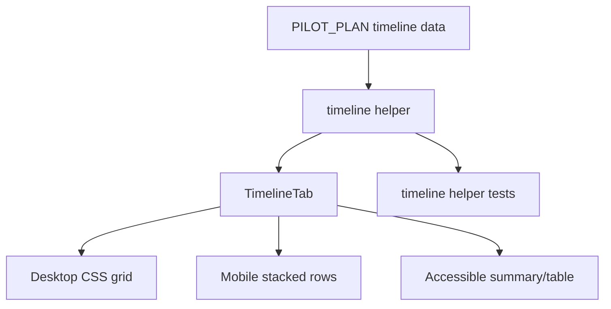

# feat: improve Company Ops timeline readability and planning signal

## Goal Capsule

| Field | Value |
|---|---|
| Objective | Make the `/ops?tab=timeline` reference tab easier to read, scan, and use for critical-path decisions without turning it into another editable planning surface. |
| Primary user | MorningForm staff using the pilot ops board to understand what should be happening now, what depends on what, and which milestones matter. |
| Authority hierarchy | Staff-only `/ops` auth and allowlist remain non-negotiable; the timeline remains read-only reference material; implementation should reuse the existing static `PILOT_PLAN` data unless a live-data need is proven. |
| Execution profile | Small UI/data-shape improvement with pure helper tests and browser visual QA. No database or API migration. |
| Stop conditions | Stop before adding drag/drop, inline editing, persisted timeline rows, or a new charting dependency. Those are bigger product decisions, not timeline polish. |
| Tail ownership | If staff later need live schedule updates, promote timeline events into a real table in a separate plan; do not keep expanding static tuple data indefinitely. |

---

## Product Contract

### Summary

The current Timeline tab is a static 12-week grid: row labels on the left, 12 week columns, colored cells for workstream spans, and a milestone row. It preserves the original pilot plan, but it does not tell the operator what matters this week, which rows are critical path, or what each bar means without reading a separate legend.

This plan improves the existing static tab rather than replacing it. The timeline should become a better executive planning artifact: current week visible, milestones legible, workstreams grouped by operating lane, labels accessible, and mobile behavior intentional.

### Problem Frame

The pilot ops board now has a live Workstream tracker and read-only reference tabs. The timeline sits between them: it is not a task list, but it should help staff decide whether the workstream is on track. Today it is visually compact but under-explained; the color legend is detached from each bar; milestone details are compressed into triangles; the current week is not emphasized; and the JSX has a list-rendering wart in `PILOT_PLAN.bars.map` because the returned fragment has no key.

### Requirements

- R1. The Timeline tab highlights the current pilot week when today's date falls between the first and last planned week, and degrades to a clear "before start" or "after plan window" state outside that range.
- R2. Workstream bars expose their lane, start week, end week, label, and critical-path status without relying on a separate color legend alone.
- R3. Milestones render as readable labels anchored to their week, not just triangle glyphs that require cross-reading a legend.
- R4. The timeline remains read-only and continues to be sourced from `PILOT_PLAN`; no database table, editor, drag/drop, or new API is introduced.
- R5. The desktop timeline stays dense enough to compare all 12 weeks at once, while mobile gets a deliberate readable layout instead of a compressed horizontal-only grid.
- R6. The timeline has an accessible text/table equivalent so screen-reader and keyboard users can understand each workstream span and milestone.
- R7. The implementation removes the React missing-key warning path in the current timeline map.
- R8. Visual QA covers desktop and mobile because timeline usability depends on rendered layout, colors, overflow, and text fit.

### Acceptance Examples

- AE1. Given the current date is within the 12-week pilot window, when staff open `/ops?tab=timeline`, then the matching week column is visually distinct and the summary copy names the active week.
- AE2. Given a workstream marked critical path, when staff scan the timeline, then that row has a clear critical-path marker that does not depend on color alone.
- AE3. Given a phone-width viewport, when staff open the tab, then each workstream remains readable without tiny text, clipped labels, or needing to infer milestones from symbols.
- AE4. Given a screen reader or no CSS, when staff read the tab, then each timeline row still communicates label, lane, week span, and milestone text.
- AE5. Given the timeline renders in development, then the console has no missing-key warning from `TimelineTab`.

### Scope Boundaries

- In scope: Timeline tab data shape, derived timeline helpers, Timeline tab JSX/CSS, accessibility text/table, current-week indicator, visual QA.
- Deferred: live timeline editing, task-to-timeline synchronization, date dragging, progress percentages, persisted schedule changes, notifications.
- Outside this product identity for this pass: a general project-management Gantt tool. This is a focused staff reference view for the MorningForm pilot.

---

## Planning Contract

### Key Technical Decisions

- KTD1. Keep timeline data static but make it typed and self-describing. The existing tuple arrays are compact, but the timeline renderer now needs lane names, critical-path flags, and derived labels. Add a thin typed adapter/helper rather than introducing a database model.
- KTD2. Use native React + CSS, not a charting dependency. The timeline is a 12-week planning grid; CSS grid plus semantic fallback is enough and keeps bundle/runtime cost low.
- KTD3. Derive current-week state in one pure helper. Date math is the only non-trivial logic; isolate it in a helper with deterministic tests instead of sprinkling `new Date()` calculations through JSX.
- KTD4. Keep Workstream as the live editable surface. Timeline improvements may link conceptually to workstreams but should not create a second editable source of truth.
- KTD5. Treat visual audit as required. Prior repo learning says code review and unit tests miss layout regressions; this change is layout-heavy, so browser screenshots are part of done.

### High-Level Technical Design

### Existing Patterns To Follow

- `src/app/ops/board-grouping.ts` and `src/app/ops/board-grouping.test.ts` show the local pattern for small pure helpers next to the ops UI.
- `src/app/ops/reference-tabs.tsx` keeps reference-tab rendering server-side and read-only; preserve that shape.
- `src/app/ops/ops.module.css` already scopes the imported gist visual language to `.opsRoot`; keep all new timeline CSS scoped there.
- `docs/solutions/best-practices/visual-audit-non-optional-ui-gate-2026-05-16.md` applies directly: UI polish needs a browser pass.

### Sequencing

1. Normalize the timeline data model and helper output first.
2. Replace the Timeline tab renderer against that helper.
3. Add responsive/a11y CSS and semantic fallback.
4. Run targeted helper tests, lint, TypeScript, and browser visual QA.

---

## Implementation Units

### U1. Timeline data adapter and current-week helper

- **Goal:** Make the static timeline data self-describing enough for a richer UI while keeping `PILOT_PLAN` as source of truth.
- **Requirements:** R1, R2, R4, R7
- **Files:** `src/lib/ops/pilot-plan-data.ts`, `src/app/ops/timeline-helpers.ts`, `src/app/ops/timeline-helpers.test.ts`
- **Approach:** Add a small helper that converts `PILOT_PLAN.weeks`, `PILOT_PLAN.bars`, and `PILOT_PLAN.milestones` into typed rows with `label`, `from`, `to`, `lane`, `colorClassKey`, `isCritical`, and milestone labels by week. Keep any source data changes minimal: if tuple-to-object conversion gets noisy, leave source tuples and map them in the helper. Compute current week from a passed `Date` argument so tests stay deterministic.
- **Test Scenarios:**
  - Date before 2026-06-22 returns `before`.
  - Date inside week 1, week 4, and week 12 returns the expected week number.
  - Date after the final week returns `after`.
  - Bar data produces inclusive week spans and preserves lane/color keys.
  - Milestone lookup returns readable text for milestone weeks and empty state for non-milestone weeks.
- **Verification:** `npx vitest run src/app/ops/timeline-helpers.test.ts`

### U2. Timeline renderer with current-week, lanes, and milestones

- **Goal:** Render the timeline as a clearer planning artifact without adding client JS.
- **Requirements:** R1, R2, R3, R4, R7
- **Files:** `src/app/ops/reference-tabs.tsx`, `src/app/ops/ops.module.css`
- **Approach:** Replace the raw `PILOT_PLAN.bars.map` grid with helper output. Use keyed `Fragment` or explicit wrapper elements for each row. Add a compact summary above the grid naming active week/window state. Render milestone labels in the week cells or a dedicated row with text, not only glyphs. Add a non-color critical-path marker such as a small "Critical" pill on the relevant row labels. Keep the component server-rendered.
- **Test Scenarios:**
  - TypeScript catches invalid lane/color keys.
  - Browser console has no missing-key warnings on `/ops?tab=timeline`.
  - Current-week summary renders for in-window date and sensible copy outside the window.
- **Verification:** `npx tsc --noEmit`, browser check on `/ops?tab=timeline`.

### U3. Responsive and accessible timeline fallback

- **Goal:** Make the timeline readable on both desktop and mobile, and understandable without relying on color or exact grid rendering.
- **Requirements:** R2, R3, R5, R6, R8
- **Files:** `src/app/ops/reference-tabs.tsx`, `src/app/ops/ops.module.css`
- **Approach:** Keep the desktop grid for overview scanning. Add a mobile breakpoint that presents each row as a card/list with span, lane, current-week overlap, and milestones. Add an accessible table or visually hidden list containing each workstream span and milestone. Do not use `display: none` for the only semantic representation if screen readers need it; use the repo's existing CSS approach if one exists nearby, otherwise add a scoped utility class in `ops.module.css`.
- **Test Scenarios:**
  - 1440px viewport shows all weeks and row labels without overlap.
  - 390px viewport shows readable workstream cards/list rows without clipped text.
  - Milestones are readable in both desktop and mobile views.
  - Critical-path signal is visible without color.
- **Verification:** Browser screenshots at desktop and mobile; `npm run lint`.

### U4. Visual QA and PR evidence

- **Goal:** Make rendered timeline quality reviewable before merge.
- **Requirements:** R8
- **Files:** PR body/screenshots only; no product-code-only target.
- **Approach:** Start a local dev server with staff access configured the same way current ops QA uses it. Capture `/ops?tab=timeline` at desktop and mobile. Check console errors, Next overlays, text overlap, and horizontal overflow. Attach or summarize the screenshots/findings in the PR body.
- **Test Scenarios:**
  - Populated timeline at desktop.
  - Populated timeline at mobile.
  - Keyboard tab order through reference tabs still works.
  - Staff gating still blocks unauthenticated/non-staff users before any reference data fetch.
- **Verification:** `agent-browser` screenshot/checks plus `npx tsc --noEmit`, `npm run lint`, `npx vitest run src/app/ops/timeline-helpers.test.ts`

---

## Verification Contract

| Check | Command / Action | Covers |
|---|---|---|
| Helper unit tests | `npx vitest run src/app/ops/timeline-helpers.test.ts` | U1 date math, span derivation, milestone lookup |
| TypeScript | `npx tsc --noEmit` | U1-U3 typed data and renderer wiring |
| Lint | `npm run lint` | U2-U3 React/Next conventions |
| Browser visual QA | Open `/ops?tab=timeline` at desktop and mobile with `agent-browser` | U2-U4 rendered layout, console/overlay absence, no text overlap |
| Staff gating spot-check | Unauthenticated `/ops?tab=timeline` redirects; non-staff remains restricted | R4 privacy boundary |

---

## Definition of Done

- The Timeline tab clearly names the active week/window state.
- Workstream rows show span, lane, and critical-path status without relying on color alone.
- Milestones are readable as text in the timeline view.
- Mobile view is intentionally readable, not just a tiny horizontal grid.
- A semantic text/table representation exists for timeline rows and milestones.
- No React missing-key warning remains in `TimelineTab`.
- Targeted helper tests, TypeScript, and lint pass.
- Browser visual QA covers desktop and mobile and is summarized in the PR.
- No database table, API route, or live editable timeline is added.

---

## Appendix

### Source Notes

- Current timeline renderer: `src/app/ops/reference-tabs.tsx`
- Static pilot plan data: `src/lib/ops/pilot-plan-data.ts`
- Scoped ops CSS: `src/app/ops/ops.module.css`
- Existing pure helper test pattern: `src/app/ops/board-grouping.test.ts`
- Visual QA precedent: `docs/solutions/best-practices/visual-audit-non-optional-ui-gate-2026-05-16.md`
